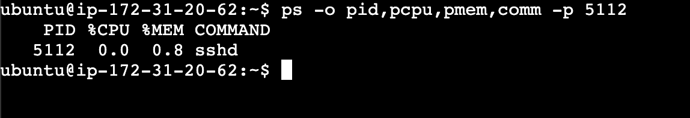
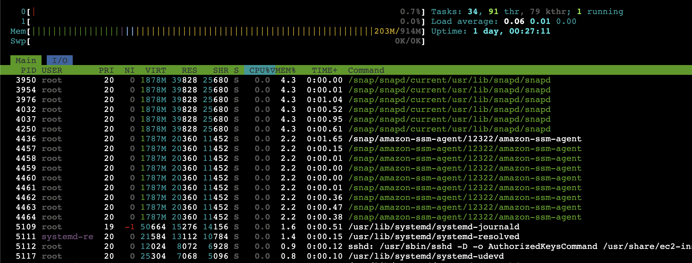
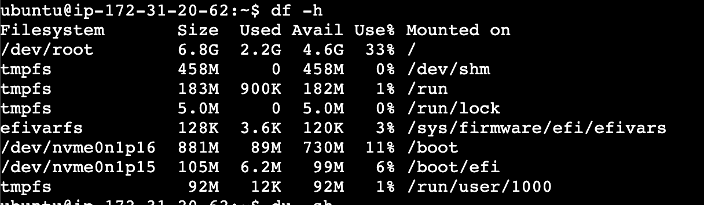
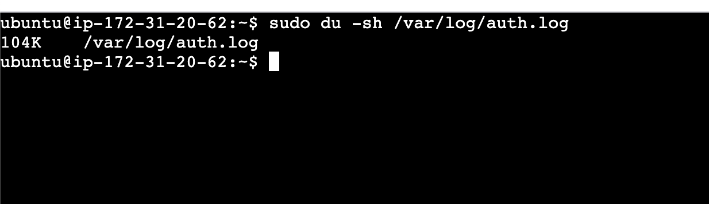
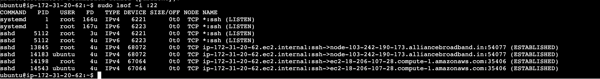
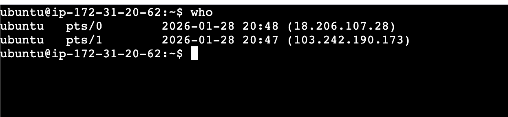

# Runbook
## What is Runbook

 - A mini runbook is a concise, step-by-step operational guide used by DevOps teams to quickly diagnose and resolve a specific alert or incident.
 - A mini runbook in DevOps is a short, quick-reference playbook that tells you exactly what to do when something breaks — without fluff.
 - Think of it as “incident handling in 2–3 minutes.

### Runbook for SSH Service

- Target service: SSH
- Process: sshd
- Purpose: Remote access service
- Snapshot: CPU & Memory
    - PID: 5112
    - ps -o pid,pcpu,pmem,comm -p 5112:
    - :sshd CPU usage is low (<1%) under idle conditions; spikes only during active logins.
    - htop:
    - :
    - free -h:
    -  :low swap measn ssh is not putting pressure
    - top -H -p <PID>:
    -  :See if one SSH connection is burning CPU.

### Red Flags
- sshd CPU > 20% without active logins
- Rapid growth in number of sshd processes
- RSS memory increasing continuously
- High load average but low system CPU usage (possible stuck I/O)

-------------------------------------------------------------------------
- Snapshot: Disk & IO:
    - df-h:
    - : If disk if full SSH login can fail
    - du -sh /var/log/auth.log:
    - : SSH logs consuming normal disk space; no log bloat observed.
## Disk & IO – SSH

- Verified filesystem usage using df -h
- Checked SSH-related logs for disk growth
- Observed disk IO using vmstat and iostat
- No disk saturation or IO wait observed

Conclusion: Disk and IO are not impacting SSH service.
-------------------------------------------
 - Snapshot:  Network
 - sudo lsof -i :22:
 - - Confirms which process owns port 22.
 - who:
 - 

 ### Network Red Flags
- SSH not in LISTEN state
- Port 22 bound to unexpected process
- High number of SSH connections from same IP
- Packet loss or high latency during login

-------

