### Part 1: Linux File System Hierarchy

**Core Directories (Must Know):**
- `/` (root) - The starting point of everything
    - This is the main part where all other directory emerges from. it contains all the other directories. only the root user can make changes here and no one else is allowed.
    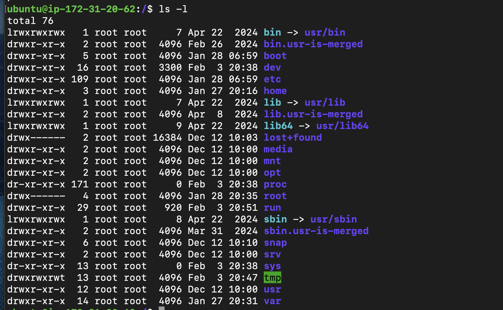
- `/home` - User home directories
    - Home directories for all users to store their personal files, containing saved files, personal settings, etc
    - every user has their home directory like for a user test, its home directory would be /hpme/test. every non root user has a personal directory inside /home
    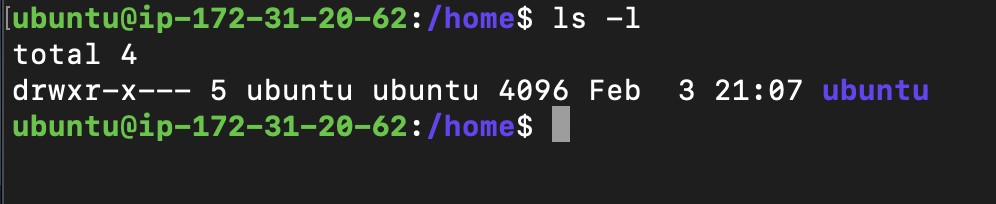
- `/root` - Root user's home directory
    - This is root users home directory and is not the same as /.The private home folder for the root user. It's just like /home/alice, but for the "superuser."
- `/etc` - Configuration files. 
    - Almost every file in this directory is a plain-text configuration file. /etc/passwd -> contains users account info like home directory path etc. /etc/shadow -> contains users password in  encrypted form
    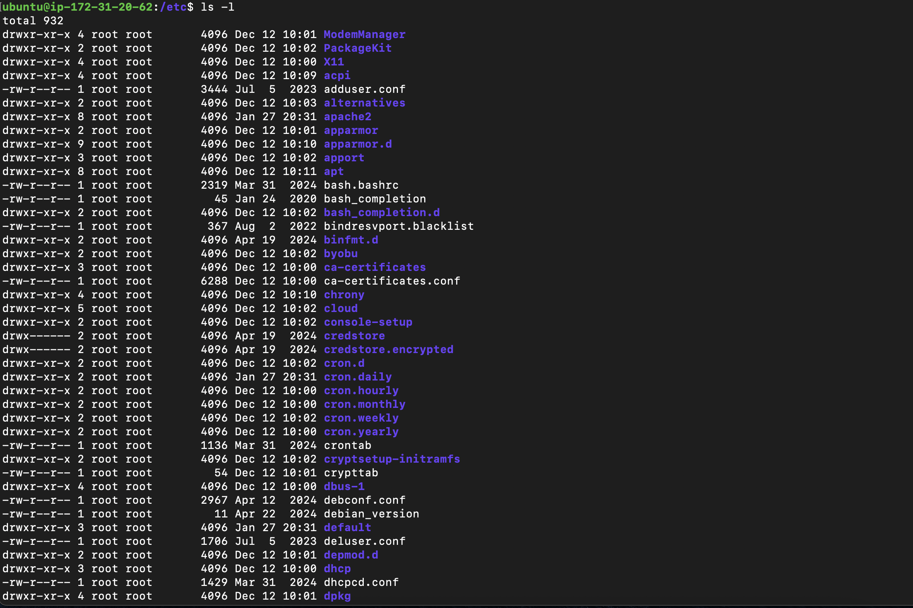
- `/var/log` - Log files (very important for DevOps!)
    - The "Black Box" of Linux. Contains all system and app logs. This is arguably the most important directory for troubleshooting. If a program crashes or a login fails, the "why" is recorded here in plain text.

    /var/log/syslog (or messages on RHEL): The general-purpose log that records almost everything happening on the system.

    /var/log/auth.log: Tracks logins and security-related events. Great for seeing if someone is trying to brute-force your password.

    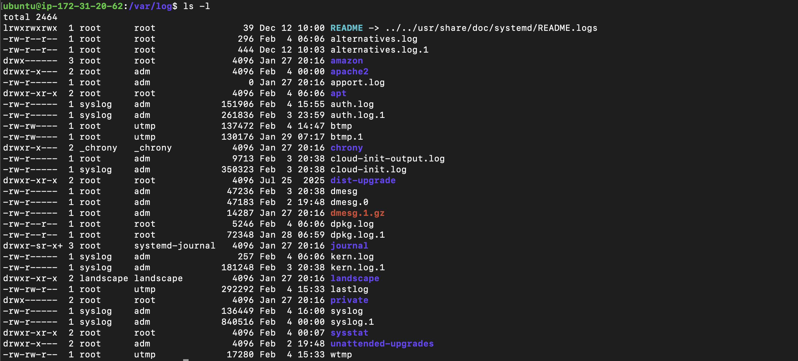

- `/tmp` - Temporary files.
    - when we run anything it creates temporary files which are stored here and gets delted when the sytem is restarted.

    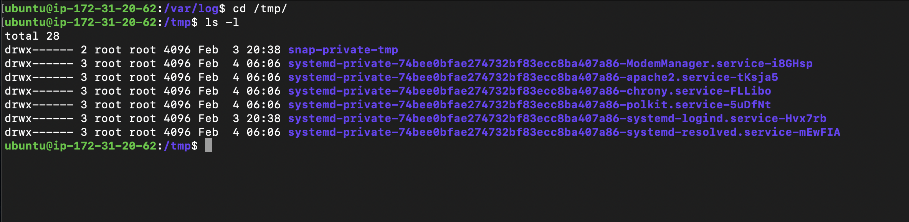

**Additional Directories (Good to Know):**
- `/bin` - Essential command binaries
    - contains all the essential commands like cp,ping etc which are used to naviagte round linux
    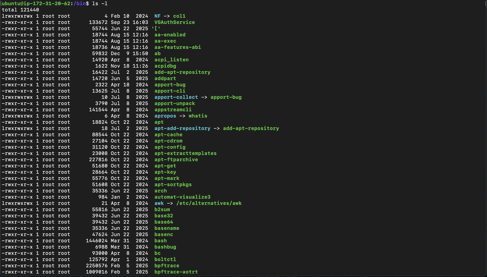

- `/usr/bin` - User command binaries
    - On most modern Linux distributions (like Ubuntu, Fedora, and Debian), /bin is now just a symbolic link to /usr/bin. This means they are effectively the same folder. If you go to the root directory and run ls -l, you will likely see: lrwxrwxrwx bin -> usr/bin
    - 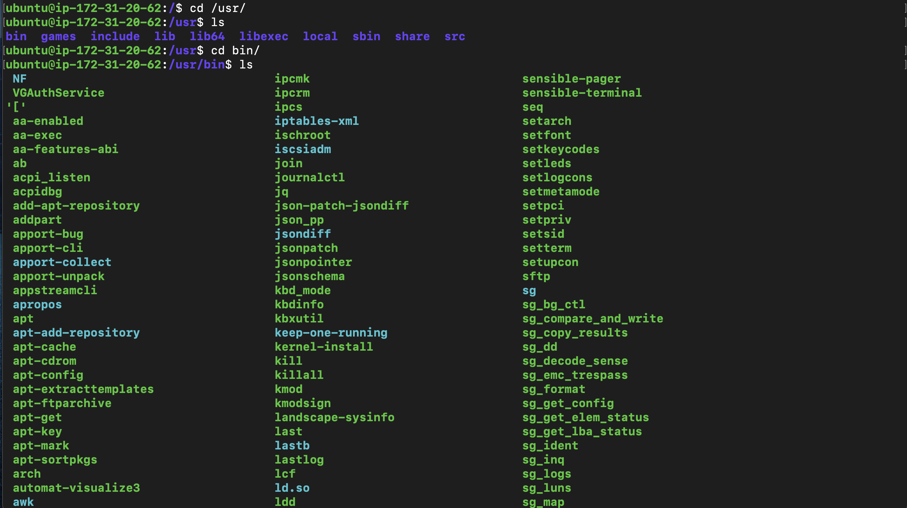

- `/opt` - Optional/third-party applications
    - While /usr/bin is for the "official" apps that come with your Linux distribution, /opt is the neighborhood for optional or add-on software.
    Common residents of /opt:
    Google Chrome (/opt/google/chrome)
    Visual Studio Code
    Discord
    Zoom
    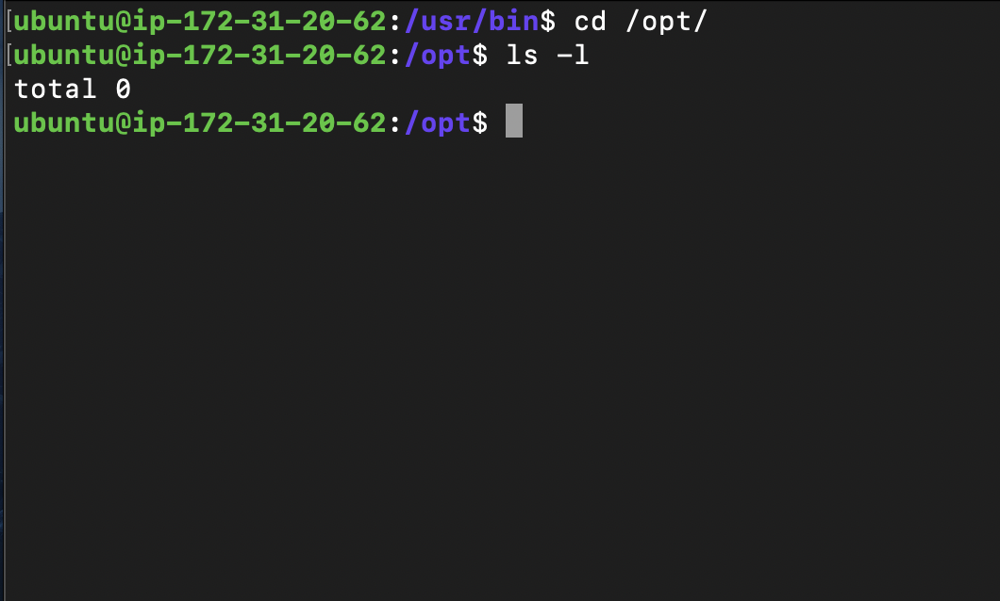

- / (root)

I would use this when…

I want to understand the top-level structure of the system

I’m checking if a path is absolute (everything starts from /)

I’m navigating or scripting paths like /etc/nginx/nginx.conf

- /home

I would use this when…

I’m working as a normal (non-root) user

I need to access user files, configs, SSH keys

I’m debugging issues related to a specific user
(e.g. /home/yash/.ssh/authorized_keys)

/root

I would use this when…

I’m logged in as root

I need root’s private files, scripts, or SSH configs

I’m in recovery or emergency mode and /home users aren’t relevant

- /etc

I would use this when…

I need to configure or troubleshoot a service

A service isn’t starting and I want to check configs
(e.g. /etc/nginx, /etc/ssh/sshd_config)

I’m validating system-wide settings (users, services, networking)

- /var/log

I would use this when…

A service is crashing, failing, or behaving weirdly

I need to debug production issues

I want to check authentication, system, or app logs
(e.g. /var/log/syslog, /var/log/auth.log, /var/log/nginx/)

🔥 In real DevOps life: 90% troubleshooting starts here

- /tmp

I would use this when…

I need a temporary file during debugging or scripting

I’m testing something that doesn’t need persistence

I want files that can be safely auto-deleted on reboot

Additional Directories (Good to Know)
- /bin

I would use this when…

I want to know where essential system commands live

I’m in minimal or recovery mode and need core tools
(like ls, cp, mv, cat)

I’m debugging PATH or broken shell environments

- /usr/bin

I would use this when…

I’m checking where most user-level commands are installed

A command works for one user but not another (PATH issues)

I’m validating package installations

- /opt

I would use this when…

I’m installing or managing third-party or custom software

I want to keep non-system apps cleanly separated

I’m working with tools like monitoring agents, custom builds, etc.

DevOps Mental Model (Very Important)

Think like this during incidents:

❓ Service broken? → /etc (config) → /var/log (why)
❓ User issue? → /home
❓ Command missing? → /bin or /usr/bin
❓ Testing something quick? → /tmp
❓ Custom software? → /opt

## Output of du -sh /var/log/* 2>/dev/null | sort -h | tail 5

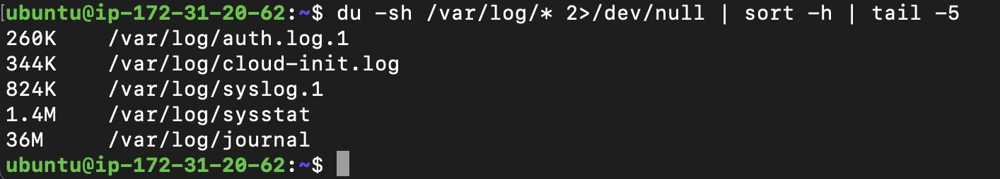

## cat /etc/hostname

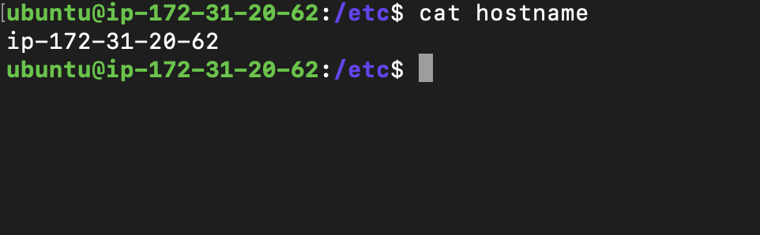

## ls-la

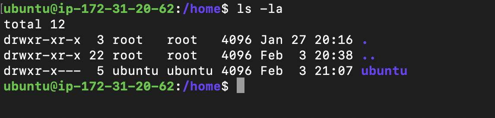

### Part 2: Scenario-Based Practice 

- scenario 1

1. sudo systemctl status myapp.service 
why-> (check if its running or not)
2. sudo systemctl is-enabled myapp 
why-> (check if it shows enabled or not)
3. journalctl -u myapp
why->  checks logs (journalctl)

- scenario 2

1. htop
why -> it shows cpu and load
2. htop --sort=%CPU | head -n 10 / htop --sort=%MEM | head -n 10
why -> it shows the cpu and mem %

- scenario 3

1. systemctl status docker.io
why-> shows is service is active or not
2. journalctl -u docker.io
why-> shows docker related logs

- scenario 4

1. Check current permissions
Command: ls -l /home/user/backup.sh
Look for: -rw-r--r-- (notice no 'x' = not executable)

2. Add execute permission
Command: chmod +x /home/user/backup.sh

3. Verify it worked
Command: ls -l /home/user/backup.sh
Look for: -rwxr-xr-x (notice 'x' = executable)

4. Try running it
Command: ./backup.sh

- scenario 5

