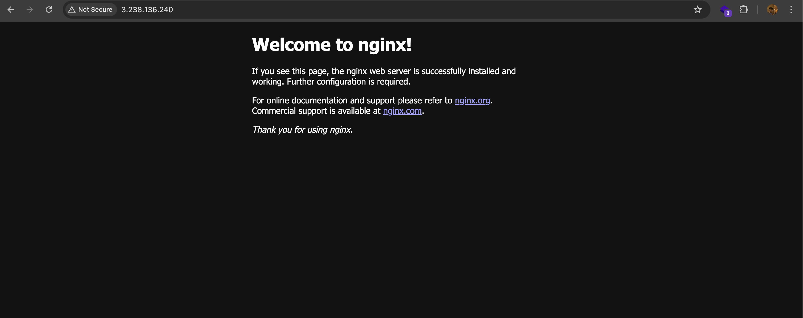

# Day 08 – Cloud Server Setup: Docker, Nginx & Web Deployment

## Commands used

- ssh -i < path to pem file > ubuntu@public-ip-of-instance
- sudo apt update
- sudo apt install nginx
- sudo systemctl status nginx
- go to instances in aws
- go to security group
- go to inbound rules
- edit inbound rules
- add port 80, tcp from anywhere ipv4
- go to your browser on local and type http://< public ip-adress of ec2 >
- see nginx page
- to get logs go to instance and type journalctl -u nginx
- to save it to file journalctl -u nginx >> nginx.log
- to copy it to local scp -i < path to pem file > ubuntu@public-ip-of-instace: ~/nginx.log .
- locally see it has downloaded from the remote server

## Challenges Faced

- challenges faced in scp -i command

## What I Learned

- learned in depth about secure copy
- learned about remote -> local scp and local to remote scp

