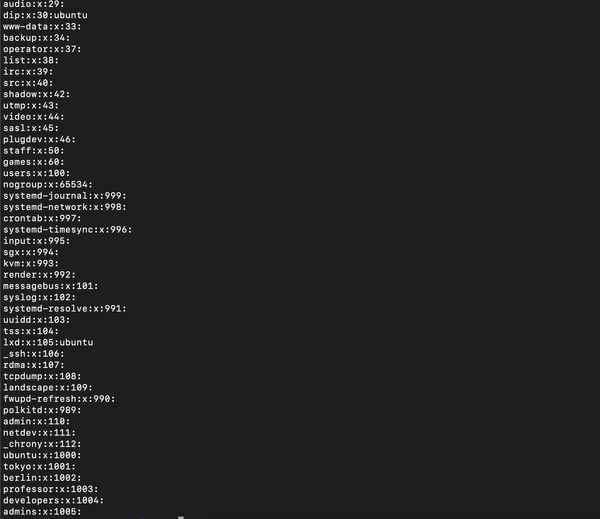
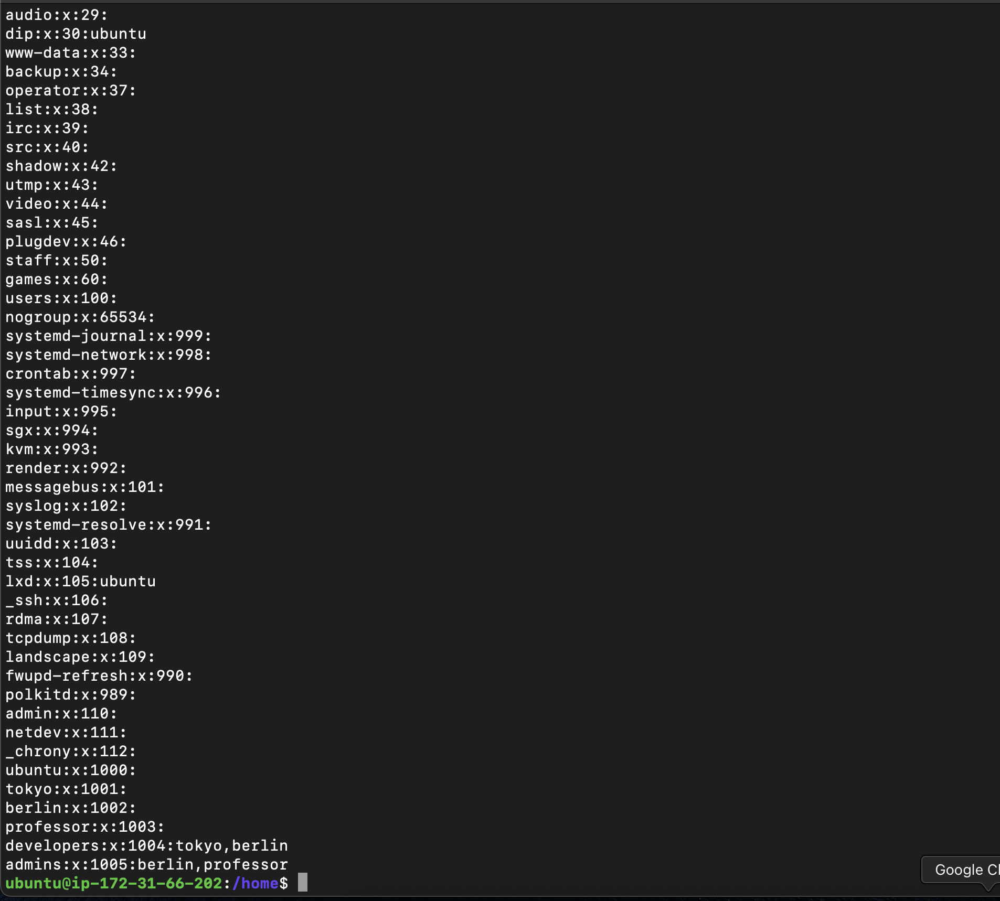
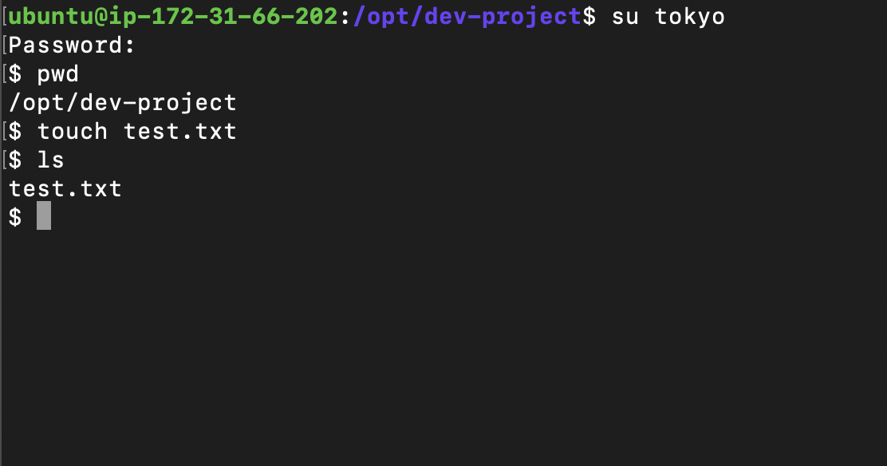
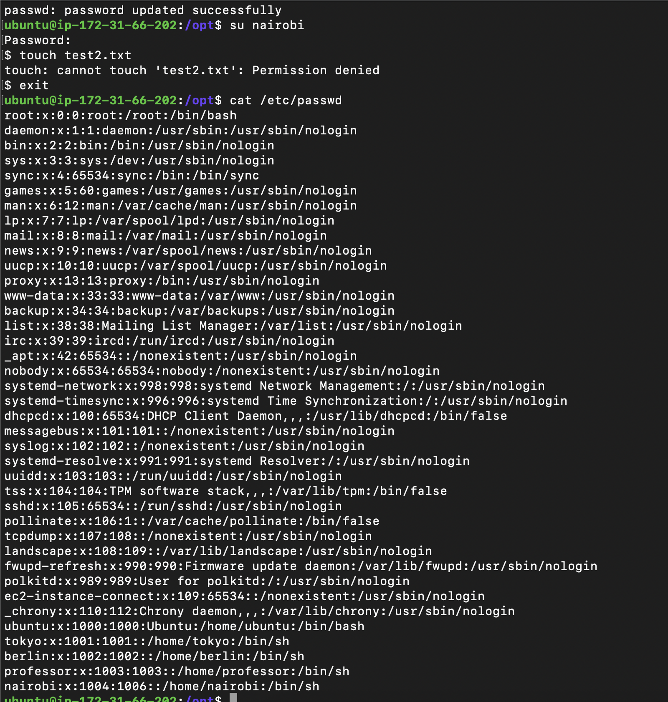

### Task 1: Create Users 

- sudo useradd -m tokyo
- sudo useradd -m berlin
- sudo useradd -m professor
- cd ..
- pwd (should be /home)
- ls
- shows ubuntu tokyo berlin professor
- cat /etc/passwd (user config)
- passwd tokyo

### Task 2: Create Groups
 
- sudo groupadd developers
- sudo groupadd admins
- cat /etc/groups

### Task 3: Assign to Groups

- sudo usermod -aG developers tokyo
- sudo usermod -aG developers,admin berlin
- sudo usermod -aG admins professor
- to check -> cat /etc/group

### Task 4: Shared Directory 

- cd /opt
- sudo mkdir dev-project
- sudo chgrp developers dev-project/
- su tokyo
- touch test.txt
- 

### Task 5: Team Workspace 

- 
- nairobi cannot create files since the permission is 775 to the folder and since nairobi is part of home group not project-team she cannot create the file since permisssion for others is just to read and execute not write

- when we do sudo usermod -aG project-team nairobi
- su nairobi
- touch test2.txt
- ls
- we can see the file being created

## What I Learned

- how to add multiple groups toa user
- file permission issues and troubleshooting