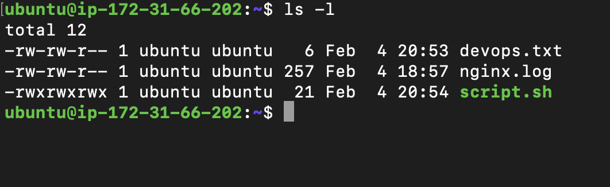
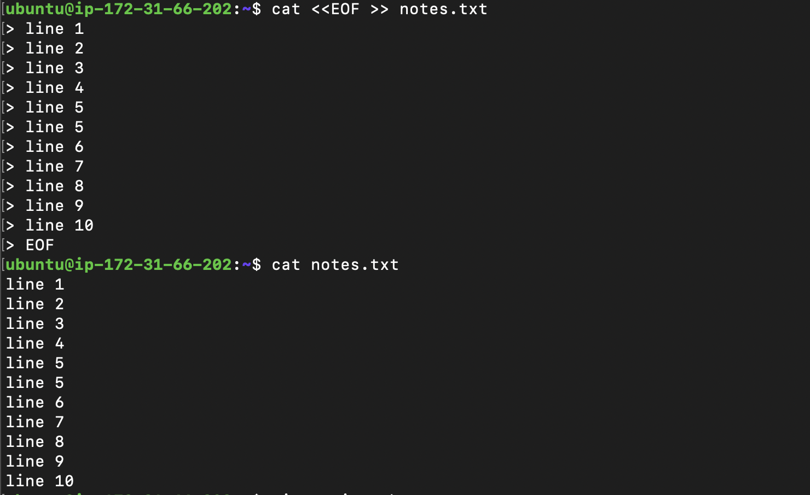
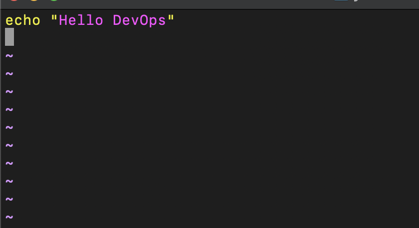
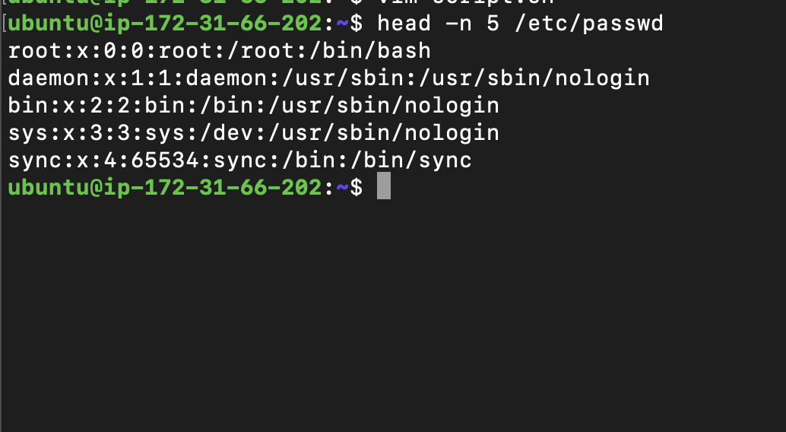
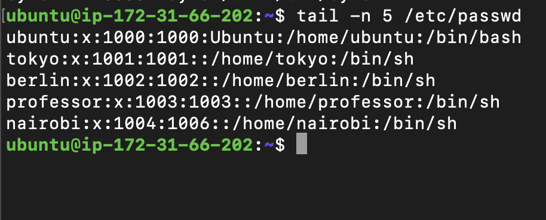
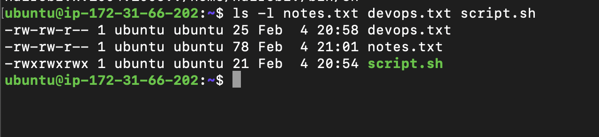
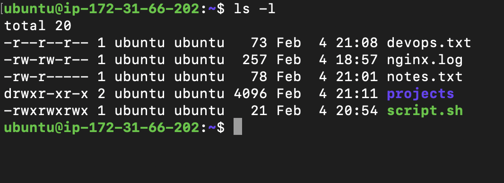

### Task 1: Create Files 
- touch test.txt
- echo "hello" >> test.txt
- vim script.sh
- echo "hello devops"
- chmod 777 script.sh
- ./script.sh

- 

### Task 2: Read Files

- 
- 
- 
- 
### Task 3: Understand Permissions 

- 
- for script.sh all users,groups and ext users can rwx
- for devops.txt and notes.txt its 664, read,write and not execute for users and groups and for others its read only

### Task 4: Modify Permissions 
- 
- to change permission of any file or directory it will be chmod only

### Task 5: Test Permissions

- writing to a read only file through vim it works since the directory in which the file is has rwx so it writes through vim tho vim shows warning that writing to a read only file but echo fails
- ubuntu@ip-172-31-66-202:~$ chmod 444 script.sh 
ubuntu@ip-172-31-66-202:~$ ./script.sh
 bash: ./script.sh: Permission denied

- The system prevents the write operation because the file does not have write (w) permission.
- When a file has read-only permissions (e.g. 444), the operating system blocks write operations. Only reading is allowed unless permissions are changed or the user has elevated privileges.

