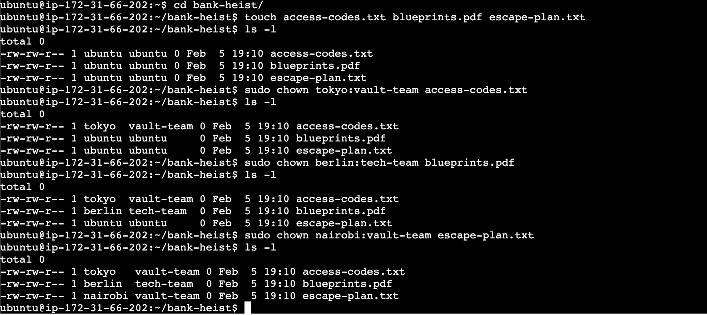

### Task 1: Understanding Ownership

1. all files owners and groups are ubuntu

- diff between user and gorup -> Users can be either people, meaning accounts tied to physical users, or accounts which exist for specific applications to use. Groups are logical expressions of organization, tying users together for a common purpose. Users within a group can read, write, or execute files owned by that group.
-> so suppose there is a developer group so anyone who is a dev is added to the dev grouo to get the same permissions

### Task 2: Basic chown Operations 

1. sudo chown tokyo devops-file.txt

### Task 3: Basic chgrp Operations

1. sudo groupadd heist-team
2. sudo chgrp heist-team team-notes.txt
3. ls -l

### Task 4: Combined Owner & Group Change
1. sudo chown berlin:heist-team app-logs/ [command is usdo chown owner:group file-or-directory]

### Task 5: Recursive Ownership 

1. sudo groupadd planners
2. sudo chown -R professor:heisteam heist-project/ (-R for Folder)

### Task 6: Practice Challenge 

1. sudo groupadd tech-team
2. sudo groupadd vault-team
3. 