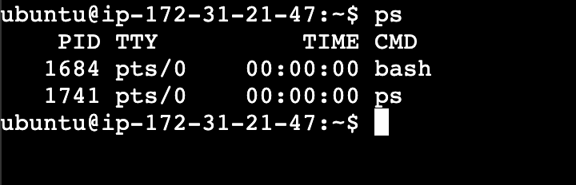
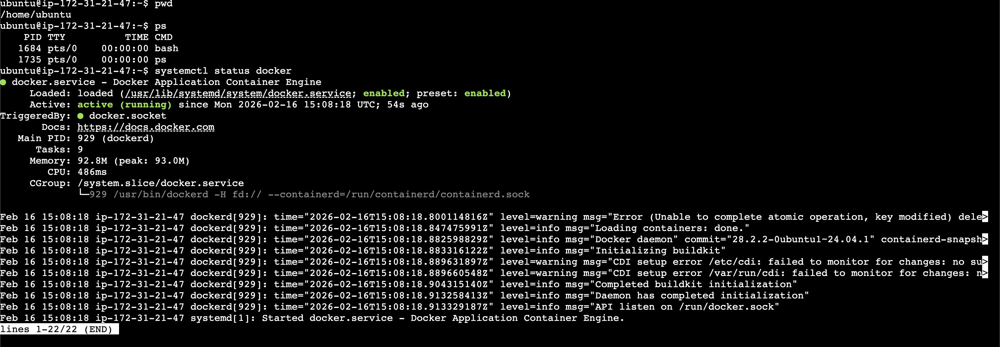
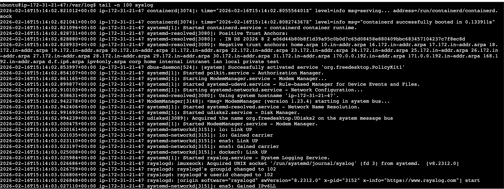
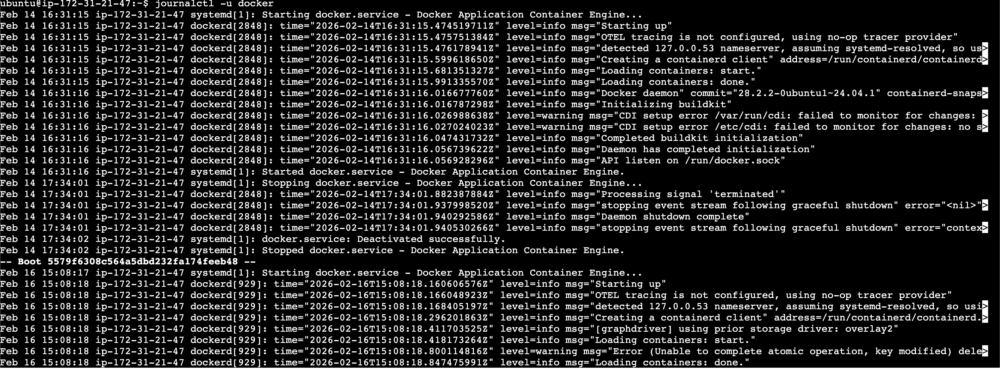
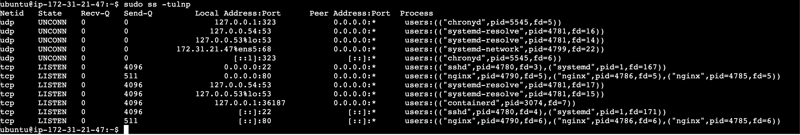

## Day-12: Revision

### Tasks

- **Mindset & plan:** revisit your Day 01 learning plan—are your goals still right? any tweaks? 
    - Goals are same just 1 tweak -> Start focusing on devops events and prepare to give technical talks 
- **Processes & services:**
    - ps
    - systemctl status docker
    - tail -n 100 /var/log/syslog 
    - journalctl -u docker 
- **File skills:** practice 3 quick ops from Days 06–11 (e.g., `echo >>`, `chmod`, `chown`, `ls -l`, `cp`, `mkdir`).  
    - echo 'echo "hello"' >> hello.sh
    - chmod 764 hello.sh
    - ls -l
     ls -l
        total 12
        -rw-rw-r-- 1 ubuntu ubuntu   10 Feb 16 15:53 demo.txt
        -rwxrw-r-- 1 ubuntu ubuntu   24 Feb 16 15:55 hell.sh
        drwxrwxr-x 2 ubuntu ubuntu 4096 Feb 14 17:17 scripts
    - sudo useradd user2
    - cat /etc/passwd
    - sudo passwd user2 (to sett pass of new user)
    - sudo chown user2 hello.sh (to change ownership from buntu -> user2)
    - ls -l (to confirm)
    - sudo groupadd dev
    - cat /etc/group (to verify group was created)
    - sudo usermod -aG dev user2 (to add user to the group dev)
    - sudo chgrp dev hello.sh
    - ls -l 
        total 12
        -rw-rw-r-- 1 ubuntu ubuntu   10 Feb 16 15:53 demo.txt
        -rwxrw-r-- 1 user2  dev      24 Feb 16 15:55 hell.sh
        drwxrwxr-x 2 ubuntu ubuntu 4096 Feb 14 17:17 scripts

- **Cheat sheet refresh:** 
    - ps aux or ps aux --sort=-%cpu | head
        Why?

        1. Find abnormal processes
        2. Spot crypto miners
        3. Detect unknown daemons
        4. Check which user is running what

    - df -h
        Why?
        1. Disk full = services cras
        2. Logs filling /var
        3. DB failing due to storage

    - top
        Why?
        1. CPU spike?
        2. Memory exhaustion?
        3. Runaway process?
        4. Load average high?
        5. This gives immediate system health.

    - tail -f /var/log/syslog or authlog
        Why?
        1. Failed SSH attempts
        2. Service crashes
        3. Kernel errors
        4. Security events

    - free -h (Memory Health)
        Why?
        1. OOM killer?
        2. Swap usage?
        3. Memory leak?
        Very important in performance incidents.

To sound more senior, say:

1. First I check system health (top, free, df),
2. then process anomalies (ps aux),
3. then logs (/var/log),
4. depending on whether it’s performance or security related.

    #### Some more commands for incident 
    - uptime () -> 16:17:58 up  1:09,  1 user,  load average: 0.00, 0.00, 0.00
    What it shows:
    1. Current time
    2. How long system has been running
    3. Number of logged-in users
    4. Load average (1, 5, 15 minutes)

    - sudo ss -tulnp (Replacement for netstat)
    What it shows:
    1. Open ports
    2. Listening services
    3. Which process is using which port
    4. Protocol (TCP/UDP)
    

    - who
    What it shows:
    1. Currently logged-in users
    2. Login time
    3. Source IP (if SSH)
    ubuntu   pts/0        2026-02-16 15:58 (18.206.107.28)

    - last
    What it shows:

    1. Login history
    2. Logout times
    3. Reboots
    4. Failed login attempts

<!--
    untu   pts/0        2026-02-16 15:58 (18.206.107.28)
$ last
ubuntu   pts/0        18.206.107.28    Mon Feb 16 15:58   still logged in
ubuntu   pts/0        18.206.107.28    Mon Feb 16 15:36 - 15:57  (00:20)
ubuntu   pts/0        18.206.107.28    Mon Feb 16 15:08 - 15:17  (00:09)
reboot   system boot  6.14.0-1018-aws  Mon Feb 16 15:08   still running
ubuntu   pts/0        103.242.190.174  Sat Feb 14 16:06 - 17:34  (01:27)
reboot   system boot  6.14.0-1018-aws  Sat Feb 14 14:09 - 17:34  (03:24)
-->

-------
First I check system health (uptime, top, free, df).
Then I inspect processes (ps aux).
Then network exposure (ss -tulnp).
Then user activity (who, last).
Finally I check logs.
----------

- **User/group sanity:**

Done Already

## Mini Self-Check 

- 1) Which 3 commands save you the most time right now, and why?
    - head -n 100 filename.txt (to get the first n lines of a file)
    - tail -f filename.txt (to get live logs of a file like what is getting added or deleted)
    - grep -i "failed" /var/log/auth.log (Instantly filter logs and find specific errors)
- 2) How do you check if a service is healthy? List the exact 2–3 commands you’d run first. 
    - sudo systemctl status servicename
    - sudo ss -tulnp 
    - journalctl -u servicename
    
<!--
First I check systemctl status to confirm the service is running and inspect recent logs.
Then I verify it’s listening on the correct port using ss -tulnp.
Finally, I test it directly using curl (or relevant client) to confirm it’s responding correctly.
-->
 - 3) How do you safely change ownership and permissions without breaking access? Give one example command.  
    - sudo chown -R nginx:nginx /var/www/app (Apply the command not just to one file/directory,
but to everything inside it — including all subfolders and files.)
- 4) What will you focus on improving in the next 3 days?
    - Improve shell scripting
    - Provide more time
    - Do more hands on

    
