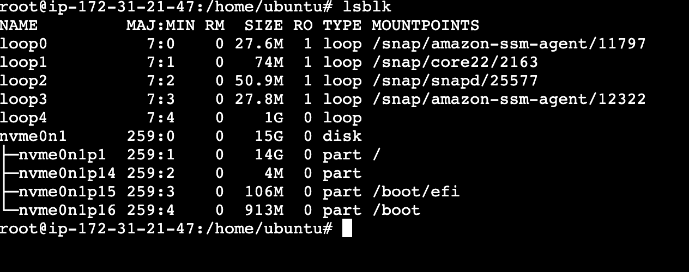
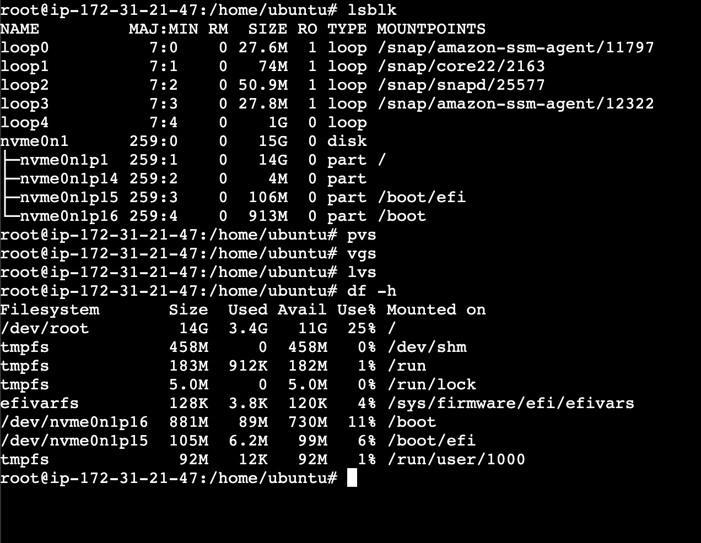
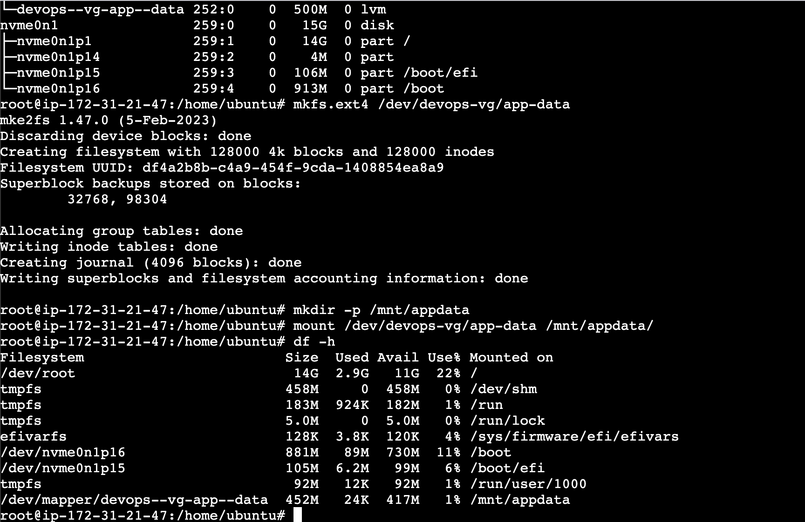

### Task 1: Check Current Storage
Run: `lsblk`, `pvs`, `vgs`, `lvs`, `df -h`

- lsblk:  here we can see loop 4 which is the 1Gb file
- df -h:  amount of space available on file system
- pvs: show phsyical volume
- vgs: show volume group
- lvs: show logical volume
- mkdir -p /mnt/appdata
- pvcreate /dev/loop4
- vgcreate devops-vg /dev/loop4
- lvcreate -L 500M -n app-data devops-vg
- mkfs.ext4 /dev/devops-vg/app-data
- mount /dev/devops-vg/app-data /mnt/appdata
- df-h 

[ lvextend increases the logical volume size, but the filesystem on top doesn’t automatically grow. resize2fs is required to expand the ext4 filesystem to use the newly available space. ]

- What you learned (3 points)
    - lvextend (to extend logical vol)
    - resize2fs (to extend file system because file sys doesnt know that logical vol has extended)
    - create EBS -> attach -> create a mount location mkdir -p /mnt/appdata -> pvcreate /dev/sdf -> vgcreate devops-vf /dev/sdf -> lvcreate -L 500M -n app-data devops-vg -> mkfs.ext4 /dev/devops-vg/app-data /mnt/appdata -> df-h

