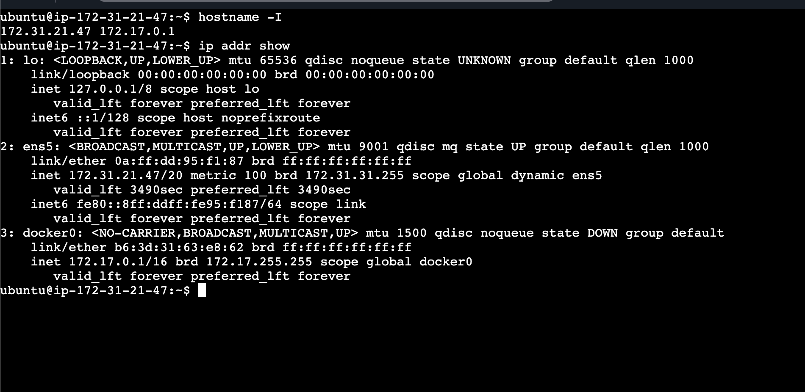
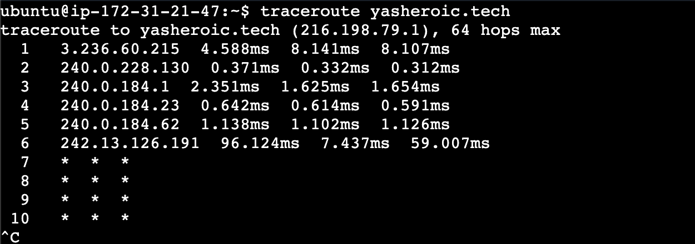
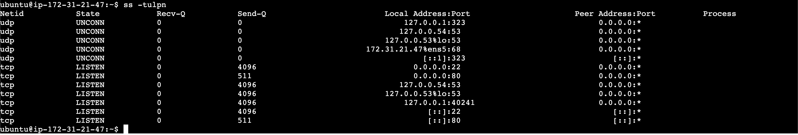
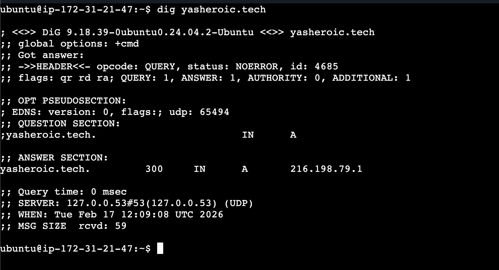
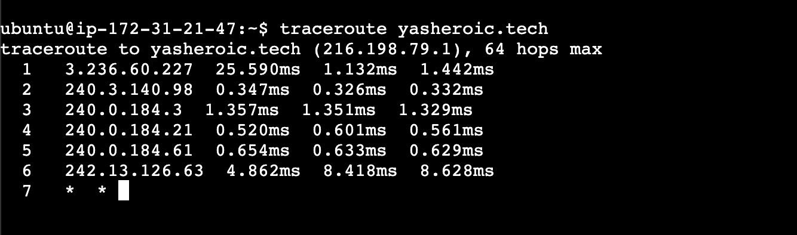
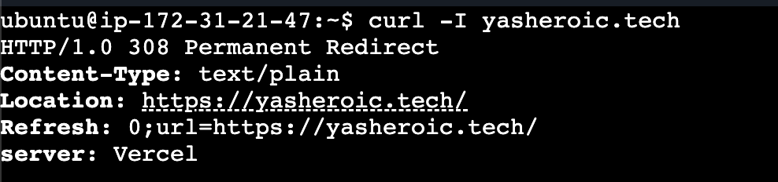
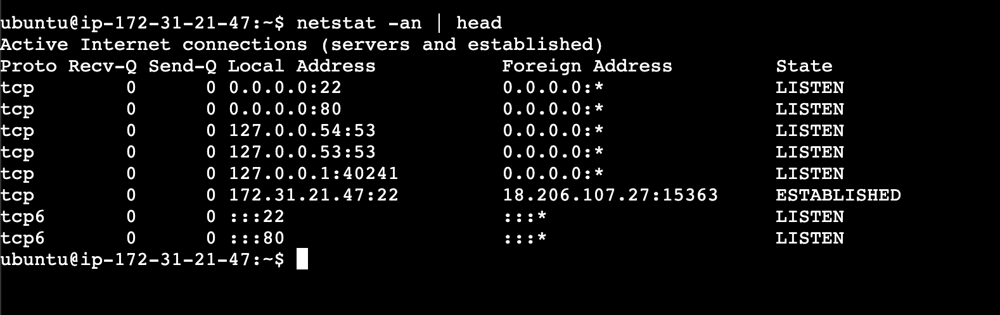

# Day 14 – Networking Fundamentals & Hands-on Checks
## OSI vs TCP/IP Model

### Quick Concepts
#### Task 1
-> 1.1
- OSI has 7 layers ->
    1. Physical Layer
    2. Data Link layer
    3. Network Layer
    4. Transport Layer
    5. Session Layer
    6. Presentation Layer
    7. Application Layer
[Data flows from 7 -> 1 from the sender side and for receiver side its 1 -> 7] 

- TCP/IP has 4 layers ->
    1. Network Access Layer
    2. Internet Layer
    3. Transport Layer
    4. Application Layer
[Data flows from 4 -> 1 from the sender side and for receiver side its 1 -> 4] 

-> 1.2(TCP/IP)
Where **IP**, **TCP/UDP**, **HTTP/HTTPS**, **DNS** sit in the stack

- IP:  Network layer
- TCP/UDP: Transport Layer
- HTTP/HTTPS: Application Layer
- DNS: Application Layer

- OSI 

L1 Physical → Cables, signals, hardware
L2 Data Link → MAC address, switching
L3 Network → IP addressing & routing
L4 Transport → TCP/UDP (ports, reliability)
L5–L7 Session, Presentation, Application → App communication, encryption, formatting

- TCP/IP
Link → Physical + Data Link (MAC, Ethernet)
Internet → IP routing
Transport → TCP/UDP
Application → HTTP, HTTPS, DNS, SSH, etc.

-> 1.3
- Real Example
curl https://example.com
This means:

Application layer → curl makes an HTTPS request
Transport layer → HTTPS runs over TCP (port 443)
Network layer → TCP packets are wrapped inside IP packets
Link layer → IP packets are sent via Ethernet/WiFi using MAC addresses

#### Task 2
- hostname -I / ip addr show: 
- traceroute yasheroic.tech: 
- ss -tulpn: 
- dig yasheroic.tech : 
- traceroute yasheroic.tech: 
- curl -I yasheroic.tech: 
- netstat -an | head: 

#### Task 3 (Mini Task: Port Probe & Interpret)

- ss -tulpn
- nc -zv localhost 22
- yes it is reachable (Connection to localhost (127.0.0.1) 22 port [tcp/ssh] succeeded!)

## Reflection (add to your markdown)
- Which command gives you the fastest signal when something is broken? 
- What layer (OSI/TCP-IP) would you inspect next if DNS fails? If HTTP 500 shows up?
- Two follow-up checks you’d run in a real incident.

**Answers**

- Ping,traceroute, nc -zv abc.com 443
- Application layer
- netstat, curl -I https://abc.com, ss -tulnp

**🔥 Better Structured Answer**
- Fastest signal depends on what you’re testing:
- ping → fastest to check basic network reachability (L3)
- nc -zv host 443 → fastest to check if service port is open (L4)

- curl -I https://host → fastest to check application health (L7)

💡 In real production, I’d pick curl -I first, because users care if the app works — not just if IP responds.

**If HTTP 500 shows up:**

HTTP 500 = server-side error.
That means:

- Network works
- TCP works
- HTTP request reached server

So problem is:
👉 Application layer (backend / code / DB / API)

Correct answer:

- Inspect Application layer (server logs, app logs, DB connectivity)

