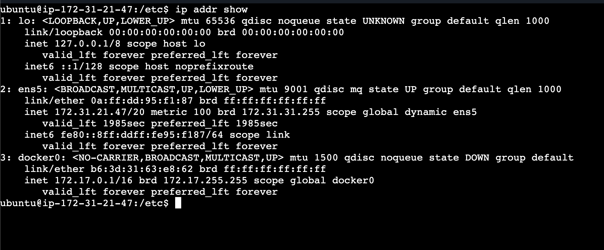

# Day-15-networking-concepts

## Task 1: DNS – How Names Become IPs

### 1.1 ->

- When we type google.com?
    - The browser first checks for browser cache and OS cache if it doesnt find the associated IP with Domain Name it goes to Recursive DNS resolver which then queries Root DNS, TLD(Top Level Domain) and Google's authorative(This is the main server which replies this contains all records like `A`, `AAAA`, `CNAME`, `MX`) DNS server
    - Authorative server finds the IP and replies back
    - The browser then uses the IP to eastablish TCP handshake(usually HTTPS) to establish connection to the server

---

### 1.2 ->

| Record | Purpose |
|--------|----------|
| A | Domain → IPv4 (google.com → 142.250.183.14) |
| AAAA | Domain → IPv6 (google.com → 2404:6800:4009:80b::200) |
| CNAME | Alias to another domain (www.example.com → example.com) |
| MX | Mail server (example.com → mail.example.com) |
| NS | Authoritative name servers (example.com → ns1.cloudflare.com) |

---

### 1.3 ->
- dig `google.com`

google.com.             300     IN      A       142.251.16.138
google.com.             300     IN      A       142.251.16.113
google.com.             300     IN      A       142.251.16.101
google.com.             300     IN      A       142.251.16.100
google.com.             300     IN      A       142.251.16.102
google.com.             300     IN      A       142.251.16.139

## Task 2: IP Addressing

2.1->

- IPv4 is a 32-bit address divided into 4 octets used to uniquely identify devices on a network. Public IPs are globally routable, while private IPs are used within internal networks. Private IP ranges include 10.0.0.0/8, 172.16.0.0/12, and 192.168.0.0/16.

2.2->

# 🌐 Public IP vs Private IP (DevOps Clear Explanation)

## 🔹 What is a Public IP?

A **Public IP address** is:

* Globally unique
* Accessible over the internet
* Assigned by ISP or cloud provider
* Routable on the internet

Example:

```
8.8.8.8
```

(Owned by Google)

### ✅ Used For:

* Hosting websites
* Public EC2 instances
* Load balancers
* APIs exposed to internet

---

## 🔹 What is a Private IP?

A **Private IP address** is:

* Used inside internal networks
* NOT accessible directly from internet
* Free to use (no ISP needed)
* Used within LAN / VPC

Example:

```
192.168.1.10
```

### ✅ Used For:

* Laptop inside WiFi
* Office network systems
* EC2 internal communication
* Kubernetes pods

---

# 🔥 Key Differences

| Feature             | Public IP            | Private IP                        |
| ------------------- | -------------------- | --------------------------------- |
| Internet accessible | ✅ Yes                | ❌ No                              |
| Globally unique     | ✅ Yes                | ❌ No (can repeat across networks) |
| Assigned by         | ISP / Cloud provider | Router / DHCP                     |
| Cost                | Usually Paid         | Free                              |
| Example             | 8.8.8.8              | 192.168.1.10                      |

---
2.3->

# 🔐 Private IP Ranges (Important)

```
10.0.0.0 – 10.255.255.255
172.16.0.0 – 172.31.255.255
192.168.0.0 – 192.168.255.255
```

Anything outside these → Public IP.

---

# 🚀 Real DevOps Example (AWS)

An EC2 instance may have:

* Private IP → `10.0.1.15`
* Public IP → `54.210.x.x`

Traffic Flow:

```
Internet → Public IP → NAT → Private IP → EC2
```

Even though users hit public IP, your app usually runs on private IP internally.

---

# 🧠 Mental Model

* Public IP = Your house’s street address
* Private IP = Your room number inside house

---
2.3->
- 2 pvt IP
- 1 Loopback IP

| Interface | IP           | Type     |
| --------- | ------------ | -------- |
| lo        | 127.0.0.1    | Loopback |
| ens5      | 172.31.21.47 | Private  |
| docker0   | 172.17.0.1   | Private  |


### Task 3: CIDR & Subnetting
3.1->
- It means the CIDR Blocks
- 24 bits network , 8 bits host in /24, 16 bits network in /16 and 16 bits host in /16, 28 bit network and 4 bits host in /28

1. /24 -> 8 host bit = 2^8 = 256 IP address, usable 256-2 = 254

2. /16 -> 16 host bit = 2^16 = 65536 IP, total- 65534

3. /28 -> 4 host bit = 2^4 = 16 IPS, 14 usable

3.3-> We use subnetting to divide a large network into smaller, manageable, secure, and efficient networks.

| CIDR | Subnet Mask                            | Total IPs | Usable Hosts |
|------|----------------------------------------|-----------|--------------|
| /24  | 11111111.11111111.11111111.00000000    | 256       | 254          |
| /16  | 11111111.11111111.00000000.00000000    | 65536     | 65534        |
| /28  | 11111111.11111111.11111111.11110000    | 16        | 14           |


### Task 4: Ports – The Doors to Services
1. What is a port? Why do we need them?
    - ports are gates on a server
    - A port is a logical communication endpoint on a device.IP address identifies the machine
    - Port identifies the specific application running on that machine
**Why Do We Need Ports?**

- Because one server runs multiple services.

Example:
 - Your EC2 may run:
 - Web server (Nginx)
 - SSH
 - Database
 - Docker API

All on same IP.
**Ports allow traffic to go to the correct service.**

**🔥 Example**

If your server IP is:

54.210.x.x

Then:

54.210.x.x:22   → SSH
54.210.x.x:80   → HTTP
54.210.x.x:443  → HTTPS
54.210.x.x:3306 → MySQL

Without ports, the OS wouldn’t know which application should receive the packet.

**Technically**

Ports are:
- 16-bit numbers
- Range: 0–65535
**Types:**

Range	    Type
0–1023	    Well-known ports
1024–49151	Registered ports
49152–65535	Ephemeral (temporary) ports

**🔥 Real DevOps Example**

When you run:

docker run -p 8080:80 nginx


You’re mapping:

Host port 8080

To container port 80

Ports allow multiple apps to share same machine.

2. Document these common ports:

| Port | Service |
|------|---------|
| 22   | SSH     |
| 80   | HTTP    |
| 443  | HTTPS   |
| 53   | DNS     |
| 3306 | MySql   |
| 6379 | Redis   |
| 27017| MongoDB |

3. Run `ss -tulpn` — match at least 2 listening ports to their services

- ssh: 22
- HTTP: 80
- NTP: 323
- DHCP: 68


### Task 5: Putting It Together
Answer in 2–3 lines each:
- You run `curl http://myapp.com:8080` — what networking concepts from today are involved?
- Your app can't reach a database at `10.0.1.50:3306` — what would you check first?

## Answers (Task 5)
**You run curl http://myapp.com:8080 — what networking concepts are involved?**

- DNS resolves myapp.com to an IP address.
- TCP connection is established to port 8080 on that IP.
- Routing and subnet rules determine how the packet reaches the server.

**Your app can't reach a database at 10.0.1.50:3306 — what would you check first?**

- Check network connectivity (ping / telnet / nc to port 3306).
- Verify security groups / firewall rules allow traffic to port 3306.
- Confirm the database service is running and listening on 3306.