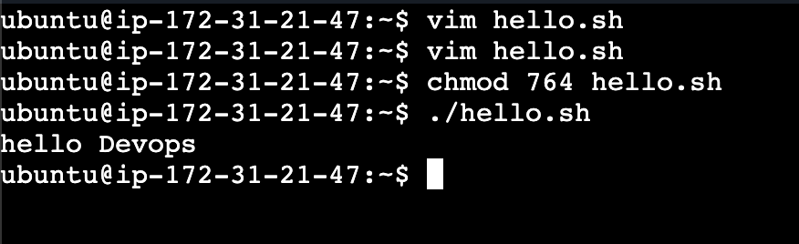
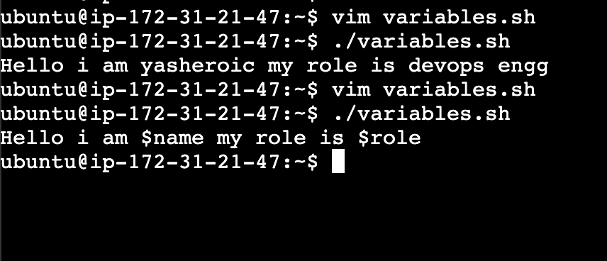
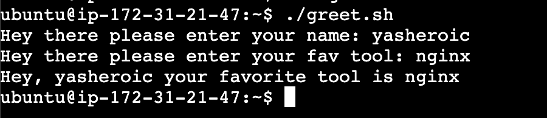
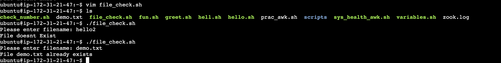
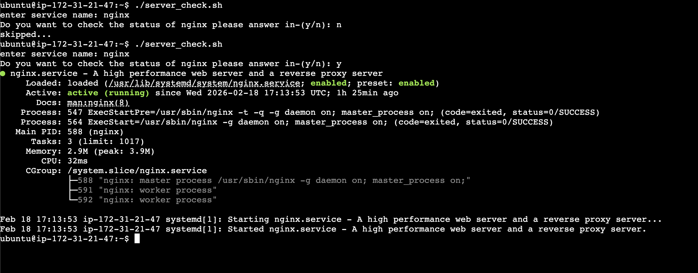

### Task 1: Your First Script

1. 

**Document:** What happens if you remove the shebang line?

-> it still runs since its a simple script. If we use conditions () , [] then it might fail or not run. we can use `bash hello.sh` it would work then

### Task 2: Variables
1. 
2. Single quotes ' ' treat $name as literal text, while double quotes " " expand $name to its variable value.

### Task 3: User Input with read

1. 

### Task 4: If-Else Conditions
1.  -> for if use ; then and end with fi. use [  ] for comparing
2. 

### Task 5: Combine It All

1. 

-----------