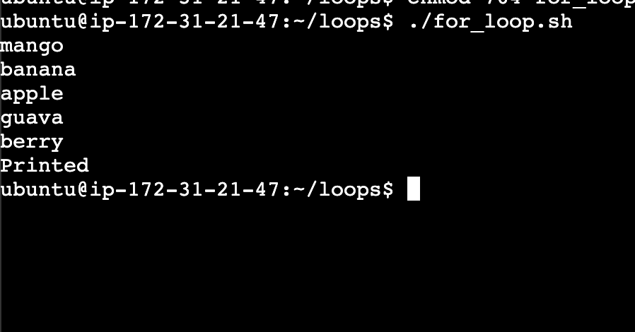
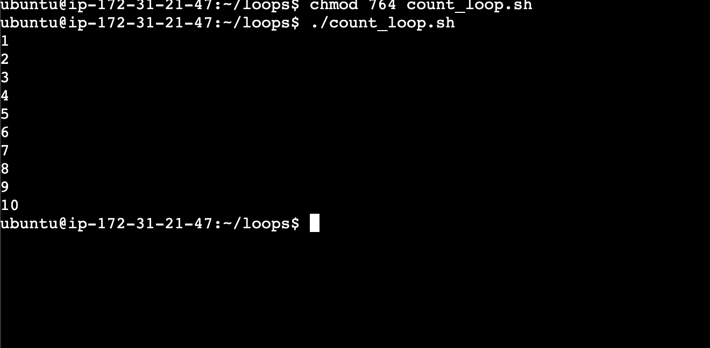
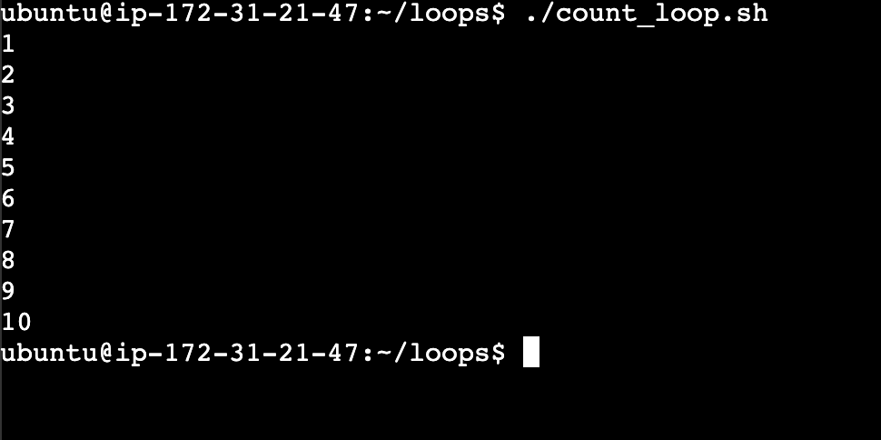
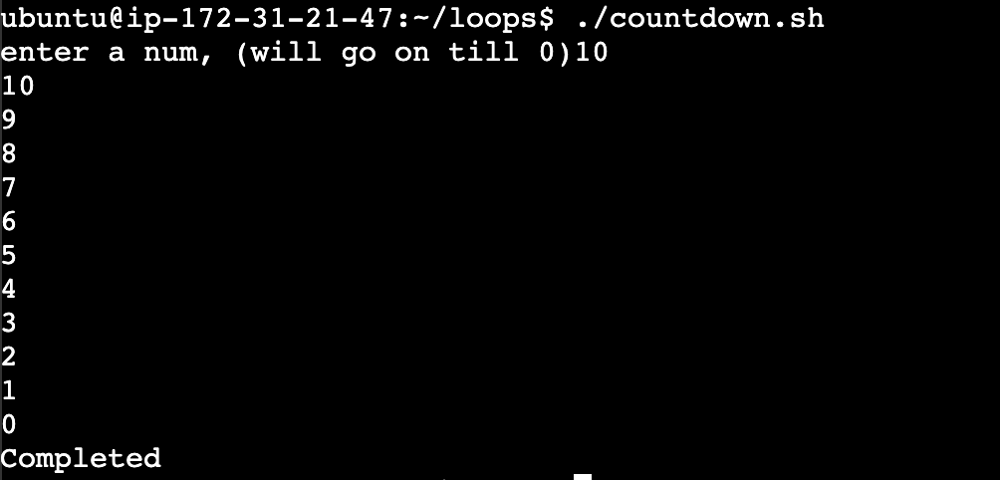
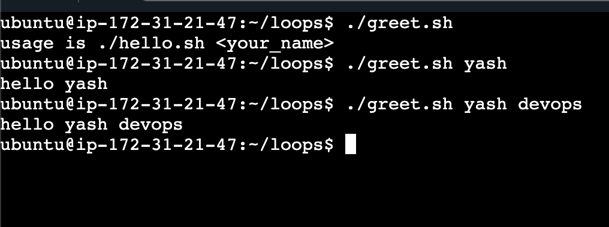
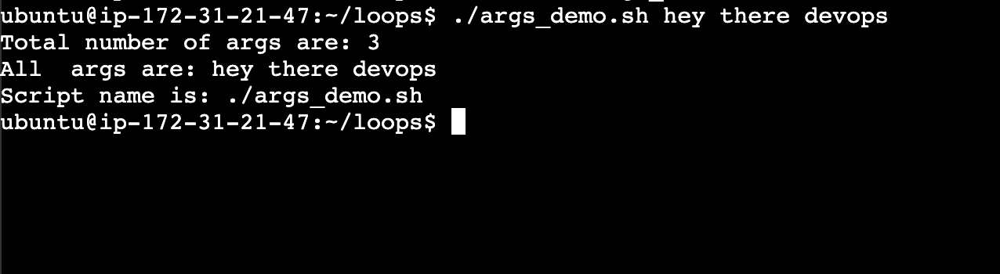
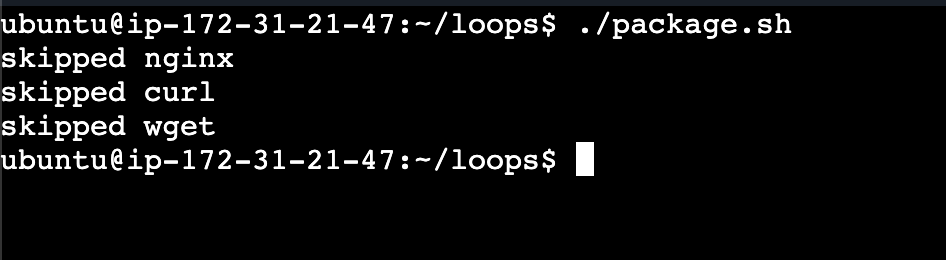
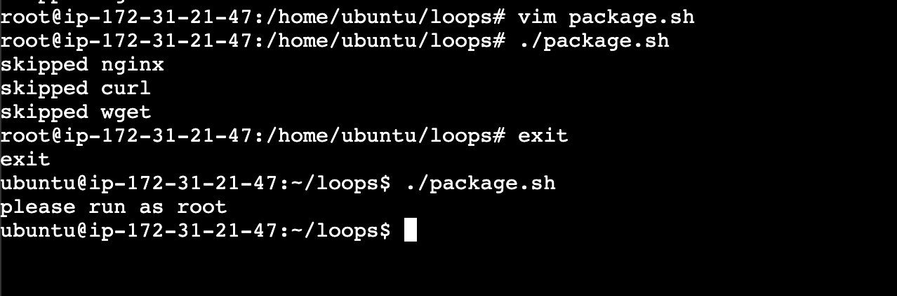
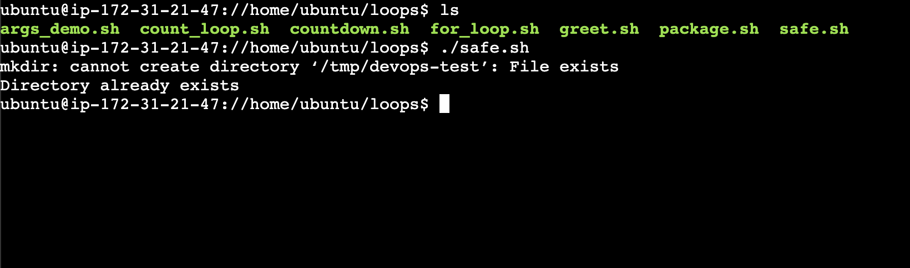

### Task 1: For Loop

1. 
2. 
**Note:** 
Inside (( )) (C-style loop), you don’t use -eq or -le.
Those are used in [ ] test conditions.

---

### Task 2: While Loop
1. 

---

### Task 3: Command-Line Arguments

1. 
2. 

---

### Task 4: Install Packages via Script
1. 
use array but can also use `for i in nginx curl wget`

2.

### Task 5: Error Handling
1. 