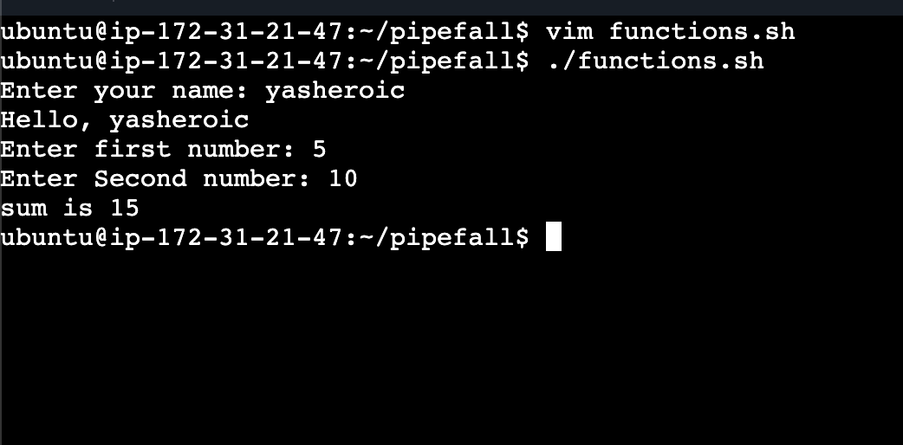
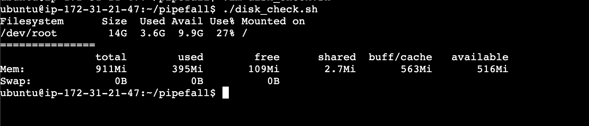
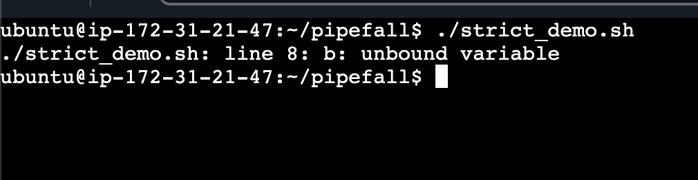
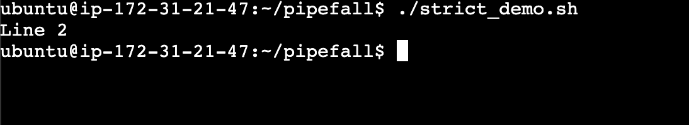
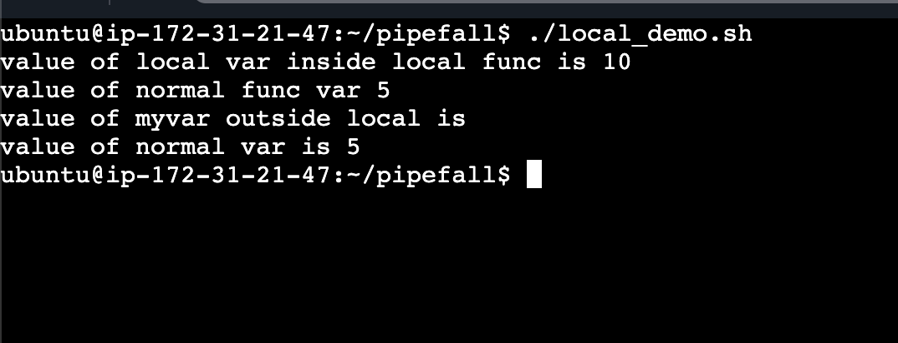
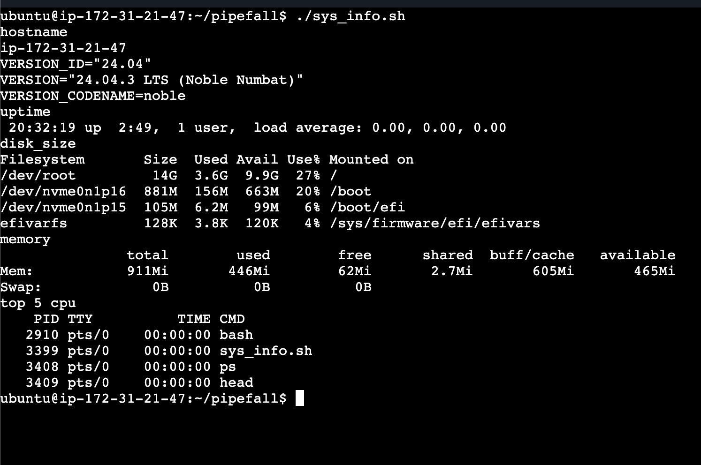

## Challenge Tasks

### Task 1: Basic Functions

1.. use mathematical funcs like this $((a+b))

### Task 2: Functions with Return Values

1.

### Task 3: Strict Mode — `set -euo pipefail`

1. 
2. because of set -e if any command fils next command wont work
3. .. what happens is when we use piepepail if either of one command of pipe fails the entire script stops
Imagine:

kubectl get pods | grep my-app

If kubectl fails but grep succeeds →
Without pipefail your CI might still pass 🤯

That’s dangerous.


 **short version** 👇

* **`-e`** → Exit immediately if a command fails (non-zero status)
* **`-u`** → Error if you use an undefined variable
* **`-o`** → Used to set shell options (like `pipefail`)
* **`pipefail`** → Makes a pipeline fail if *any* command in it fails

---

Common strict mode:

```bash
set -euo pipefail
```

Meaning:

* Stop on errors
* No undefined variables
* No hidden pipeline failures

That’s it. 🚀


### Task 4: Local Variables

1-3.  
local var -> not accessible outside func

🔥 Why This Matters (Real DevOps Insight)

If you don’t use local:

Variables leak globally

- Large scripts break unexpectedly
- Functions overwrite each other’s variables
- Debugging becomes painful

In production scripts → always use local inside function


### Task 5: Build a Script — System Info Reporter
1. 
