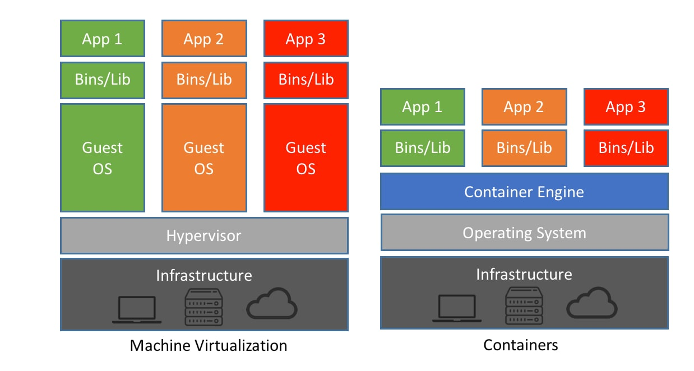
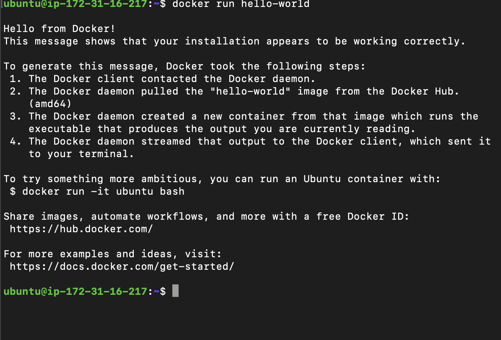
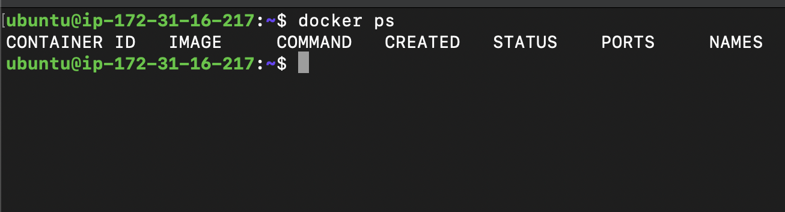
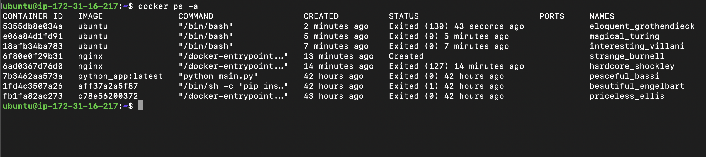
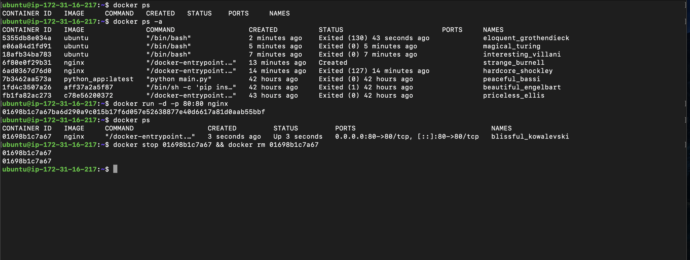

## Challenge Tasks

### Task 1: What is Docker?

- 1.1. Containers: These are like a box where we put all our code and dependies and environment in a single place and anyone can anyone can pull in the image and run the container without setting up the environment and installing dependencies. No more it works on my machine issue

- 1.2. In containers they use shared resources on our HOST OS and when they are not in use they dont use it. We dont need another layer of hypervisor and fixed memory and storage for them. no need for high end OS we can use lightwieght os image in containers

- 1.3. Docker Architecture->
a. Docker Client: Suppose this as the first thing which talks to docker daemon(docker d). it is the layer between users and docker daemon. we users write instructions or give commands through docker client which docker client gives it to docker daemon
b. docker engine: contains Docker CLI(client+ docker daemon + REST api)
c. docker daemon: to build image and run containers.
d. docker registry: this is the official place where all docker images are stored so anyone with authorization can pull and use those images
e. dockerfiles: these are used to create docker images
f. docker images: these are created from dockerfiles which needs to be run to create a container.
g. docker container: it is created from docker image which runs the app inside it

- Framed Answer (Task 1)
Yash — since you're moving deeper into DevOps, I’ll review this like a mentor reviewing a submission 👇

Short answer: **Concept is correct ✅ but structure + clarity needs improvement.**
You understand Docker, but the explanation needs to be sharper and more technically accurate.

Let’s refine it properly.

---

# ✅ Task 1: What is Docker?

## 1️⃣ What is a Container & Why Do We Need It?

A **container** is a lightweight, isolated environment that packages:

* Application code
* Runtime
* Libraries
* Dependencies
* Environment variables

into a single unit called an **image**, which runs as a **container**.

### Why do we need containers?

* Eliminates “It works on my machine” problem
* Same environment in Dev, Test, Prod
* Faster startup than VMs
* Lightweight (shares host OS kernel)
* Easy scaling in microservices

---

## 2️⃣ Containers vs Virtual Machines


### 🖥 Virtual Machines (VMs)

* Each VM has:

  * Full Guest OS
  * Virtual hardware
  * Hypervisor layer
* Heavy
* Fixed RAM & disk allocation
* Slower boot time

---

### 📦 Containers


* Share Host OS kernel
* No hypervisor needed
* Lightweight
* Fast startup
* Uses resources only when running

---

### 🔥 Real Difference (Interview Line)

> VMs virtualize hardware.
> Containers virtualize the OS.

---

## 3️⃣ Docker Architecture

Your explanation is close, but slightly mixed up.
Let me correct it cleanly:

---

### 🧱 Docker Architecture Components

```
User → Docker Client → Docker Daemon → Containers
                     ↘ Images ↔ Registry
```

---

### 1️⃣ Docker Client

* CLI (`docker build`, `docker run`)
* Sends commands to Docker Daemon via REST API

---

### 2️⃣ Docker Daemon (`dockerd`)

* Background service
* Builds images
* Runs containers
* Manages networks & volumes

👉 Important:
**Docker Engine = Docker Daemon + REST API + CLI**

You slightly separated daemon & engine incorrectly.

---

### 3️⃣ Docker Image

* Blueprint of a container
* Read-only template
* Created using a Dockerfile

---

### 4️⃣ Docker Container

* Running instance of an image
* Has writable layer
* Isolated process

---

### 5️⃣ Docker Registry

Example:

* Docker Hub
* Amazon Elastic Container Registry

Stores Docker images so others can pull them.

---

### 6️⃣ Dockerfile

* Text file
* Contains instructions to build image
* Example steps:

  * FROM
  * COPY
  * RUN
  * CMD

---

# 🧠 How You Should "Draw" Architecture in Interview

You can say:

> User gives command → Docker Client → Docker Daemon →
> Daemon builds image or runs container →
> If image not present → pulls from Registry →
> Container runs as isolated process on Host OS.


# 🚀 Advice for You (DevOps Path)

Start thinking in this flow:

App → Dockerfile → Image → Registry → EC2 → Container → Nginx → CI/CD


### Task 2: Install Docker

1. 

### Task 3: Run Real Containers

1. 
2. docker run -it ubuntu

🧠 Key Concept

A container runs as long as its main process runs.

In your case:

Main process = /bin/bash
No interactive terminal attached → exits immediately
Container status = Exited (0)

So there are no logs.

- docker ps:

no active container since we deleted nginx

- docker ps -a
 all containers even the ones which are not running

- docker stop <container_id> && docker rm <container_id>


### Task 4: Explore

1. we can execute other commands which the container runs in background
2. docker run -d --name nginx-app nginx
3. docker run -d -p 80:80 nginx
4. docker logs <container_id> 
5. docker exec -it <container name/id> bash
