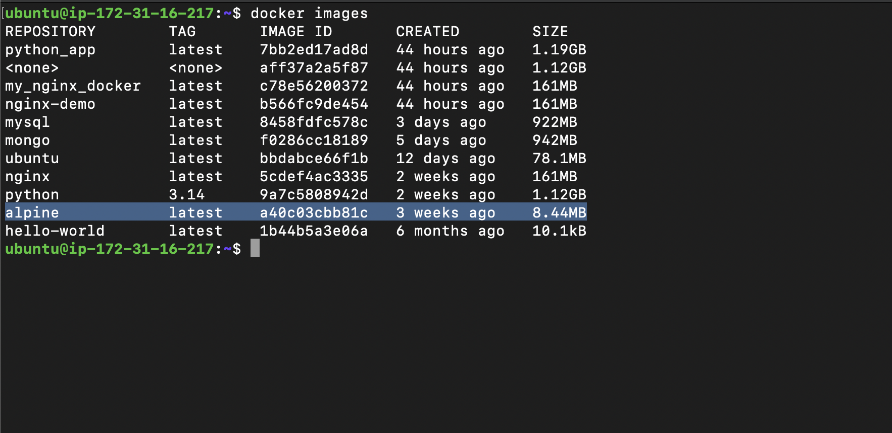
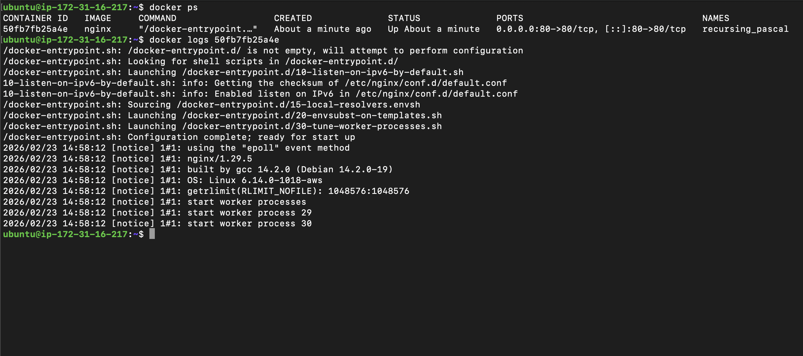

## Challenge Tasks

### Task 1: Docker Images

1. 2.  docker images

a. ubuntu -> 78.1 MB
b. alpine -> 8.44 MB
c. nginx ->  161 MB

3. alpine is smaller since it has a minimal 0S, only essential system files
4. docker inspect nginx
we can see its exposed ports, ENV,os,layers etc

5. docker rmi alpine

🔎 Why Alpine is Much Smaller
1️⃣ Minimal Base System

ubuntu is a full-featured OS

alpine is a minimal Linux distribution

Ubuntu includes:

Many default packages

System utilities

Full GNU tools

Extra libraries

Alpine includes:

Only essential system files

BusyBox instead of full GNU utilities

Very few preinstalled packages

--------------

### Task 2: Image Layers

1. it shows all layers of nginx image which built from dockerfile
2.3.  Docker images are made up of multiple read-only layers, where each Dockerfile instruction creates a new layer. Layers allow Docker to cache builds, share common components between images, and reduce storage usage. Layers that modify the filesystem increase image size, while metadata-only instructions show 0B because they don't add files.

Perfect 👍 here’s a **short, clean notes version** you can copy:

---

## 🔹 Why Docker Uses Layers

### 1️⃣ Caching (Faster Builds)

* Each Dockerfile instruction creates a layer.
* If a layer doesn’t change, Docker reuses it.
* Only changed layers rebuild.
* Makes builds much faster.

Docker checks each layer:

FROM → unchanged → reuse cache

WORKDIR → unchanged → reuse

COPY package.json → unchanged → reuse

RUN npm install → unchanged → reuse (important!)

COPY . . → changed → rebuild from here

CMD → reused

⚡ So npm install DOES NOT run again.

That’s why ordering matters.

---

### 2️⃣ Efficient Storage

* Layers are stored only once on disk.
* Multiple containers/images can share the same base layers.
* Saves disk space.

---

### 3️⃣ Faster Pulls

* When pulling an image, Docker downloads only missing layers.
* If base layer already exists, it skips downloading it again.
* Reduces network usage and speeds up deployment.

---

### 🔥 Key Point

> Layers are read-only and immutable.
> If one layer changes, all layers above it rebuild.

---

### Task 3: Container Lifecycle
1. 2. 3. On pausing docker pause <container_id> and doing docker ps -a it shows status `Up 18 seconds (Paused) `

4. docker unpause 1e4f74e2bdc4
5. Exited (0) 2 seconds ago
6. Up 2 seconds
7. Exited (137) 4 seconds ago
8. docker rm 1e4f74e2bdc4

- Difference: stop vs kill
**✅ docker stop**
# docker stop my-container

- Sends SIGTERM first
- Gives container time (default 10 seconds) to shut down properly
- Graceful shutdown
- Then sends SIGKILL if needed

**❌ docker kill**
# docker kill my-container

- Sends SIGKILL immediately
- No cleanup
- No waiting
- Like pulling the power plug

**🎯 When Would You Use kill?**

- Container is frozen
- App not responding
- docker stop not working
- Emergency situation

### Task 4: Working with Running Containers

1. docker run -d -p 80:80 nginx
2. docker logs 50fb7fb25a4e

3. docker logs -f 50fb7fb25a4e
4. docker exec -it 50fb7fb25a4e bash
5. docker exec 50fb7fb25a4e ls
6.  docker inspect 50fb7fb25a4e | grep -i "IP" `or to run in single commnad`
docker inspect 50fb7fb25a4e | grep -Ei "port|IP|MOUNTS|VOLUME"

a.  "IPAddress": "172.17.0.2",
b.  "HostPort": "80"
c.  "Mounts": [],
            "ExposedPorts": 
            "Volumes": null,

-----------

### Task 5: Cleanup

1. docker stop $(docker ps -q)
2. docker rm -f $(docker ps -aq)
3. docker image prune -a / docker image prune [-a makes all images which are tagged also get removed]
4. docker system df

----