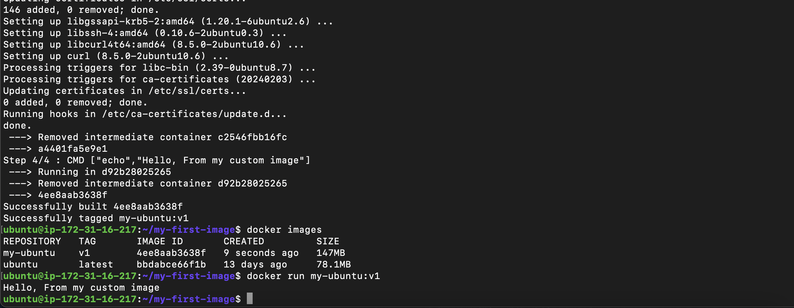
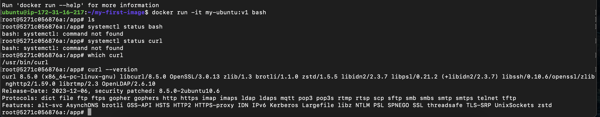
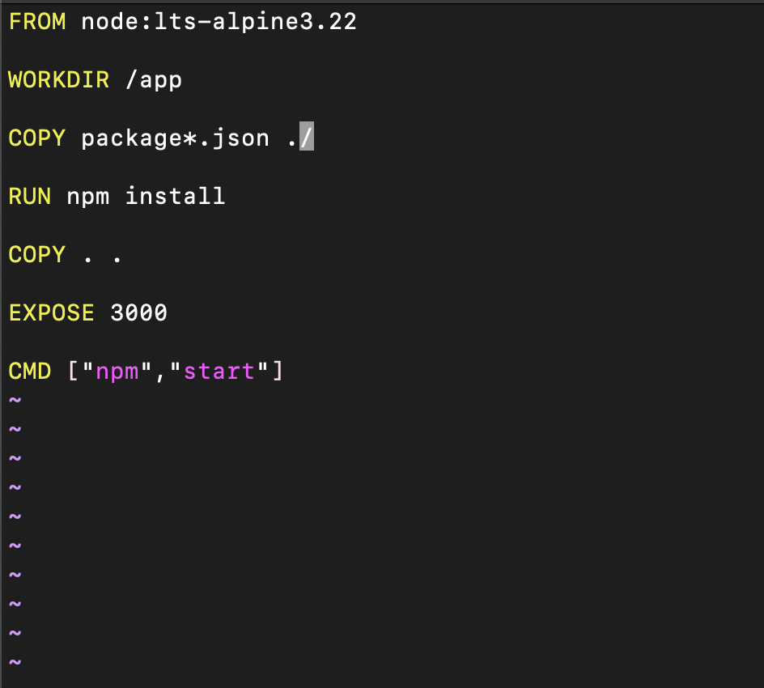
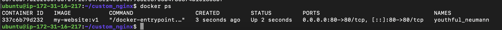
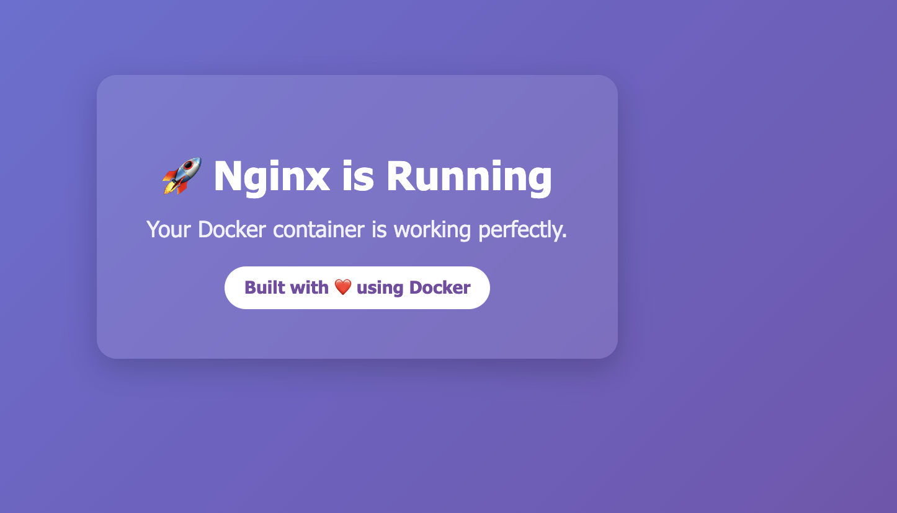
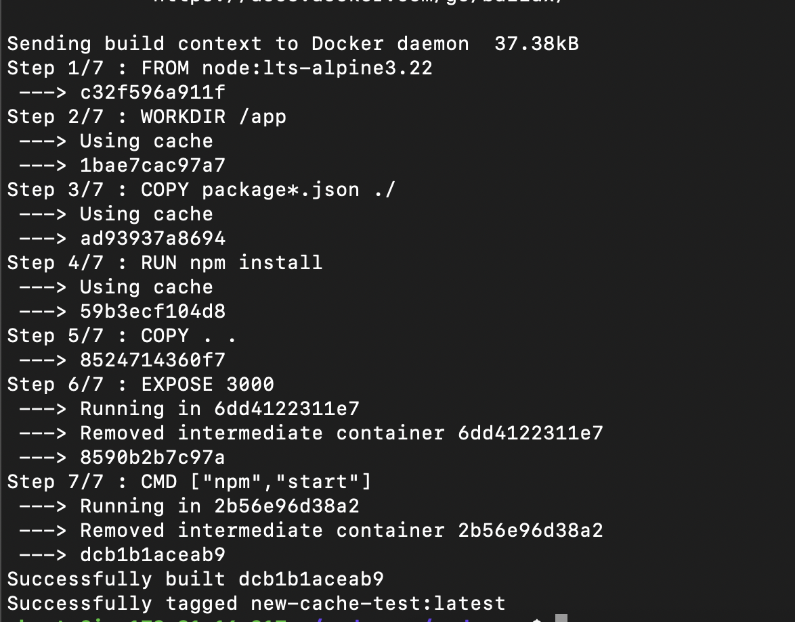

## Challenge Tasks

### Task 1: Your First Dockerfile

1. 2. 3. 4. 

5. to check if bash is installed or not inside the container do `docker run -it my-ubuntu:v1 bash` then inside container type `which bash` or `bash --version` or we can also do `docker run -it my-ubuntu:v1 which curl`

  

### Task 2: Dockerfile Instructions

1. 

What each line does:

- FROM → Sets the base image (Node + Linux).
- WORKDIR → Sets working folder inside container.
- COPY → Copies files from your system to the image.
- RUN → Executes command during build time.
- EXPOSE → Documents which port app uses.
- CMD → Default command when container starts.

### Task 3: CMD vs ENTRYPOINT
1. with cmd the hello world can be replaced when executed like docker run -it myapp ls. so it will it run ls command and wont run hello worl. default command and repalaceable

2. wit entrypoint it only appends and it does not take any argument like entrypoint ["echo","hello"]. on running if we do docker run -it myapp:v1 ls it will print hello ls and not list it

3. ✅ Use CMD when:

You want to provide a default command

But allow the user to override it completely

The container is flexible

Example:
CMD ["python", "app.py"]

User can override:

docker run myimage bash

👉 Runs bash instead of python app.py

Think: CMD = default suggestion

✅ Use ENTRYPOINT when:

The container should always run a specific main program

You want to treat the container like a fixed executable

Only arguments should change

Example:
ENTRYPOINT ["node"]

Now:

docker run myimage app.js

Runs:

node app.js

User cannot replace node unless using --entrypoint.

Think: ENTRYPOINT = fixed main command

🔥 Best Production Pattern (Very Common)
ENTRYPOINT ["node"]
CMD ["server.js"]

Now:

docker run myimage

Runs:

node server.js

And:

docker run myimage app.js

Runs:

node app.js

👉 ENTRYPOINT = fixed program
👉 CMD = default argument

This is how real production images are built (nginx, postgres, etc.)

🧠 One-Line Memory Trick

CMD = default, replaceable

ENTRYPOINT = fixed, append-only

----

### Task 4: Build a Simple Web App Image

1. 2. 3. 4. 

### Task 5: .dockerignore

1. 2. 3. 4. Done in Task 2

### Task 6: Build Optimization

1. 2. 3. 

when in correct order if i only modify node server.js code and no change in package file then it doesnt do package.json file so it doesn again goes to that steps it takes it from cache and just updates the server.js code

🧪 Step 1 — Create a Simple App

Use this structure:

project/
 ├── Dockerfile
 ├── package.json
 └── server.js
Dockerfile (Version 1 – Not Optimized)
FROM node:18-alpine
WORKDIR /app
COPY . .
RUN npm install
CMD ["node", "server.js"]
🔨 Step 2 — First Build
docker build -t cache-test .

You’ll see:

Step 1/5 : FROM node:18-alpine
Step 2/5 : WORKDIR /app
Step 3/5 : COPY . .
Step 4/5 : RUN npm install
Step 5/5 : CMD ...

All steps run fully.

🔁 Step 3 — Change One Line

Edit server.js:

console.log("Version 2");

Now rebuild:

docker build -t cache-test .
🔎 What You’ll Notice

Docker output:

Step 1/5 : FROM node:18-alpine  → Using cache
Step 2/5 : WORKDIR /app        → Using cache
Step 3/5 : COPY . .            → NOT cached
Step 4/5 : RUN npm install     → NOT cached
Why?

Because COPY . . changed (you modified server.js)

When that layer changes → all layers below it rebuild.

This is how Docker caching works.

🚀 Step 4 — Optimize Dockerfile

Now reorder like this:

FROM node:18-alpine
WORKDIR /app

COPY package.json .
RUN npm install

COPY . .

CMD ["node", "server.js"]
🔨 Build Again
docker build -t cache-test .

First build → full build.

Now change only server.js again.

Rebuild:

docker build -t cache-test .
🔎 Now You’ll See
Step 1: FROM → Using cache
Step 2: WORKDIR → Using cache
Step 3: COPY package.json → Using cache
Step 4: RUN npm install → Using cache
Step 5: COPY . . → Rebuild

🔥 Notice:

npm install did NOT run again.

Build is MUCH faster.

🧠 Why Layer Order Matters

Docker builds images in layers.

Each instruction = one layer.

If a layer changes:
→ All layers after it rebuild.

So:

❌ Bad Order

If you copy everything before installing dependencies,
any small code change forces npm install again.

✅ Good Order

Copy dependency files first,
install dependencies,
then copy frequently changing source code.

**Why does layer order matter?**

- Docker caches each layer.
- If a layer changes, all following layers rebuild.
- Frequently changing files should be copied last.
- Stable steps (like dependency install) should be early.
- Proper ordering improves build speed dramatically.

🧠 DevOps Mental Model

Stable layers → Top
Changing layers → Bottom

Think:
“Which files change often?” → move them lower.