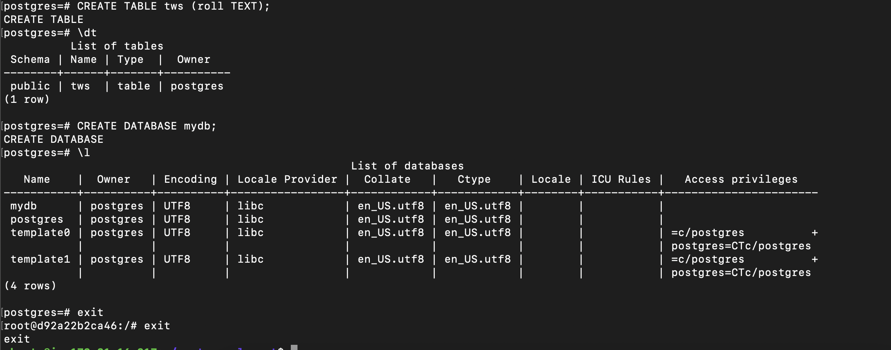
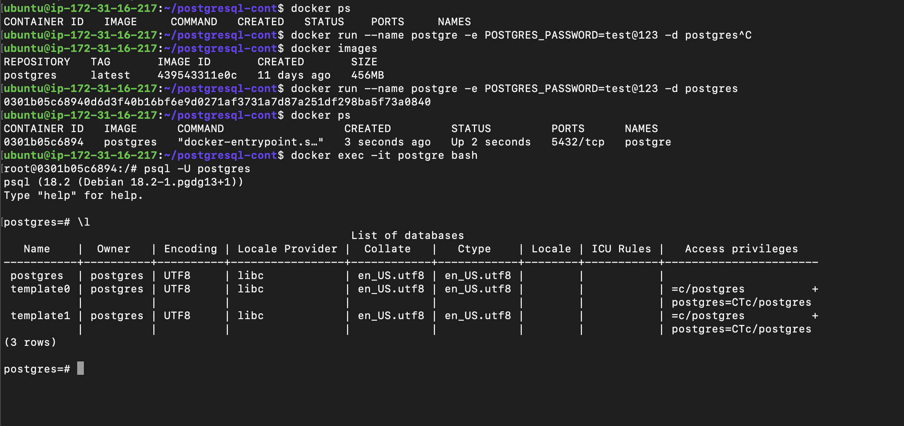
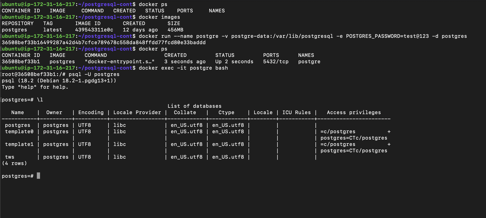
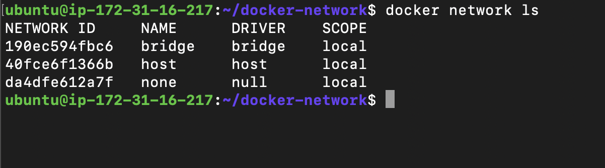
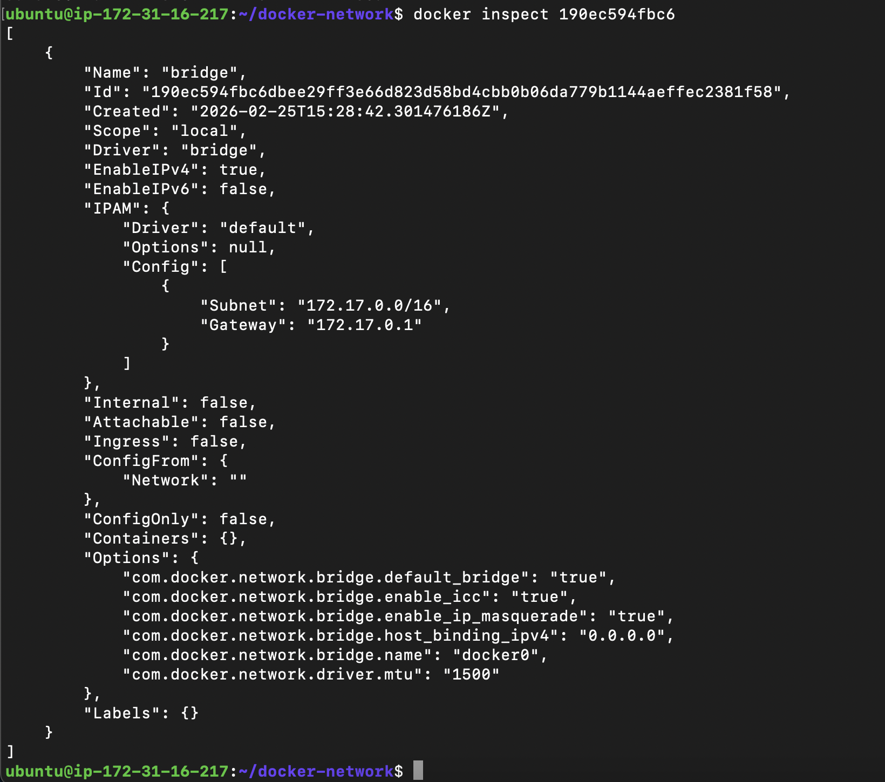
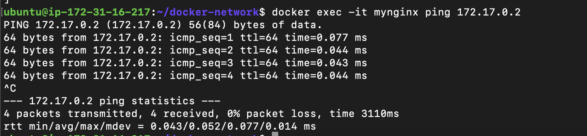
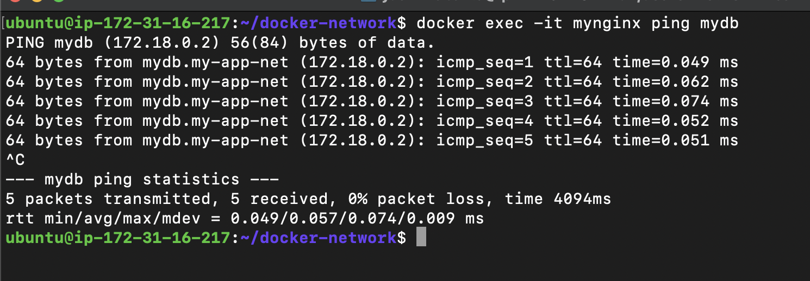

## Challenge Tasks
### Task 1: The Problem

1. 


data is gone

data is gone because we didnt attach a volume and containers are ephimeral so as containers got removed so did the data

### Task 2: Named Volumes

1.  -> `docker run --name postgre -v postgre-data:/var/lib/postgresql -e POSTGRES_PASSWORD=test@123 -d postgres`

`docker exec -it postgre bash`

`psql -U postgres`

`CREATE DATABASE tws;`

`\l`

we can see the db we created in prev container

- docker volume ls: shows all created volume

- docker volume inspect: shows info abt volume like mount etc

### Task 3: Bind Mounts

1. docker run -p 80:80 -v /home/ubuntu/nginx2:/usr/share/nginx/html/ -d nginx

4. whatever changes i make on index.html locally is getting changed inside the containers index.html too and getting reflected on the nginx web page

Yes ✅ you are 100% right.

What you observed is exactly how **bind mounts** work.

When you edit `index.html` on your host:

* It changes inside the container instantly
* Nginx serves the updated file
* Browser refresh reflects changes

That means your bind mount is working properly 👏

---

Now let’s write proper notes (infra-level explanation).

Since you're using:

🌐 Nginx
🐳 Docker

---

# 📌 Difference: Named Volume vs Bind Mount

## 🟢 1️⃣ Named Volume

Example:

```bash
docker run -v pgdata:/var/lib/postgresql/data postgres
```

### 🔹 Characteristics:

* Managed by Docker
* Stored inside Docker’s internal directory (`/var/lib/docker/volumes`)
* You don’t control exact host path
* Best for production databases
* Portable & safer
* Not tightly coupled to host filesystem

### 🔹 Use Case:

* Databases
* Persistent app data
* Production workloads

---

## 🔵 2️⃣ Bind Mount

Example:

```bash
docker run -v $(pwd):/usr/share/nginx/html nginx
```

### 🔹 Characteristics:

* Directly maps a host directory
* You control the exact path
* Changes reflect instantly
* Depends on host filesystem structure
* Less portable

### 🔹 Use Case:

* Local development
* Live code editing
* Testing static files

---

# 🧠 What You Just Observed

With bind mount:

```
Host Folder  <----->  Container Folder
```

They are literally the same files.

No copy.
No duplication.
Direct filesystem mapping.

That’s why changes are instant.

---

# 🔥 Short Interview-Ready Answer

> A named volume is managed by Docker and is used for persistent container data, especially in production.
> A bind mount directly maps a host directory into the container and is mainly used for development where live file changes are required.

---

# 🚀 Extra DevOps Insight (Important)

| Feature                     | Named Volume | Bind Mount   |
| --------------------------- | ------------ | ------------ |
| Managed by Docker           | ✅            | ❌            |
| Good for DB                 | ✅            | ⚠️ Not ideal |
| Good for Dev                | ⚠️           | ✅            |
| Portable                    | ✅            | ❌            |
| Requires existing host path | ❌            | ✅            |

---

That’s why volumes are used for databases,
and bind mounts are used for development.

### Task 4: Docker Networking Basics

1. docker network ls

2. docker network <NETWORK ID>

3. docker exec -it mynginx ping mydb
ping: mydb: Name or service not known

ping by name doesnt work

`1st container` -> docker run --name mynginx --network bridge -p 80:80 -d nginx

`2nd container` -> docker run --name postgre --network bridge -v postgre-data:/var/lib/postgresql -e POSTGRES_PASSWORD=test@123 -d mydb

4. inspect mydb container
`docker inspect mydb` find IPV4 address or do `docker inspect mydb | grep IPAddress`

next do `docker exec -it mynginx ping 172.17.0.2`

see the output it pings

**so ping by name doesnt work but ping by IP works**



---
### Task 5: Custom Networks

1. docker network create -d bridge my-app-net
2. 
3. yes ping worked on named bridge networks

4. The default bridge network is a legacy network without automatic DNS-based service discovery, whereas user-defined bridge networks include Docker’s embedded DNS server, enabling containers to resolve each other by name.

------

Excellent question 👌 this is **core Docker networking architecture**.

Here’s the clean explanation you can write in your notes:

---

# 📌 Why Custom Networking Allows Name-Based Communication but Default Bridge Doesn't

## 🔹 Default `bridge` Network

* It is a **legacy network** created automatically by Docker.
* It does **NOT include Docker’s embedded DNS server** for container name resolution.
* Containers can communicate by **IP address only**.
* No automatic service discovery.
* Containers started separately are isolated at the DNS level.

👉 Result:
❌ `ping mydb` → fails
✅ `ping 172.17.x.x` → works

---

## 🔹 User-Defined (Custom) Bridge Network

When you create a network:

```bash
docker network create mynetwork
```

Docker automatically:

* Creates an **isolated virtual network**
* Enables an **embedded DNS server**
* Registers container names as DNS records
* Provides automatic service discovery

So containers can resolve each other using:

```bash
ping container_name
```

👉 Result:
✅ `ping mydb` → works
✅ `ping mydb` resolves to container IP automatically

---

# 🧠 Technical Reason (Important)

Docker runs an internal DNS server at:

```id="g7x6jq"
127.0.0.11
```

But this DNS server is enabled only for **user-defined bridge networks**, not the default `bridge`.

That is the architectural difference.

---

# 🎯 Real-World DevOps Insight

In production, we:

* NEVER rely on IP addresses (they change)
* Always rely on service names
* Use Docker Compose or custom networks

Example:

```yaml
services:
  web:
  db:
```

Here `web` talks to `db` by name — because Compose creates a custom bridge network.

### Task 6: Put It Together

**Completed**