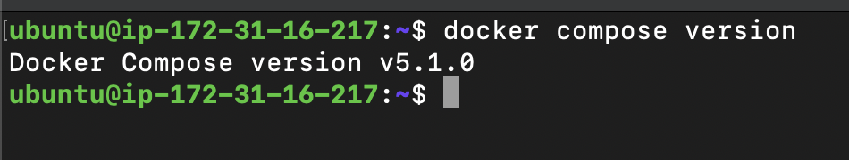
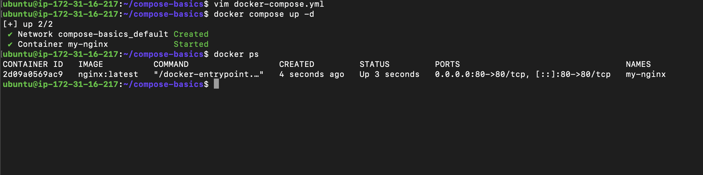
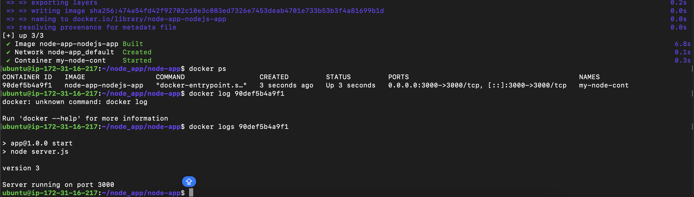
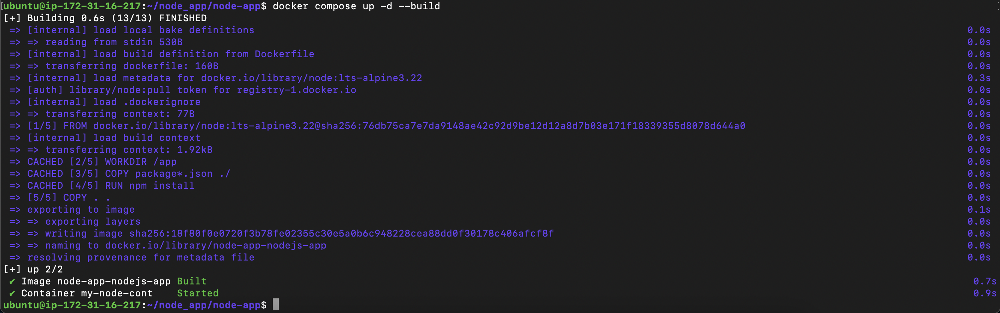
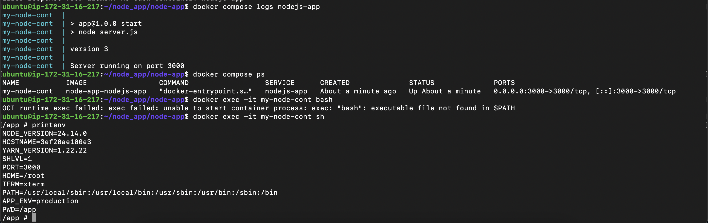

## Challenge Tasks

### Task 1: Install & Verify

1. 
It is installed

---

### Task 2: Your First Compose File

1. 2. 3. 4. 

---

### Task 3: Two-Container Setup
1. added docker-compose file

**Verify:** Stop and restart with `docker compose down` and `docker compose up` — is your WordPress data still there?

**ANSWERS: Yes data persists because of use of Named Mount**

### Task 4: Compose Commands

1. 2. 3. 

`docker logs <container_id>`

4. since this contains only 1 app i can see logs of only 1 service my node app
`docker compose logs nodejs-app`

5. To see logs of docker compose service we need to type

`doocker compose logs` not `docker logs`

to check one specific service -> `docker compose logs nodejs-app`

to check logs of all `docker compose logs all`

NAME            SERVICE       STATUS       PORTS
my-node-cont   nodejs-app    running      0.0.0.0:3000->3000/tcp

`use name of service`

7.  i changed server.js so i did this to build the image and it got immediately deploy to the container and changes were live
---

1. touch .env 
    - PORT=3000
    - APP_ENV=production
2. in docker-compose.yml file add
    - env_file:
        - .env
3. to verify run docker compose up -d
 docker exec -it <name> sh
 printenv

 

it will show all the env which we gave
