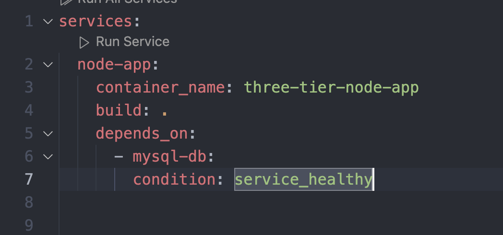
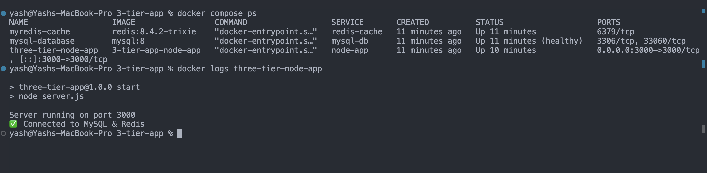
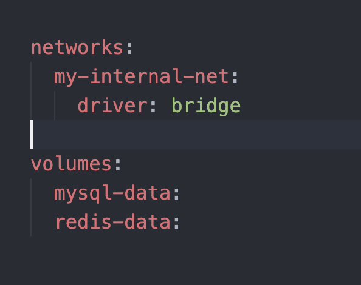

## Challenge Tasks

### Task 1: Build Your Own App Stack

1. 2026/day-34/Dockerfile

### Task 2: depends_on & Healthchecks

1. 3.  
2. 

Yes the app waits for the db to be healthy

### Task 3: Restart Policies
1. On restart always the db restarts itself 
2. docker kill mysql-database
3. on failure

🔹 restart: always

Use when:

Database containers

Backend APIs

Critical infrastructure

Production services

Services that must recover automatically after crash

After Docker daemon restart

After system reboot

Behavior:

Restarts after crash

Restarts after kill

Restarts after daemon restart

Does NOT restart after docker stop

Does NOT restart after docker compose down

🔹 restart: on-failure

Use when:

Background workers

Batch jobs

Data processing tasks

Containers that should restart only if they crash unexpectedly

Behavior:

Restarts only if exit code ≠ 0

Does NOT restart after manual stop

Does NOT restart after successful completion (exit code 0)
### Task 4: Custom Dockerfiles in Compose

Done

### Task 5: Named Networks & Volumes

1. 2. 3. 

### Task 6: Scaling (Bonus)
1. Try scaling your web app to 3 replicas using `docker compose up --scale`
2. What happens? What breaks?
3. Write in your notes: Why doesn't simple scaling work with port mapping?

### Task 6: Scaling (Bonus)
1. it wont work first we need to remove container_name then when we scale to 3 it will show error for por

`Bind for 0.0.0.0:3000 failed: port is already allocated`

f you try 3 replicas:

Container 1 wants host:3000

Container 2 wants host:3000

Container 3 wants host:3000

🚨 Impossible.

One host port cannot map to multiple containers.

3. .

🎯 This Is The Core Lesson

Scaling fails because:

Host port mapping is one-to-one.

Docker Compose has no built-in load balancer.

✅ Step 3 — How To Make Scaling Work

Remove the ports section entirely from node-app.

Like this:

node-app:
  build: .
  networks:
    - my-internal-net

Now run:

docker compose up -d --scale node-app=3

Now it WILL scale successfully.

Check:

docker ps

You’ll see:

3-tier-app-node-app-1
3-tier-app-node-app-2
3-tier-app-node-app-3
❓ But Now How Do You Access It?

You can’t from localhost.

Because no ports are exposed.

That’s where a reverse proxy comes in.

🧠 How Real Systems Handle This

When scaling:

[ Nginx ]
    ↓
node-app-1
node-app-2
node-app-3

Nginx acts as load balancer.

**Notes**

Why simple scaling doesn’t work with port mapping?

Because:

Each container tries to bind the same host port.

Host ports cannot be shared.

Docker Compose does not provide automatic load balancing.

You need a reverse proxy or orchestrator.