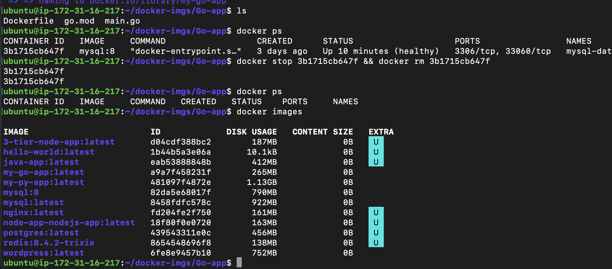
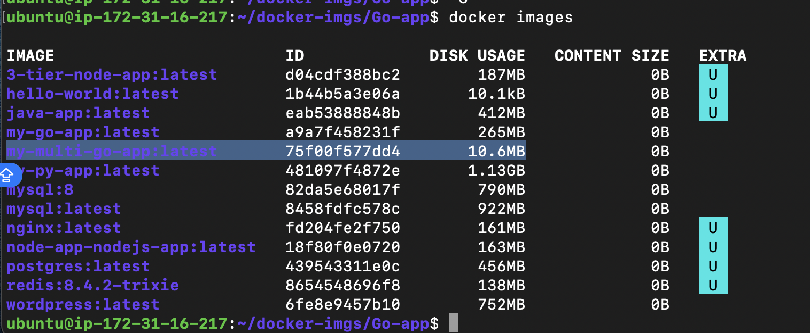
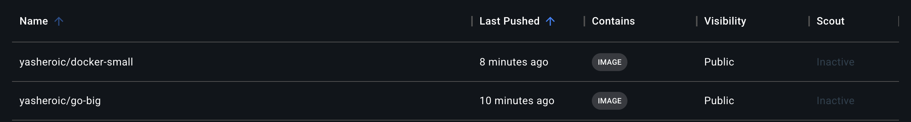
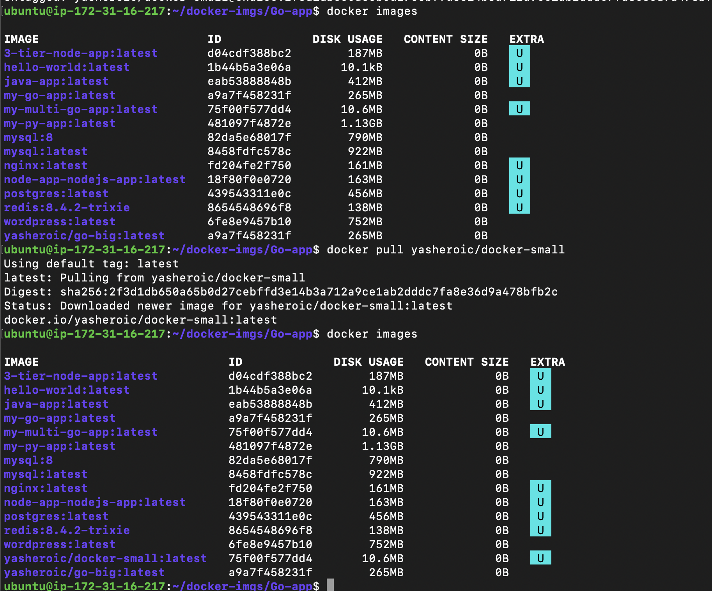
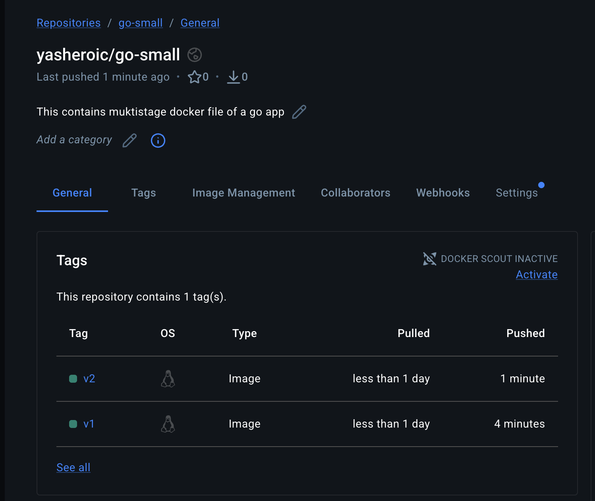
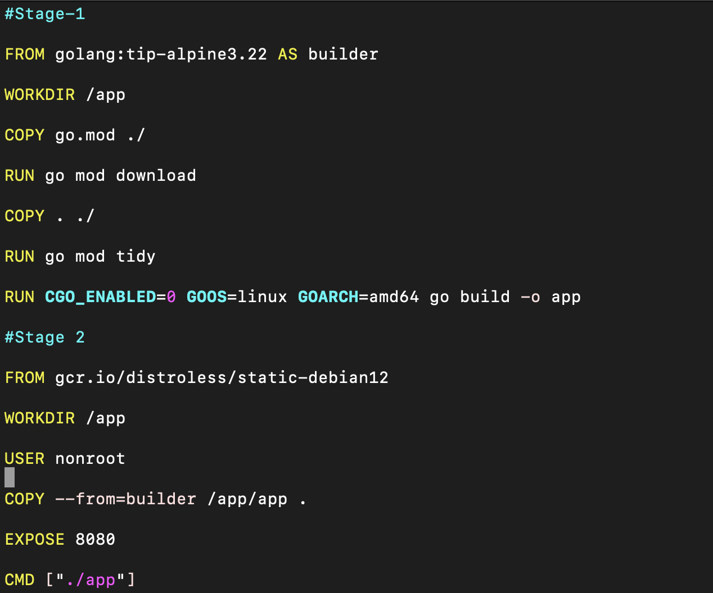

## Challenge Tasks

### Task 1: The Problem with Large Images

1. go.main
2. Dockerfile
3. 
`Size: 266 MB`

---

### Task 2: Multi-Stage Build

1. docker build -f Dockerfile.multistage -t my-multi-go-app .
2. my-multi-go-app:latest       75f00f577dd4       10.6MB

`SIZE: 10MB`

3. 266 MB `vs` 10.6 MB

**Why is the multi-stage image so much smaller?**

- Because of layer caching during builder stage we compile it and in the final stage only the app with dependencies is compied we dont build there and in final stage we use distroless image so no tools are installed so it is very light

*🧠 Proper Interview-Level Answer*

`The multi-stage image is much smaller because the final stage only includes the compiled application binary and a minimal base image. The build tools, Go compiler, source code, and intermediate files from the builder stage are not included in the final image. This significantly reduces the image size.`

***Multi-stage image***

*Stage 1:*

- Uses large golang image
- Compiles binary

*Stage 2:*

- Uses distroless (very minimal)
- Copies ONLY /app/app binary

*Final image contains:*

- Minimal base OS
- One compiled binary
- Size ≈ 10–20MB

### Task 3: Push to Docker Hub
1. 2. 3. 4. 
5. 

---

### Task 4: Docker Hub Repository
1. 2. Done
3. 
- docker tag yasheroic/go-small:v1 yasheroic/go-small:v2
- 
4. 
- Pulling without tag → pulls latest
- Pulling specific tag → pulls that exact version
- If latest changes, future pulls get new version
- Versioned tag remains stable

### Task 5: Image Best Practices

1. 2. 3. 4. 5. 
