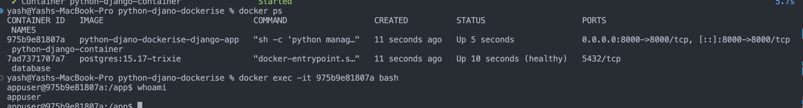

## Challenge Tasks

### Task 1: Pick Your App

1. Create a Python-django app with postgres db

### Task 2: Write the Dockerfile

*Important*
| Stack  | Dependency Location | Copied in Multi-stage? |
| ------ | ------------------- | ---------------------- |
| Python | /usr/local          | ✅ Yes                  |
| Node   | /app/node_modules   | ✅ Yes                  |
| Java   | Bundled in JAR      | ❌ No (only jar copied) |
| Go     | Compiled binary     | ❌ No                   |
| PHP    | /app/vendor         | ✅ Yes                  |
| Ruby   | /usr/local/bundle   | ✅ Yes                  |

### Task 3: Add Docker Compose

- 1 to 6: Added both docker compose and docker multistage file
### Task 4: Ship It
1.  docker tag python-djano-dockerise-django-app yasheroic/django-app:latest
2. docker push yasheroic/django-app:latest
3. docker pull yasheroic/django-app:latest
4.     Started                                                                                                    5.8s 
yash@Yashs-MacBook-Pro python-djano-dockerise % docker ps
CONTAINER ID   IMAGE                         COMMAND                  CREATED         STATUS                   PORTS                                         NAMES
ff6129590f00   yasheroic/django-app:latest   "sh -c 'python manag…"   8 seconds ago   Up 2 seconds             0.0.0.0:8000->8000/tcp, [::]:8000->8000/tcp   python-django-container
8eac33049867   postgres:15.17-trixie         "docker-entrypoint.s…"   8 seconds ago   Up 8 seconds (healthy)   5432/tcp                                      database