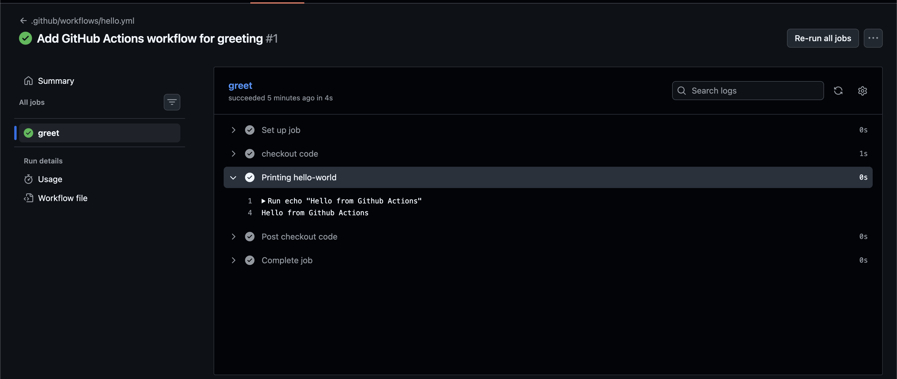
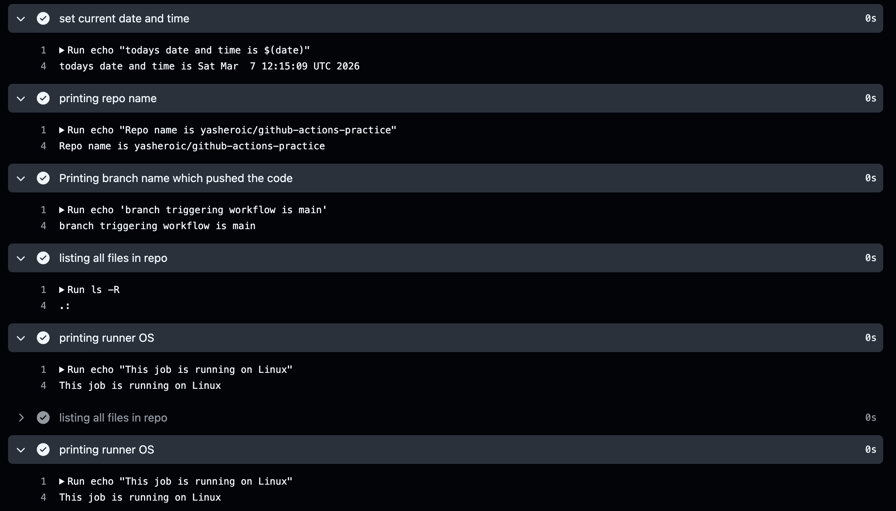

## Challenge Tasks

### Task 1: Set Up

- [✅] Done

### Task 2: Hello Workflow

1. 2. 3. 4. 
5. 2026/day-40/hello.yml

### Task 3: Understand the Anatomy

- `on:` Trigger->This checks push,pull request or manual trigger.
- `jobs:` these are the individual jobs and a worlflow can have multiple jobs like `test` , `build` , `deploy`
- `runs-on:` these are the runners on which the jobs run on. every job needs an individual runner
- `steps:` each job can have multiple step liek checking out repo, installing deps etc
- `uses:`these are where we use github defined actions or community defined actions like action/checkout@v4
- `run:` these are the places where we write user defined shell commands
- `name:` (on a step): these act as a description for each step

---

Your understanding is **mostly correct**, just a few small corrections and clearer wording will make it **technically accurate**.

Here is a **cleaned-up version** you can use in notes or README.

---

### GitHub Actions Workflow Anatomy

* **`on:` Trigger**
  Defines **when the workflow runs**.
  Examples: `push`, `pull_request`, `workflow_dispatch` (manual trigger), `schedule`, etc.

* **`jobs:`**
  A workflow contains one or more **jobs** such as `build`, `test`, or `deploy`.
  Jobs run **independently by default** and can also depend on other jobs using `needs:`.

* **`runs-on:`**
  Specifies the **runner (machine/OS)** where the job will execute.
  Example: `ubuntu-latest`, `windows-latest`, `macos-latest`.
  **Each job gets its own runner.**

* **`steps:`**
  A job consists of multiple **steps** executed **sequentially**.
  Steps can run commands or use actions.

* **`uses:`**
  Used to **run a pre-built GitHub Action** created by GitHub or the community.
  Example: `actions/checkout@v4`.

* **`run:`**
  Used to execute **custom shell commands/scripts** inside the runner.
  Example: `npm install`, `docker build`, `echo "Hello"`.

* **`name:` (optional)**
  Provides a **human-readable label** for the workflow, job, or step so it’s easier to understand in the **Actions UI logs**.

---
### Example With Anatomy

```yaml
name: Hello Workflow

on: push

jobs:
  greet:
    runs-on: ubuntu-latest

    steps:
      - name: Checkout code
        uses: actions/checkout@v4

      - name: Print message
        run: echo "Hello from GitHub Actions!"
```

---

### DevOps Insight

The **hierarchy of a workflow** is:

```
Workflow
 └── Jobs
      └── Steps
           ├── uses (action)
           └── run (shell command)
```

### Task 4: Add More Steps

1. 

### Task 5: Break It On Purpose

0s
Run exit 1
Error: Process completed with exit code 1.

*What does a failed pipeline look like?*

The workflow run shows a red ❌ status in the GitHub Actions tab.

- The job stops executing after the failing step.
- Steps after the failure are skipped.

- Logs show the exact command that failed.

*How do you read the error?*

- Open the workflow run in the Actions tab.

- Click the failed job.

- Click the failed step.

- Check the logs to see the command and error message.

- Identify the failing command and fix it.

#### Important

- To check branch: ` ${{ github.ref_name }}`
- to check repo name: `${{ github.repository }}`
- To check os: `${ runner.os }`
- To list files: `ls -R`
- to print date and time: `$(date)`