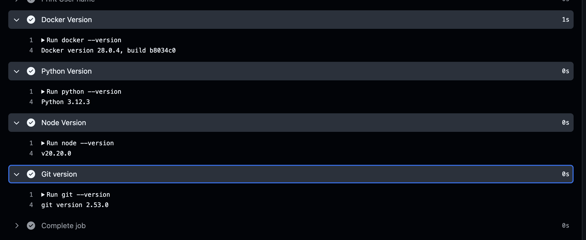
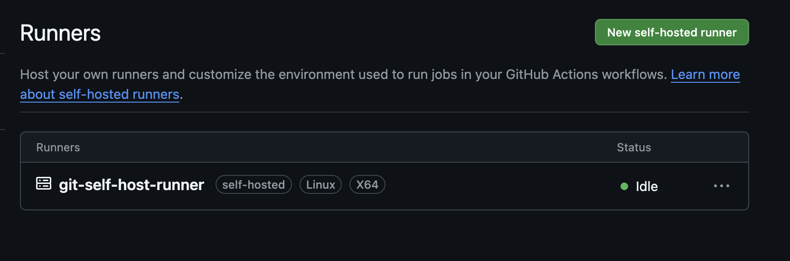
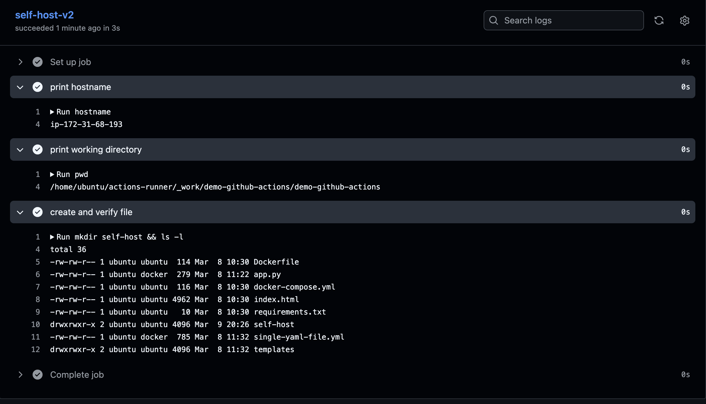
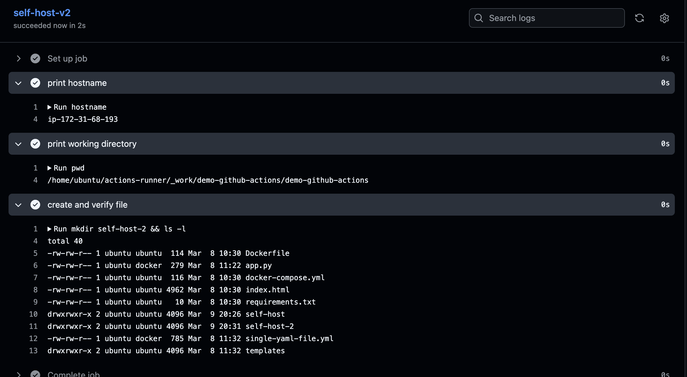

## Challenge Tasks

### Task 1: GitHub-Hosted Runners

- **Ubuntu**
Run echo "OS is Linux"
*OS is Linux*

Run hostname
*runnervm0kj6c*

Run whoami
*runner*

- **Macos**
Run echo "OS is macOS"
*OS is macOS*

Run hostname
*iad20-eo1213-43516a9b-eafd-4b18-8238-eb4a9d468b0f-B696867C65AD.local*

Run whoami
*runner*

- **Windows**

Run echo "OS is Windows"
*OS is Windows*

Run Write-Host $env:COMPUTERNAME
*runnervmkjq7x*

Run Write-Output "Runner user is $env:USERNAME"
*Runner user is runneradmin*

- What is a GitHub-hosted runner? Who manages it?

*Answer:* `A GitHub-hosted runner is a temporary virtual machine provided and managed by GitHub where GitHub Actions workflows run. GitHub automatically provisions, configures, and destroys the VM after the workflow finishes.`

`For public repositories, GitHub provides unlimited free minutes, while private repositories on the free plan get 2000 minutes per month.`

---
### Task 2: Explore What's Pre-installed

**If ubuntu-latest runner comes with pre installed python or docker why do we set it up again using setup action?**

- Yes, **`ubuntu-latest` runners already have Python installed**, but we still use **`actions/setup-python`** to control the Python version and ensure consistent builds.

### Key reasons

**1. Specify a Python version**

The runner may have multiple versions, but not the one your project needs.

```yaml
- uses: actions/setup-python@v5
  with:
    python-version: '3.11'
```

This guarantees the workflow uses **Python 3.11**.

---

**2. Consistent builds**

GitHub can update `ubuntu-latest`, which may change the default Python version.
Using `setup-python` ensures your workflow always runs with the **same version**.

Example:

```
Without setup-python → Python 3.10
After runner update → Python 3.12 (build may break)
```

---

**3. Dependency caching**

It allows caching dependencies to speed up workflows.

```yaml
- uses: actions/setup-python@v5
  with:
    python-version: '3.11'
    cache: 'pip'
```

---

✅ **Summary:**
Even though Python is preinstalled on GitHub runners, `setup-python` is used to **select a specific version, ensure consistency, and enable dependency caching.**


1. 


2. 
- **Programming Languages & Runtimes:** The image includes support and various versions for popular languages.

.NET

Go

Java (multiple LTS versions of Eclipse Temurin and others)

Node.js (multiple LTS versions)

Python (multiple popular versions, including PyPy)

Ruby

PHP

Rust

Swift

Erlang

- **Package Managers:**

APT (for Ubuntu system packages)

pipx (for Python packages)

- **Third-Party Repositories & Tools:**
Docker and Docker Compose

Git and Git LFS

Google Cloud CLI

PostgreSQL

MongoDB

- *Various build tools like:* Ant, Gradle, and Maven

- **Other Development Tools:**
Clang, GCC, and GNU C++ compilers

Android SDK and NDK

Microsoft Edge and Firefox web browsers (and their webdrivers)

- **Why does it matter that runners come with tools pre-installed?**

It matters because **pre-installed tools make workflows faster, simpler, and easier to maintain**.

### 1. Faster workflow execution

Since tools are already installed, you don’t need to install them every time.

Example:

```yaml
- run: python --version
```

Instead of doing:

```yaml
- run: sudo apt-get install python3
```

This **saves several minutes** in CI/CD pipelines.

---

### 2. Less setup in workflows

You can directly use tools like **Docker, Node, Python, Git** without writing installation steps.

Example:

```yaml
- run: docker build -t myapp .
```

No need to install Docker first.

---

### 3. More reliable builds

GitHub maintains these tools and versions on the runner, so the environment is **consistent across runs**.

Example:

```yaml
runs-on: ubuntu-latest
```

Every run gets a **clean VM with the same preinstalled tools**.

---

✅ **Summary:**
Pre-installed tools on GitHub runners **reduce setup time, speed up workflows, and provide a consistent environment for CI/CD pipelines.**

### Task 3: Set Up a Self-Hosted Runner

- 

### Task 4: Use Your Self-Hosted Runner

- 

**Verify:** Check your machine — is the file there? - YES ✅

---

### Task 5: Labels

- 
- runs on: [self-hosted, label]

---

### Task 6: GitHub-Hosted vs Self-Hosted

| Category | GitHub-Hosted | Self-Hosted |
|---|---|---|
| Who manages it? | GitHub | You / your organization |
| Cost | Free for public repos, limited free minutes for private repos | Infrastructure cost (servers, maintenance) |
| Pre-installed tools | Yes (Docker, Python, Node, etc.) | Depends on what you install |
| Good for | Quick setup, small–medium projects | Custom environments, private networks |
| Security concern | Runs on external GitHub infrastructure | You must manage and secure it yourself |