## Challenge Tasks

### Task 1: Multi-Job Workflow

1. 2. 3. 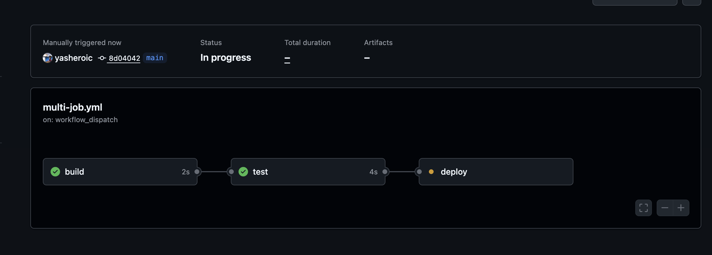

**Verify:** Check the workflow graph in the Actions tab — does it show the dependency chain?- **YES ✅**

---

### Task 2: Environment Variables

1.  **Workflow level** — To set a workflow-level environment variable in GitHub Actions, you use the env key at the top level of your workflow file. *This variable will be available to all jobs and steps within the workflow*

2. **Job level** — To set job-level environment variables in GitHub Actions, use the env key directly within a specific job's definition in your YAML workflow file. *These variables will be available to all steps within that job, but not to other jobs in the workflow*

3. **Step level** — In GitHub Actions, you can define step-level environment variables using the env keyword within a specific step of your workflow file. The scope of these variables is limited to that single step

- 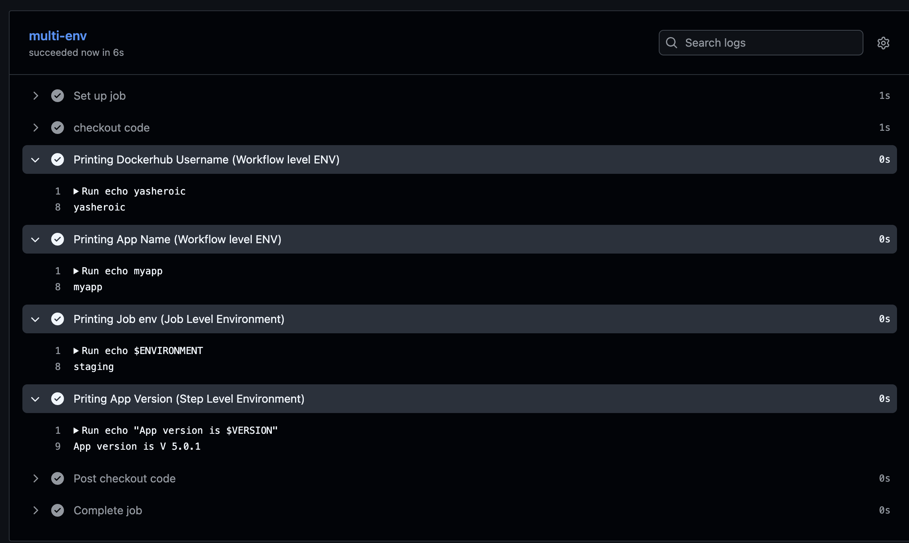

- 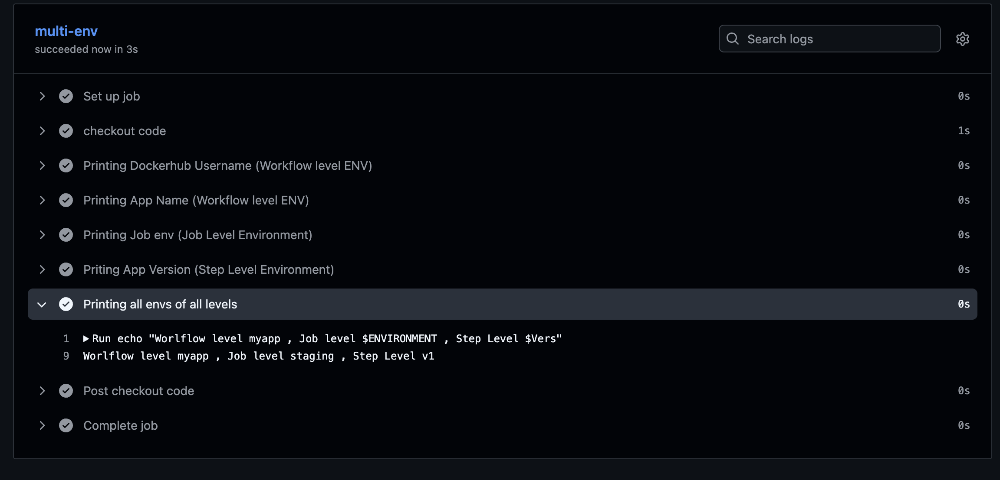

**Practical guideline (DevOps rule)**

*Use:*

- `${{ }}` when referencing GitHub contexts

- vars
- env
- secrets
- github
- needs
- matrix

*Use:*

`$VAR` when inside run: scripts

✅ Short answer 

`${{ }} is GitHub Actions expression syntax evaluated before the job run`

Workflow ENV
     ↓
Job ENV
     ↓
Step ENV (highest priority)

`In GitHub Actions, environment variables follow a precedence order: workflow < job < step, meaning step-level variables override job-level variables, and job-level variables override workflow-level variables.`

| Context   | Used for              | Example                  |
| --------- | --------------------- | ------------------------ |
| `github`  | Workflow/repo info    | `${{ github.actor }}`    |
| `env`     | Environment variables | `${{ env.APP }}`         |
| `vars`    | Repo/org variables    | `${{ vars.USERNAME }}`   |
| `secrets` | Sensitive values      | `${{ secrets.API_KEY }}` |
| `runner`  | Runner details        | `${{ runner.os }}`       |
| `job`     | Job information       | `${{ job.status }}`      |

**GitHub context variable** - ${{ github.actor }} : These are provided by github

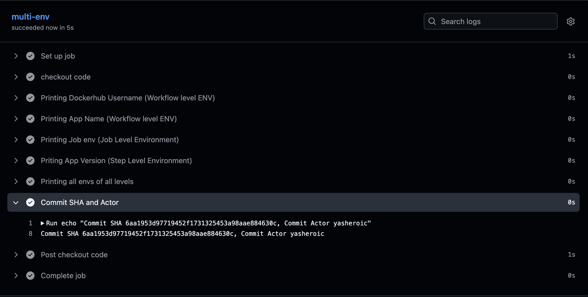

### Task 3: Job Outputs

| Type        | Used for                 | Syntax                             |
| ----------- | ------------------------ | ---------------------------------- |
| Step output | Share data between steps | `${{ steps.step_id.outputs.var }}` |
| Job output  | Share data between jobs  | `${{ needs.job_id.outputs.var }}`  |

---

1. 2. 3. 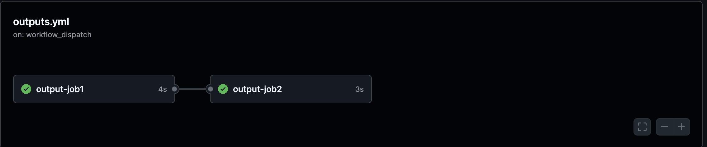
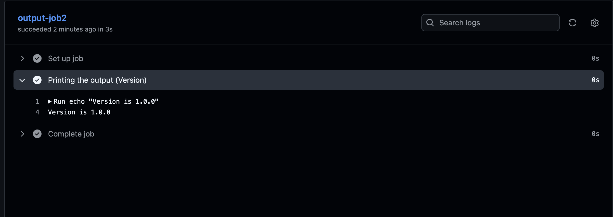

`You pass outputs between jobs when one job produces data that another job needs to use.`

`Since jobs run in separate runners (separate VMs), variables from one job are not automatically available in another job. Outputs allow you to transfer that information.`

*Example:* 

- Passing build version: A build job generates a version number, and the deploy job uses it.

### Task 4: Conditionals

- *Conditionals:* `Conditionals in GitHub Actions are primarily implemented using the if keyword with expressions to control the execution of jobs or individual steps. These expressions use contexts, functions, and operators to evaluate conditions, which determine whether a component should run or be skipped. `

1. 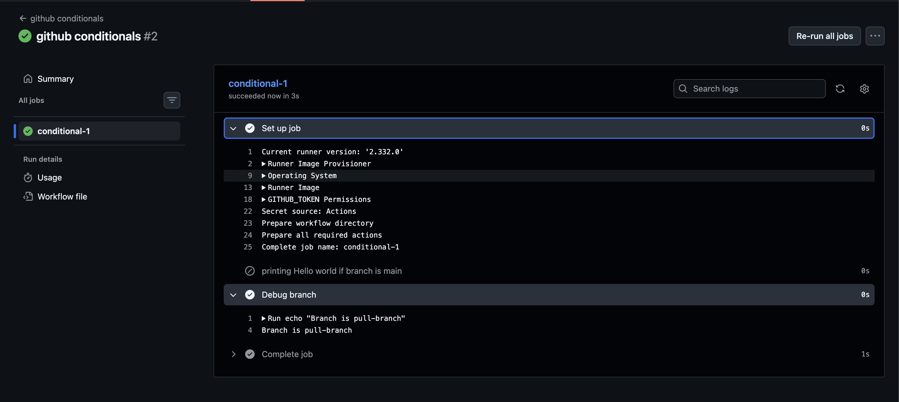

- added workflow_dispatch
- went to actions and click run and selected run and branch pull-branch
- saw the first step getting skipped

2. * Based on Job or Step Status*
You can use status check functions to run steps even if previous ones fail (e.g., for cleanup or notifications). 

- *success():* True if all previous steps/jobs succeeded (default).
- *failure():* True if any previous step/job failed.
- *always():* True regardless of the previous results.
- *cancelled():* True if the workflow was canceled. 

- image: 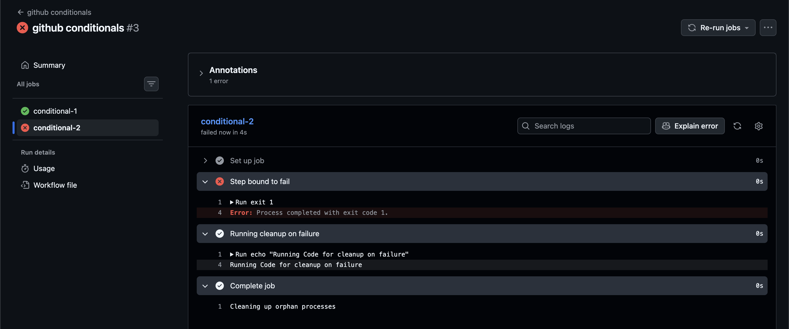

steps:
            - name: Step bound to fail
              run: exit 1
            - name: Running cleanup on failure
              if: failure()
              run: echo "Running Code for cleanup on failure"

3. 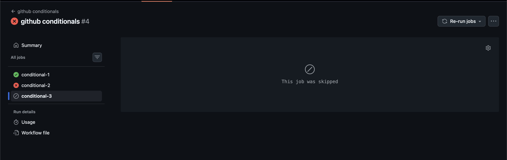

conditional-3:
        runs-on: ubuntu-latest
        if: ${{ github.event_name == 'push' }}
        steps:
            - name: Printing Success message if trigger is push
              run: echo "Job Success!!"
              

4. `In GitHub Actions, the continue-on-error keyword allows a workflow to proceed even if a specific step or job fails. This is useful for non-critical tasks like uploading logs or running experimental configurations.`

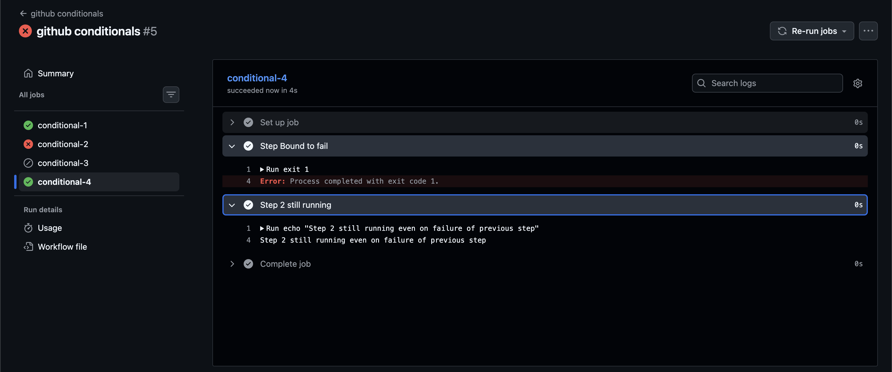

### Task 5: Putting It Together

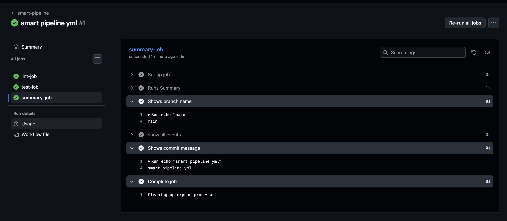
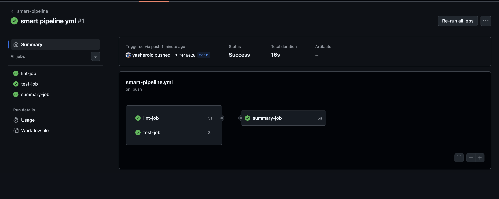

---