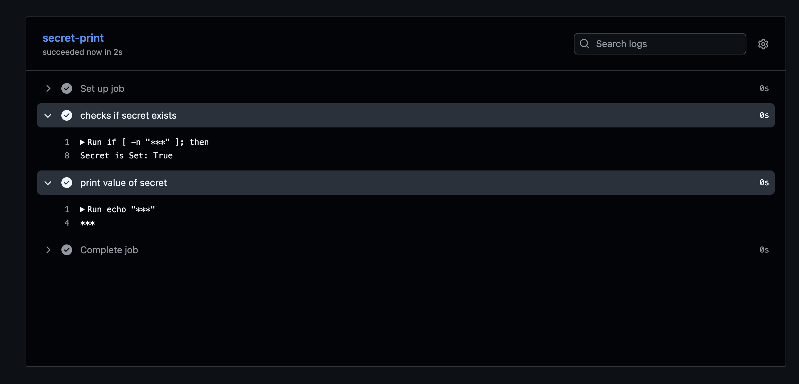
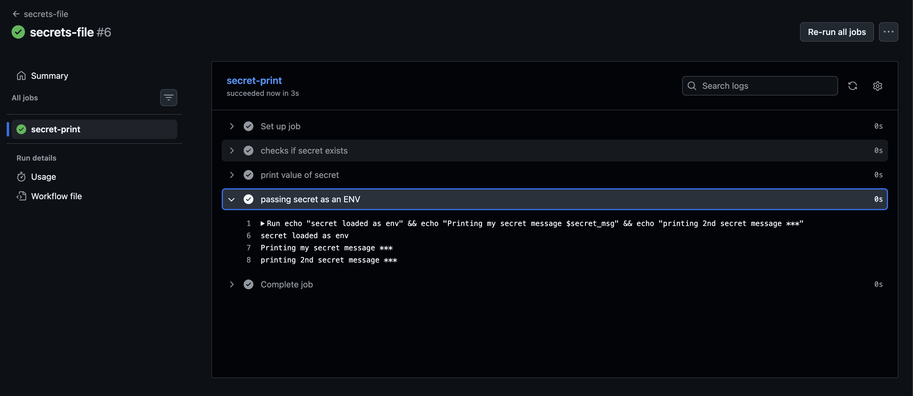
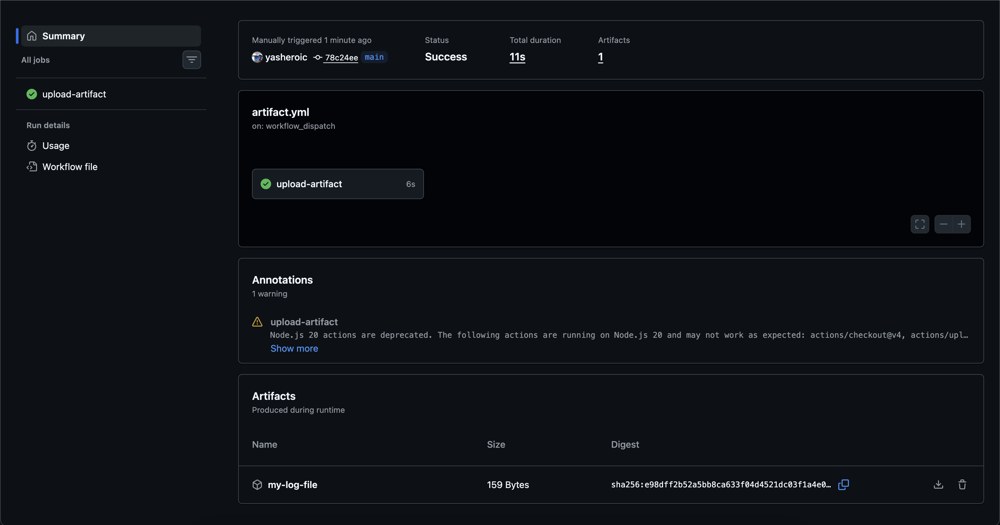
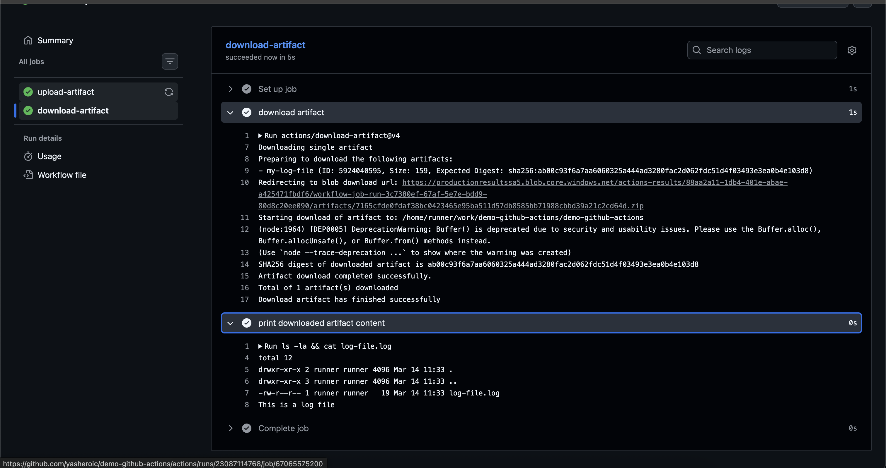
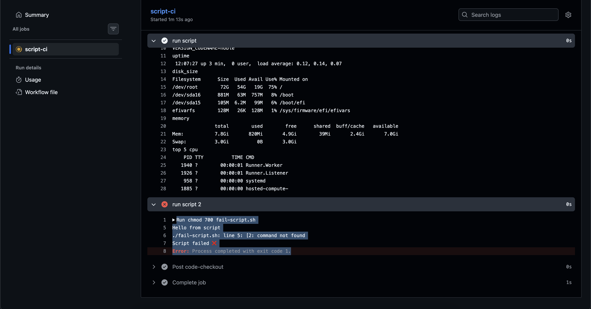
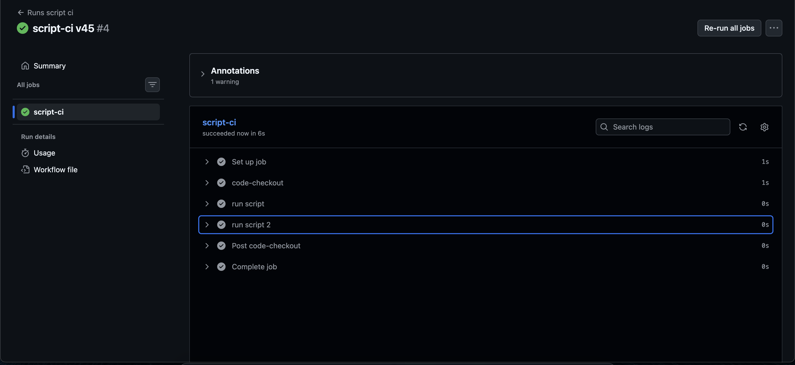
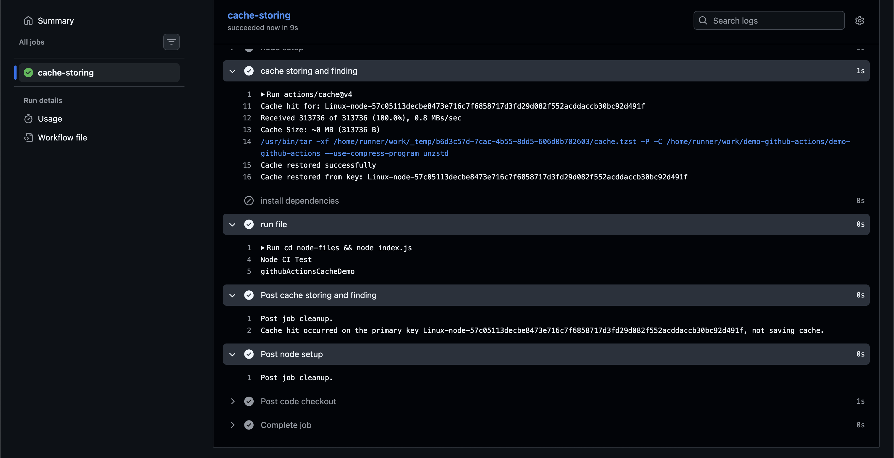

## Challenge Tasks

### Task 1: GitHub Secrets

1. 2. 3. 

4. it prints `***`

## Why should you never print secrets in CI logs?

- CI logs may be **visible to many team members** or even **public** in open-source repositories.
- Even though platforms like GitHub **mask secrets as `***`**, certain transformations or partial outputs could still leak sensitive data.
- Exposed secrets can allow attackers to gain **unauthorized access to servers, APIs, databases, or cloud services**.
- CI logs are often **stored for a long time**, meaning a leaked secret could remain accessible even after the workflow finishes.
- Following security best practices means **never logging secrets** and **rotating them immediately** if exposure is suspected.

---

### Task 2: Use Secrets as Environment Variables

1. 2. 3. 

---

### Task 3: Upload Artifacts

1. 
2. 2026/day-44/log-file.log -> Downloaded artifact

3. 
 steps:
            - name: checkout repo
              uses: actions/checkout@v4
            
            - name: create files
              run: |
                mkdir artifacts-folder
                echo "This is a log file" >> artifacts-folder/log-file.log
                cat artifacts-folder/log-file.log
            - name: upload file as artifact
              uses: actions/upload-artifact@v4
              with:
                name: my-log-file
                path: artifacts-folder/log-file.log

----

### Task 4: Download Artifacts Between Jobs

1. 2. 

Run ls -la && cat log-file.log
total 12
drwxr-xr-x 2 runner runner 4096 Mar 14 11:33 .
drwxr-xr-x 3 runner runner 4096 Mar 14 11:33 ..
-rw-r--r-- 1 runner runner   19 Mar 14 11:33 `log-file.log`
- `This is a log file`


### When to Use Artifacts in a Real CI/CD Pipeline

Artifacts are used to **store and transfer files generated during one stage of a pipeline so they can be used later or downloaded for review**.

#### Common Use Cases

**1. Build Outputs**

* Store compiled applications or binaries (e.g., `.jar`, `.zip`, Docker build files).
* Example: Build job produces `app.zip` → deploy job downloads it.

**2. Test Reports**

* Save test results or coverage reports.
* Example: `junit-report.xml`, `coverage.html`.

**3. Security Scan Reports**

* Store reports from tools like **Trivy, SAST, DAST, SCA**.
* Example:

  * `trivy-report.json`
  * `zap-report.html`

**4. Logs for Debugging**

* Preserve logs when a pipeline fails.
* Example: `build.log`, `deployment.log`.

**5. Passing Files Between Jobs**

* When a later job needs files created by an earlier job.
* Example:

  * Build job → upload artifact
  * Deploy job → download artifact

**6. Evidence / Compliance**

* Keep reports as proof for audits or security reviews.

#### Simple Pipeline Example

```
Build Job
   ↓
Create build.zip
   ↓
Upload artifact

Security Scan Job
   ↓
Download build.zip
   ↓
Scan application
   ↓
Upload scan-report.json

Deploy Job
   ↓
Download build.zip
   ↓
Deploy application
```

**Summary:**
Artifacts are used to **save important files produced during CI/CD so they can be reused by later jobs or downloaded by developers/security teams.**


----
### Task 5: Run Real Tests in CI

1. Run chmod 700 fail-script.sh
Hello from script
./fail-script.sh: line 5: [2: command not found
Script failed ❌
Error: Process completed with exit code 1.

- 
- 

---
### Task 6: Caching

1. 2. 3. 


Post job cleanup.
Cache hit occurred on the primary key Linux-node-57c05113decbe8473e716c7f6858717d3fd29d082f552acddaccb30bc92d491f, not saving cache.

    cache-storing:
        runs-on: ubuntu-latest
        steps:
            - name: code checkout
              uses: actions/checkout@v4

            - name: node setup
              uses: actions/setup-node@v6
              with:
                node-version: 24

            - name: cache storing and finding
              id: cache-store
              uses: actions/cache@v4
              with:
                path: node-files/node_modules
                key: ${{ runner.os }}-node-${{ hashFiles('node-files/package-lock.json') }}
                restore-keys: |
                     ${{ runner.os }}-node-
            
            - name: install dependencies
              if: steps.cache-store.outputs.cache-hit != 'true'
              run: cd node-files && npm install
            
            - name: run file
              run: cd node-files && node index.js

----

### What is being cached?

The **`node_modules` folder** is being cached, which contains all the **installed Node.js dependencies** downloaded by `npm install`.

### Where is it stored?

The cache is **stored in GitHub’s remote cache storage** and restored in future workflow runs using a **cache key**.

---

# Short Notes (for your task)

### What is Caching in CI?

Caching is used to **store dependencies so that future workflow runs can reuse them instead of reinstalling them**, making the pipeline faster.

---

### Steps to Create Cache in GitHub Actions

1. **Checkout the repository**

   ```yaml
   - uses: actions/checkout@v4
   ```

2. **Setup the environment (Node.js in this case)**

   ```yaml
   - uses: actions/setup-node@v6
   ```

3. **Add caching using `actions/cache`**

   ```yaml
   - uses: actions/cache@v4
     with:
       path: node_modules
       key: ${{ runner.os }}-node-${{ hashFiles('package-lock.json') }}
   ```

4. **Install dependencies only if cache is not found**

   ```yaml
   if: steps.cache.outputs.cache-hit != 'true'
   ```

5. **Run the application or tests**

---

### How Cache Works

**First run**

```
Cache miss → dependencies installed → cache saved
```

**Second run**

```
Cache hit → dependencies restored → install step skipped → workflow faster
```

---

### Key Concepts

| Concept     | Meaning                                |
| ----------- | -------------------------------------- |
| Cache       | Stored dependencies to reuse later     |
| Cache key   | Unique identifier for the cache        |
| hashFiles() | Changes cache when dependencies change |
| runner.os   | Separates cache for different OS       |

---

✅ **One-line summary**

> Caching in CI stores dependencies (like `node_modules`) in GitHub’s cache storage so future workflows can restore them and run faster.
