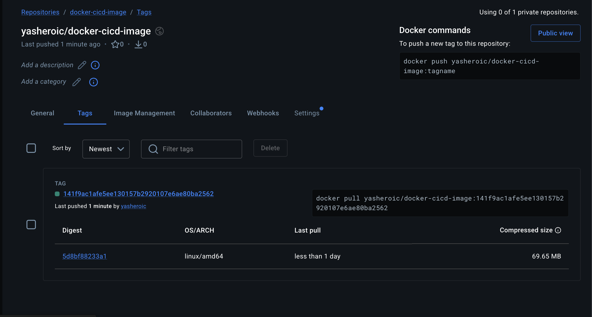
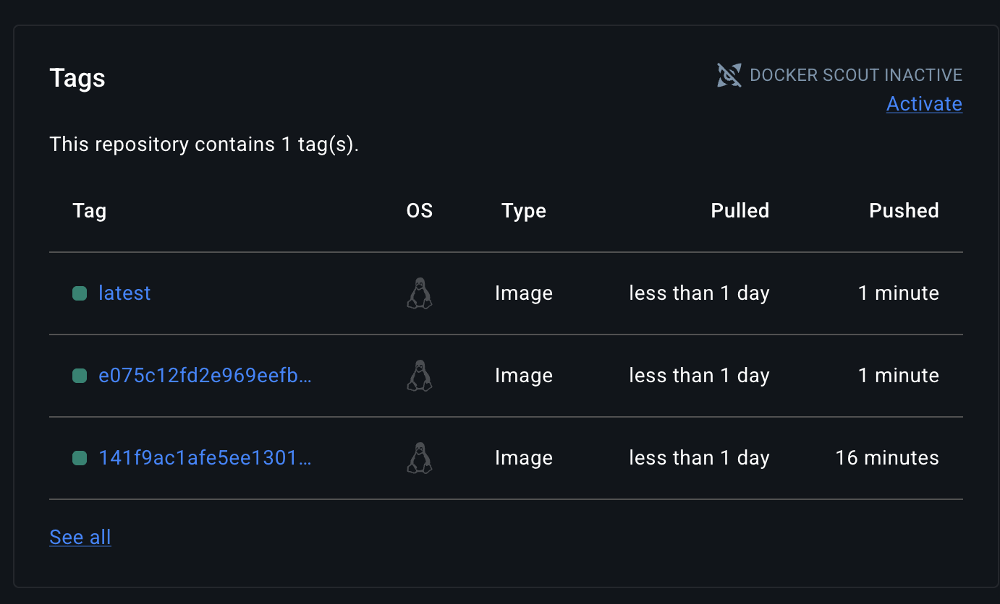
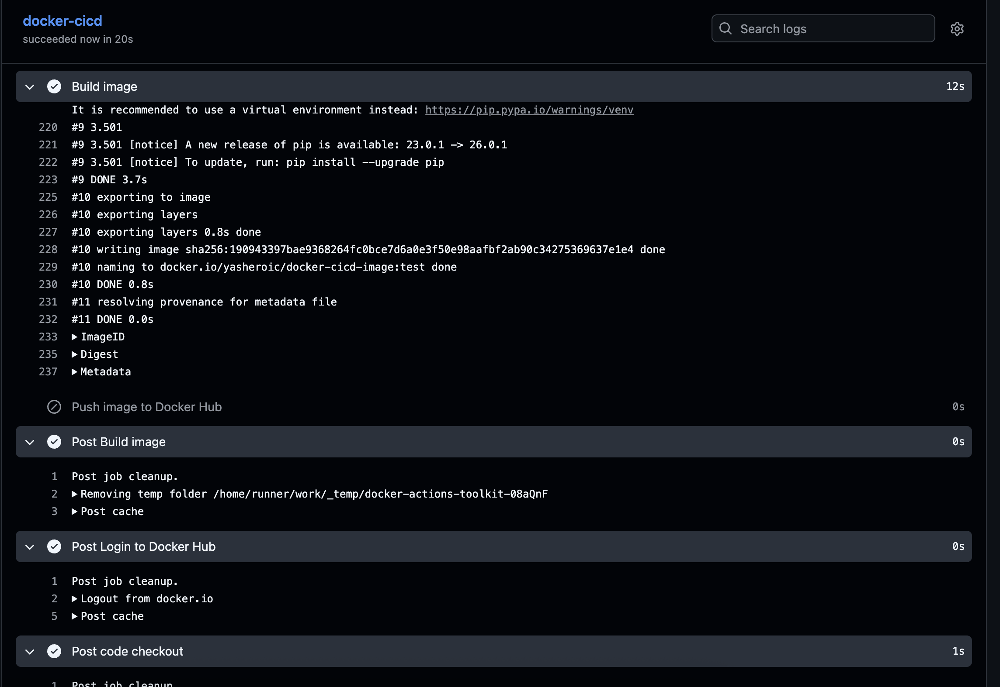
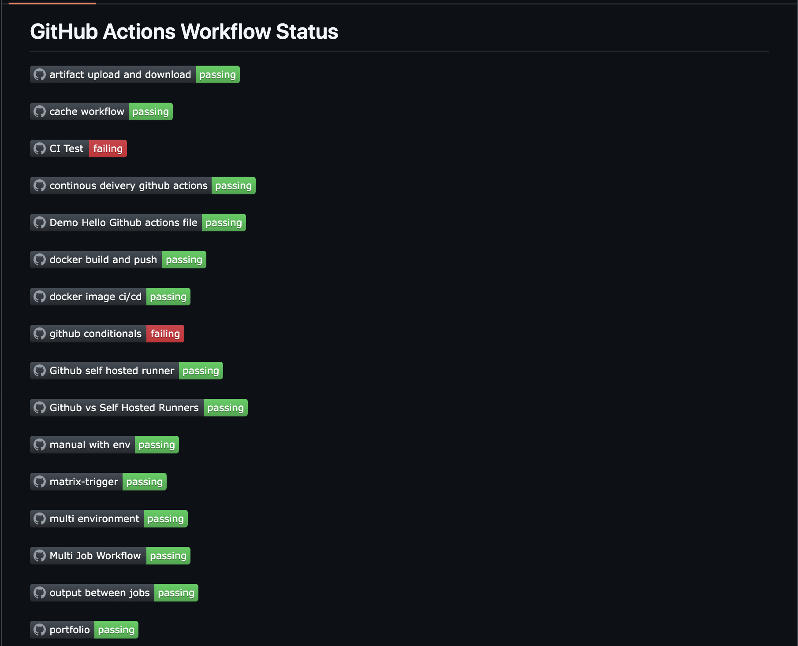
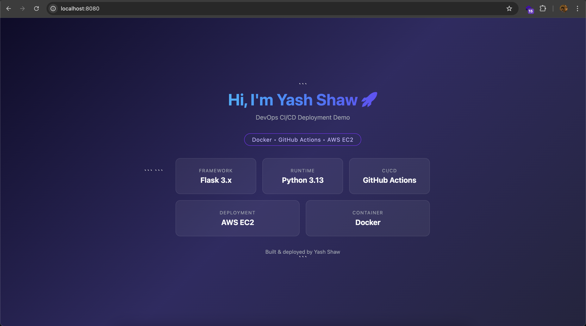

## Challenge Tasks

### Task 1: Prepare

1. 2. 3. Done ✅

---

### Task 2: Build the Docker Image in CI

1. 2. 3. 

            - name: Login to Docker Hub
              uses: docker/login-action@v4
              with:
                username: ${{ vars.DOCKERHUB_USERNAME }}
                password: ${{ secrets.DOCKERHUB_TOKEN }}

            - name: Build and push to Docker Hub
              uses: docker/build-push-action@v5
              with:
                context: .
                push: true
                tags: ${{ vars.DOCKERHUB_USERNAME }}/docker-cicd-image:${{github.sha}}

**Verify:** Check the build step logs — does the image build successfully? - YES ✅

---

### Task 3: Push to Docker Hub
- 

**Verify:** Go to Docker Hub — is your image there with both tags? - Yes ✅

---

### Task 4: Only Push on Main

- 

### Task 5: Add a Status Badge

- 

### Task 6: Pull and Run It

1. 2. 3. Yes it runs

`docker run -p 8080:80 yasheroic/docker-cicd-image:latest`

*Write in your notes: What is the full journey from `git push` to a running container?*

- `after git push the firstly the ci/cd pipeline triggers in which first step is repository code checkout then is dockerhub login from there the next step is to build to dockerfile into image and push image to dockerhub after being pulled to dockerhub the image can be pulled locally or run or we can ssh to a ec2 instance and via docker compose we can run the image on a container`

- Full Journey from git push to a Running Container

- A developer pushes code to the repository using git push.

- This triggers the GitHub Actions CI/CD workflow.

- The workflow first checks out the repository code on the GitHub runner.

- The runner logs in to Docker Hub using stored secrets.

- The workflow builds a Docker image using the Dockerfile.

- The built image is tagged and pushed to Docker Hub.

- The image can then be pulled on a local machine or a cloud server (e.g., AWS EC2) using docker pull.

- The container is started using docker run or docker compose.

- Once the container starts, the application becomes accessible via the exposed port.

---