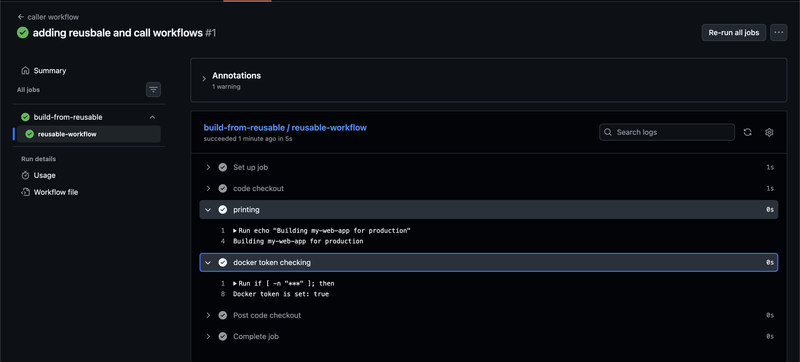
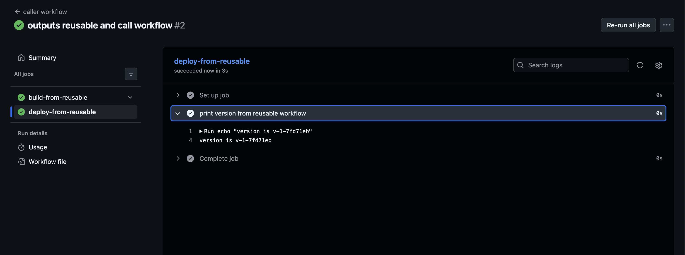

## Challenge Tasks

### Task 1: Understand `workflow_call`

1. reusable workflows are the ones which can we called from other workflows and doesnt need to be written again and again

2. workflow call trigger is the one which gets triggered when some other workflow calls like using uses:/path/of/workflow_with_workflow_call_trigger

3. we dont have to write it again

4. it must live in the same .github/workflows folder as the one which is calling it

Your answers are **mostly correct**, but a few points need **small corrections/clarifications**. Here is the **accurate version** for your notes.

---

## Task 1: Understand `workflow_call`

### 1. What is a reusable workflow?

A **reusable workflow** is a GitHub Actions workflow that can be **called from another workflow**, allowing you to **reuse the same CI/CD logic across multiple workflows or repositories** instead of rewriting it.

---

### 2. What is the `workflow_call` trigger?

The **`workflow_call` trigger** allows a workflow to be **invoked by another workflow**.

It means the workflow **does not run on events like push or pull_request**, but instead runs **when another workflow calls it using `uses:`**.

Example:

```yaml
on:
  workflow_call:
```

---

### 3. How is calling a reusable workflow different from using a regular action (`uses:`)?

**Reusable Workflow**

* Calls an **entire workflow**
* Can contain **multiple jobs and steps**
* Called at the **job level**

Example:

```yaml
jobs:
  call-workflow:
    uses: owner/repo/.github/workflows/deploy.yml@main
```

**Regular Action**

* Calls a **single reusable step or tool**
* Used **inside steps**

Example:

```yaml
steps:
  - uses: actions/checkout@v4
```

---

### 4. Where must a reusable workflow file live?

Reusable workflows **must be stored inside**:

```
.github/workflows/
```

Example:

```
.github/workflows/build.yml
.github/workflows/deploy.yml
```

---
### Task 2: Create Your First Reusable Workflow

- done

name: Reuseable-workflow


on:
    workflow_call:
        inputs:
            app_name: 
                required: true
                type: string
            environment:
                required: true
                type: string
                default: staging
        secrets:
            docker_token:
                required: true
                

jobs:
    reusable-workflow:
        runs-on: ubuntu-latest
        steps:
            - name: code checkout
              uses: actions/checkout@v4
            
            - name: printing
              run: echo "Building ${{inputs.app_name}} for ${{inputs.environment}}"
            
            - name: docker token checking
              run: |
                if [ -n "${{ secrets.docker_token }}" ]; then
                    echo "Docker token is set: true"
                else
                    echo " Docker token is set: false "
                fi
                

### Task 3: Create a Caller Workflow

- done

name: caller workflow

on:
    push:
        branches: [main]

jobs:
    build-from-reusable:
        uses: ./.github/workflows/reusable-build.yml
        with:
            app_name: my-web-app
            environment: production
        secrets:
            docker_token: ${{ secrets.DOCKERHUB_TOKEN }}
        


**Verify:** In the Actions tab, do you see the caller triggering the reusable workflow? Click into the job — can you see the inputs printed?- *YES*

---

### Task 4: Add Outputs to the Reusable Workflow



- `Run echo "version is v-1-7fd71eb"`
**version is v-1-7fd71eb**


**Verify:** Does the second job print the version from the reusable workflow? - YES ✅

---