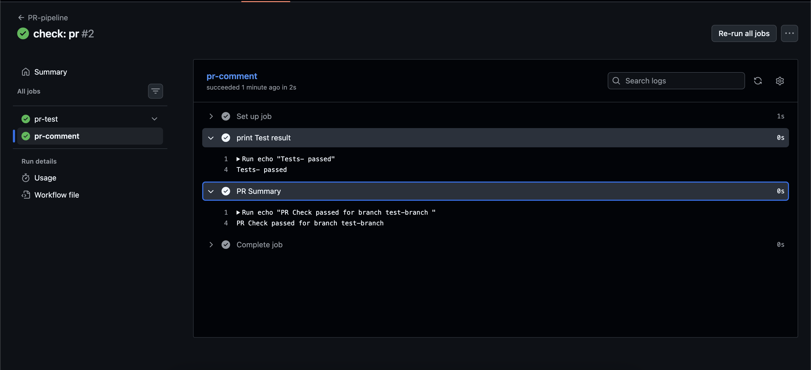

## Challenge Tasks

### Task 1: Set Up the Project Repo

1. Capstone Project CI-CD

2. Created a 3 tier Node,MySQL and Ollama App

3. - Dockerfile -> 2026/day-48/Dockerfile
   - Docker Compose file -> 2026/day-48/docker-compose.yml
   - Test script for Health check -> 2026/day-48/health-check-build.sh

---

### Task 2: Reusable Workflow — Build & Test

- Done ✅

---

### Task 3: Reusable Workflow — Docker Build & Push

- Done ✅

---

### Task 4: PR Pipeline

- 

- Pipeline Passed ✅

---

### Task 5: Main Branch Pipeline

- Done ✅

---

### Task 6: Scheduled Health Check
- Done

### Task 7: Add Badges & Documentation
- Done