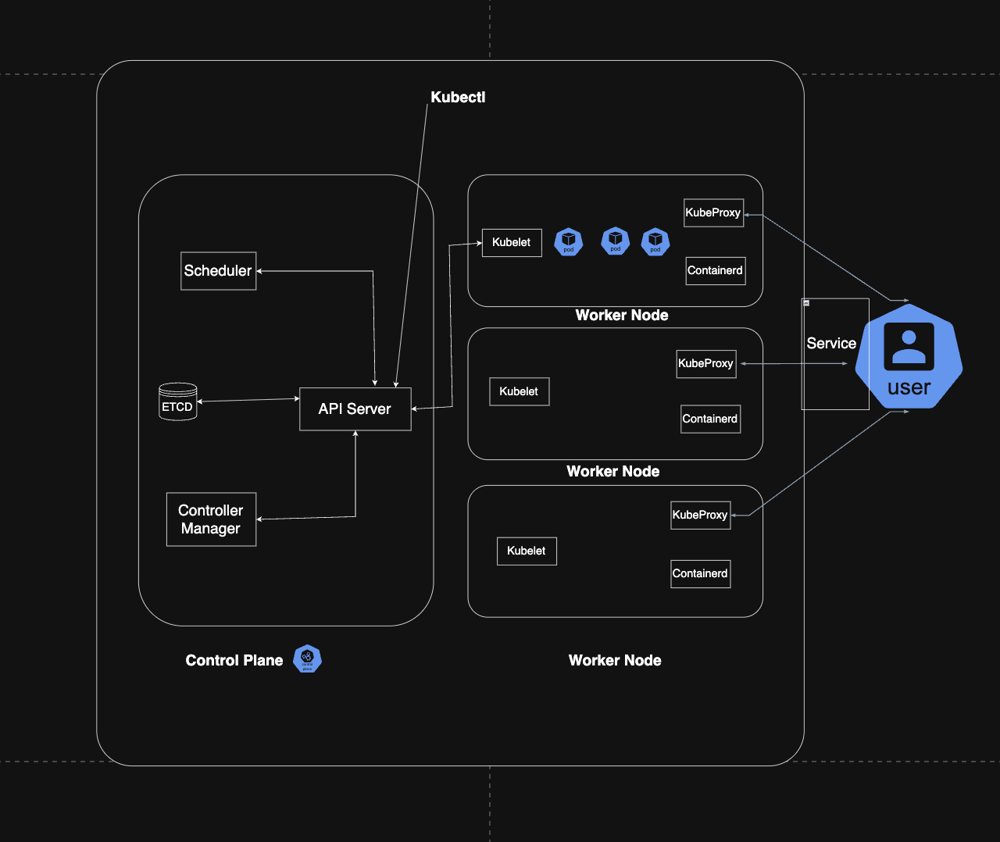

## Challenge Tasks

### Task 1: Recall the Kubernetes Story

1. Kubernetes was created because google was facing trouble to scale its app like google search etc. whenever users increased they had to manually scale up the server(containers). they called the project as Bord. Also whenever a server died they had to manually put it back up so they made borg which scaled and auto healed containers

2. Kubernetes was created by CNCF but the project was originally donated by google after 1 year of development which was originally called Borg

3. Kubernetes means k then in between 8 letters then s.  k u b e r n e t e s

---

### Task 2: Draw the Kubernetes Architecture



- when kubectl apply -f pod.yml in ran

1. request goes to api server
2. from api server it goes to etcd where scheduler stores the config or the pod and then  api server asks scheduler which worker node to run the pod on
3. scheduler decides the worker node which is capable of running the pod
4. api server then asks kubelet of that worker node to run the pod 
5. kublet asks containerd to run the pod
6. container d runs the pod

- What happens if the API server goes down?

if API server goes down to kubectl commands run, we cannot create pods, delete pods or scale deployment

- What happens if a worker node goes down?

if a worker node goes down then the control plane marks the pod as lost and scheduler imemditely starts looking for other worker nodes to run the pods on

*This is self healing*

---

### Task 3: Install kubectl
`kubectl` is the CLI tool you will use to talk to your Kubernetes cluster

### Task 4: Set Up Your Local Cluster

-  kind (Kubernetes in Docker)

- vim kind-config.yml

- kind create cluster --config kind-config.yml


**kubectl cluster-info**
Kubernetes control plane is running at https://127.0.0.1:54161
CoreDNS is running at https://127.0.0.1:54161/api/v1/namespaces/kube-system/services/kube-dns:dns/proxy

To further debug and diagnose cluster problems, use 'kubectl cluster-info dump'.

**kubectl get nodes**

kubectl get nodes
NAME                        STATUS   ROLES           AGE   VERSION
tws-cluster-control-plane   Ready    control-plane   33h   v1.35.1
tws-cluster-worker          Ready    <none>          33h   v1.35.1
tws-cluster-worker2         Ready    <none>          33h   v1.35.1
tws-cluster-worker3         Ready    <none>          33h   v1.35.1

---

Chosen Tool: kind (Kubernetes in Docker)

*Reason:*
`I chose kind because it is lightweight and runs Kubernetes clusters inside Docker containers. It allows me to easily create a multi-node cluster locally, start or delete clusters quickly, and it is commonly used for testing and development environments.`

---
### Task 5: Explore Your Cluster
# See ALL pods running in the cluster (across all namespaces)
`kubectl get pods -A`

`kubectl get pods -n kube-system`:

Control Plane Components
        ↓
Running as Pods
        ↓
Inside kube-system namespace

---

### Task 6: Practice Cluster Lifecycle

Good question. The **cluster name and the cluster configuration are two different things**.

---

# 1. What `--name` Does

When you run:

```bash
kind create cluster --config kind-config.yml --name tws-cluster
```

`--name tws-cluster` = **the name of the cluster instance**.

It is **not defined inside the config file**.

Kind uses it to:

* name Docker containers
* create a kubeconfig context
* identify the cluster

Example containers created:

```
tws-cluster-control-plane
tws-cluster-worker
tws-cluster-worker2
tws-cluster-worker3
```

---

# 2. What `kind-config.yml` Does

The config file defines the **cluster architecture**, such as:

* number of nodes
* control-plane nodes
* worker nodes
* networking options
* port mappings

Example:

```yaml
kind: Cluster
apiVersion: kind.x-k8s.io/v1alpha4

nodes:
- role: control-plane
- role: worker
- role: worker
- role: worker
```

This means:

```
1 control plane
3 workers
```

---

# 3. Creating Another Cluster

You **do NOT change the cluster name in the config file**.

You simply run:

```bash
kind create cluster --config kind-config.yml --name security-cluster
```

Now you have:

```
tws-cluster
security-cluster
```

Both clusters use the **same config file**.

---

# 4. When You Would Use Another Config File

You create another config file **only if you want a different architecture**.

Example:

### cluster-1.yml

```yaml
nodes:
- role: control-plane
- role: worker
```

Creates:

```
1 control-plane
1 worker
```

---

### cluster-2.yml

```yaml
nodes:
- role: control-plane
- role: worker
- role: worker
- role: worker
```

Creates:

```
1 control-plane
3 workers
```

---

# 5. Example with Two Clusters

Cluster 1:

```bash
kind create cluster --config kind-config.yml --name dev-cluster
```

Cluster 2:

```bash
kind create cluster --config kind-config.yml --name test-cluster
```

---

# 6. Verify Clusters

Check contexts:

```bash
kubectl config get-contexts
```

Example:

```
kind-dev-cluster
kind-test-cluster
kind-tws-cluster
```

Switch cluster:

```bash
kubectl config use-context kind-test-cluster
```

---

# Simple Rule

```
--name        → cluster identity
config.yml    → cluster architecture
```

---

