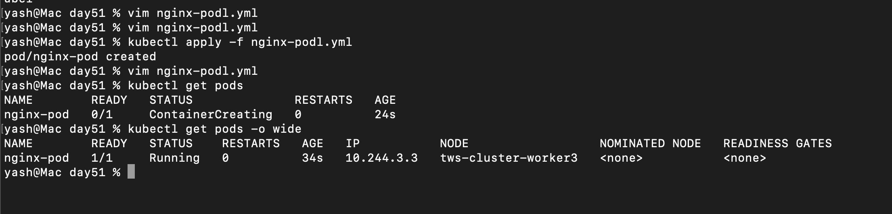
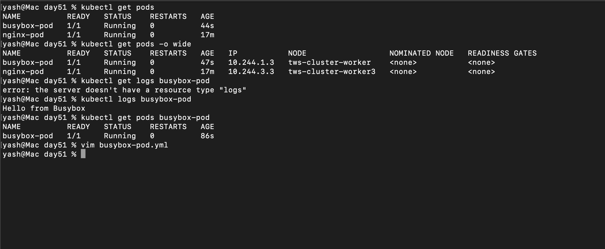
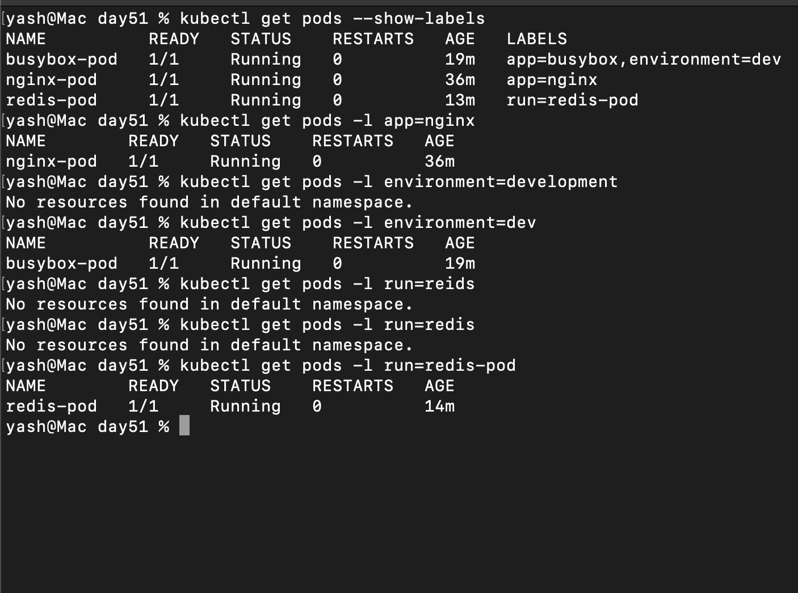
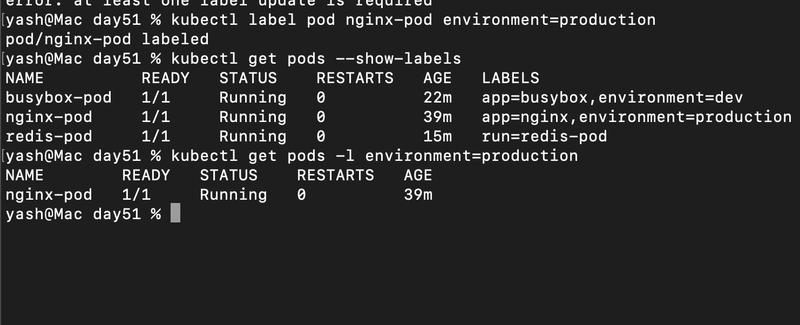
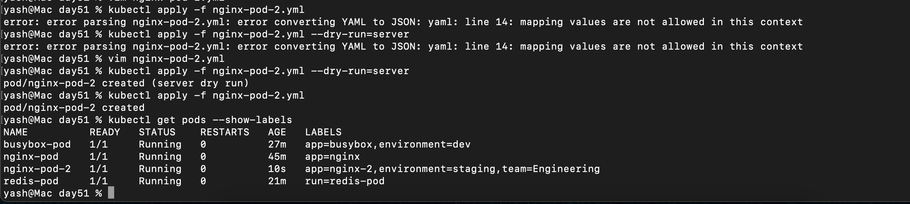
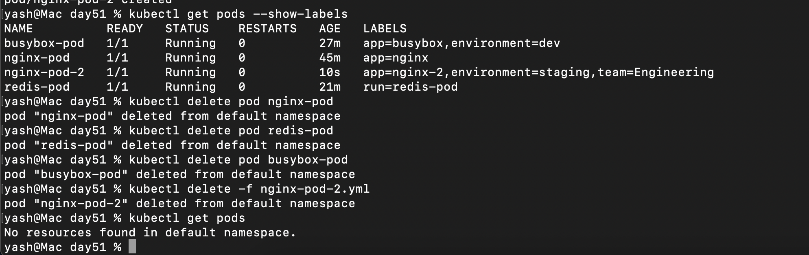

## Challenge Tasks

### Task 1: Create Your First Pod (Nginx)

- 

### 📝 kubectl exec (Short Notes)

* ❌ Old (deprecated):

```bash
kubectl exec -it <pod> bash
```

* ✅ New (correct):

```bash
kubectl exec -it <pod> -- bash
```

---

### 🔑 Key Point

* `--` separates **kubectl flags** and **container command**

---

### 🐳 Docker vs Kubernetes

* Docker:

```bash
docker exec -it <container> bash
```

* Kubernetes:

```bash
kubectl exec -it <pod> -- bash
```

---

### ⚡ Tip

* If `bash` not available:

```bash
kubectl exec -it <pod> -- sh
```


**Verify:** Can you see the Nginx welcome page when you curl from inside the pod? -YES ✅

---
### Task 2: Create a Custom Pod (BusyBox)

Good question — this is where **Docker vs Kubernetes confusion** happens 👇

---

## 🔑 1. Why `command` and not `cmd`?

In Kubernetes:

* `command` = **ENTRYPOINT**
* `args` = **CMD**

👉 Kubernetes does **NOT use `cmd` keyword at all**

---

### Mapping (VERY important)

| Dockerfile | Kubernetes |
| ---------- | ---------- |
| ENTRYPOINT | `command`  |
| CMD        | `args`     |

---

## 🔥 Your example

```yaml
command: ["sh", "-c", "echo Hello from BusyBox && sleep 3600"]
```

👉 This means:

* Run shell (`sh -c`)
* Execute full string as a command

---

## 🔑 2. Why no quotes inside echo?

```bash
echo Hello from BusyBox
```

👉 This is totally valid in shell
👉 Quotes are **optional** unless needed

---

### When quotes are needed

Use quotes only if:

* Special characters
* Variables
* Multiple spaces you want preserved

Example:

```bash
echo "Hello   World"
echo "User: $USER"
```

---

## ⚡ In your case

```bash
"echo Hello from BusyBox && sleep 3600"
```

👉 This whole thing is already a **single string**
👉 So inner quotes are **not required**

---

## ✅ You *can* write it like this too

```yaml
command: ["sh", "-c", "echo 'Hello from BusyBox' && sleep 3600"]
```

✔ Works the same
✔ Just stylistic difference

---

## 🚀 Simple takeaway (notes style)

* Kubernetes uses:

  * `command` = ENTRYPOINT
  * `args` = CMD
* No `cmd` in Kubernetes ❌
* Quotes in `echo` → optional unless needed

---
This error is **very common** — just a naming rule issue 👇

---

## ❌ Problem

```bash
name: BusyBox-Pod
```

👉 Kubernetes says:

* ❌ Uppercase letters not allowed
* ❌ Must follow **RFC 1123 naming**

---

## ✅ Fix

```yaml
metadata:
  name: busybox-pod
```

---

## 🔑 Naming Rules (remember this)

* Only **lowercase letters** → `a-z`
* Numbers allowed → `0-9`
* Hyphen allowed → `-`
* Dot allowed → `.`
* Must **start & end with alphanumeric**

---

## ❌ Invalid examples

```yaml
BusyBox-Pod   ❌ (uppercase)
my_pod        ❌ (underscore not allowed)
-pod          ❌ (cannot start with -)
pod-          ❌ (cannot end with -)
```

---

## ✅ Valid examples

```yaml
busybox-pod
nginx123
my-app.dev
```

---

## 🚀 Notes version (write this)

* Names → **lowercase only**
* Allowed → `a-z`, `0-9`, `-`, `.`
* No spaces, no `_`, no uppercase

---

Fix the name → run again:

```bash
kubectl apply -f busybox-pod.yml
```

---

If you want, I can give you a **list of Kubernetes naming rules (pods, services, labels, etc.)** — helpful for avoiding these errors completely.

- 

**Verify:** Can you see "Hello from BusyBox" in the logs? YES ✅

---

### Task 3: Imperative vs Declarative

apiVersion: v1
kind: Pod
metadata:
  labels:
    run: test-pod
  name: test-pod
spec:
  containers:
  - image: nginx
    name: test-pod
    resources: {}
  dnsPolicy: ClusterFirst
  restartPolicy: Always
status: {}

it has extra status field
dns policy
restartpolicy

**🚀 Final takeaway (write this)**

- Imperative → quick, no YAML

- Declarative → YAML, production-ready

- -o yaml → see full config

- --dry-run=client → generate YAML without creatin

---

### Task 4: Validate Before Applying

**Final takeaway**

--dry-run=client → basic check (syntax only)

--dry-run=server → full validation (real check)

Missing image → ❌ error (required field)

Dry-run → does NOT create resources

*kubectl apply -f nginx-podl.yml --dry-run=server*

`The Pod "nginx-pod" is invalid: spec.containers[0].image: Required value`

---
### Task 5: Pod Labels and Filtering



`kubectl get pods --show-label`: shows all pods with all labels

`kubectl get pods -l app=nginx` shows pods with this label matching



`kubectl get pods -l environment=production`


` Write a manifest for a third pod with at least 3 labels (app, environment, team). Apply it and practice filtering.`

- 

---

### Task 6: Clean Up
- All Deleted


--
