## Challenge Tasks

### Task 1: Explore Default Namespaces

- 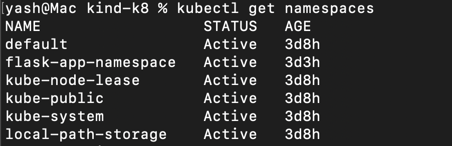
- 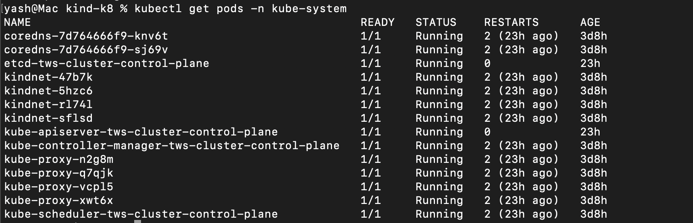
- **Verify:** How many pods are running in `kube-system`?- *14*

---

### Task 2: Create and Use Custom Namespaces

- created one namespace - development through manifest and rest 2- staging and production through direct command - 
`kubectl create namespace staging`
`kubectl create namespace production`

vim namespace-dev.yml:

```
kind: Namespace
apiVersion: v1

metadata:
    name: development
```

- 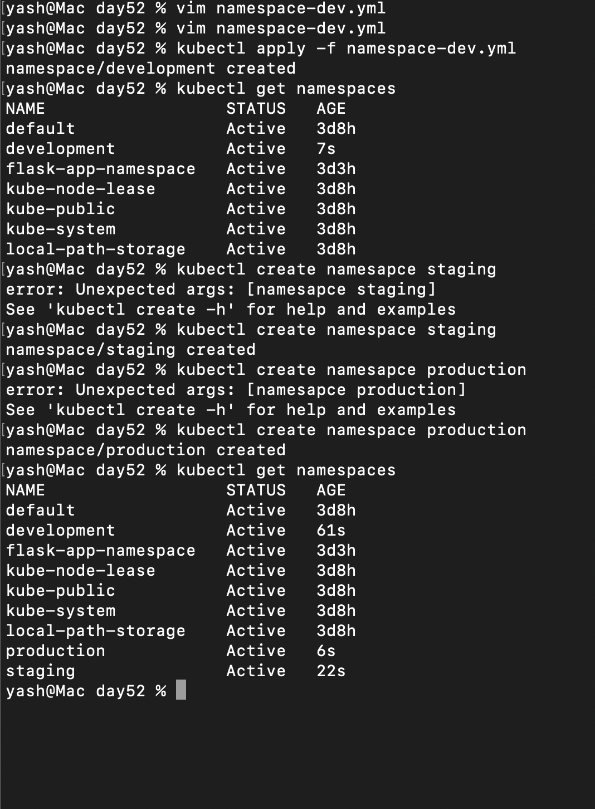
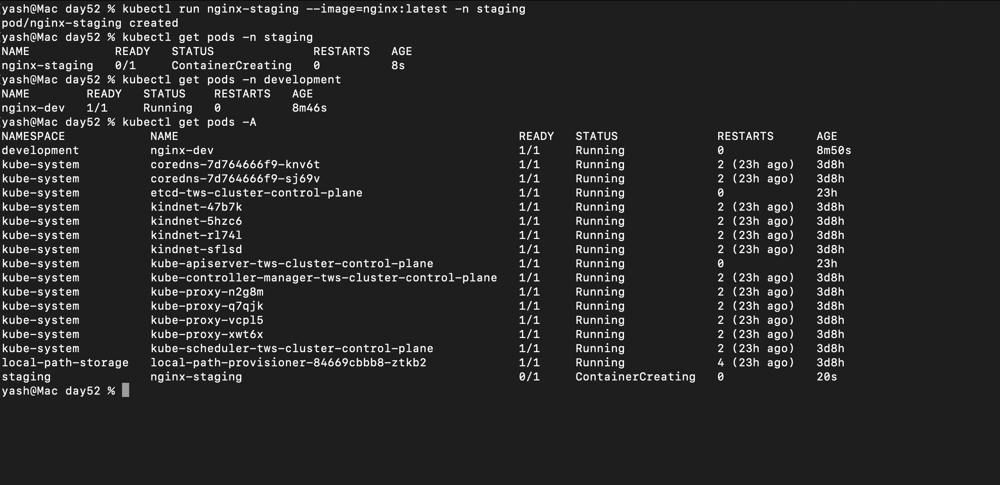


**Verify:** Does `kubectl get pods` show these pods? What about `kubectl get pods -A`?

```
Kubectl get pods only show pods in default namespace

kubectl get pods -A shows pods across all namespace
```

| Command                     | Creates    | Use case      | Example                                                            |
| --------------------------- | ---------- | ------------- | ------------------------------------------------------------------ |
| `kubectl run`               | Pod        | Testing/debug | `kubectl run nginx-pod --image=nginx`                              |
| `kubectl create deployment` | Deployment | Quick setup   | `kubectl create deployment nginx-deploy --image=nginx`             |
| `kubectl expose`            | Service    | Networking    | `kubectl expose deployment nginx-deploy --port=80 --type=NodePort` |
| `kubectl apply -f`          | Anything   | Production    | `kubectl apply -f deployment.yaml`                                 |

---

### Task 3: Create Your First Deployment

- 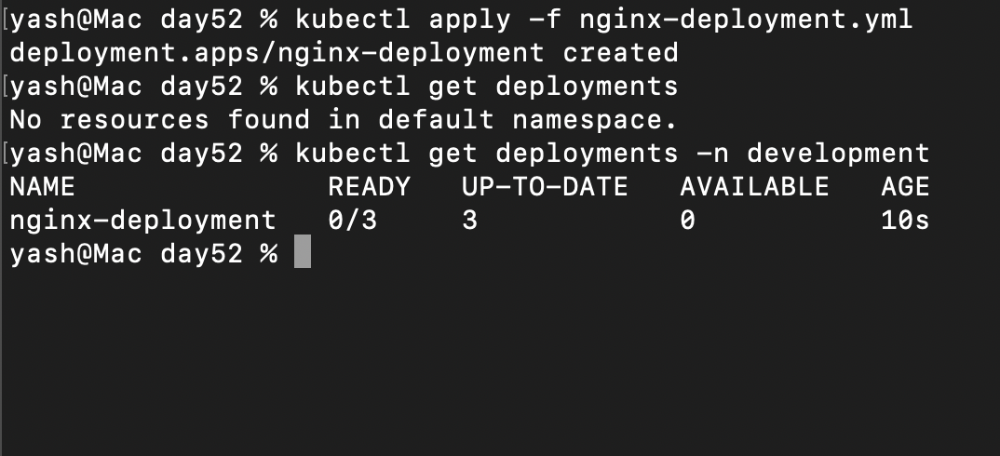

When you run:

```bash
kubectl get deployments
```

You’ll see something like:

```
NAME               READY   UP-TO-DATE   AVAILABLE   AGE
nginx-deployment   3/3     3            3           10m
```

Here’s what each column means 👇

---

# 🔹 READY

👉 Format: `current_ready / desired`

* Shows how many Pods are **ready (passing health checks)** vs how many you want

Example:

* `3/3` → all Pods are healthy ✅
* `2/3` → one Pod is not ready ❌

---

# 🔹 UP-TO-DATE

👉 Number of Pods running the **latest Deployment spec**

* After you update the Deployment (image, config, etc.), new Pods are created
* This tells how many Pods are updated to the latest version

Example:

* `3` → all Pods updated ✅
* `1` → rollout still in progress 🔄

---

# 🔹 AVAILABLE

👉 Number of Pods **ready and available to serve traffic**

* Slightly stricter than READY
* Pod must:

  * Be ready
  * Stay ready for a minimum time (`minReadySeconds`)

Example:

* `3` → all Pods serving traffic ✅
* `2` → one Pod not yet stable ❌

---

# 🔥 Quick difference (important)

* **READY** → Pod is healthy *right now*
* **AVAILABLE** → Pod is stable and safe for traffic
* **UP-TO-DATE** → Pod is running the latest version

---

# 🔥 Interview one-liner

👉
“READY shows healthy Pods, UP-TO-DATE shows Pods with the latest spec, and AVAILABLE shows Pods that are ready and stable enough to serve traffic.”

---

### Task 4: Self-Healing — Delete a Pod and Watch It Come Back

- 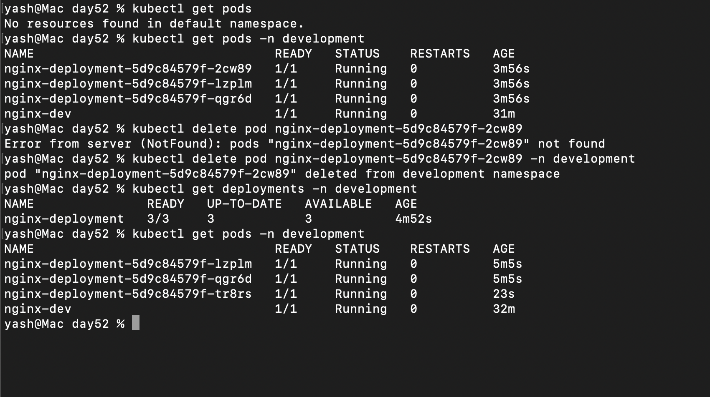

```

kubectl get deployments -n development

-> lists all the replicas and their state

kubectl get pods -n development

-> lists all pods (including hte replica created by deployment)

kubectl delete pod <pod_name> -n development

kubectl get pods -n development

-> we will see 3 pods again instead of 2 since it self headled
```

**Verify:** Is the replacement pod's name the same as the one you deleted, or different? - *It is different*

---

### Task 5: Scale the Deployment

- 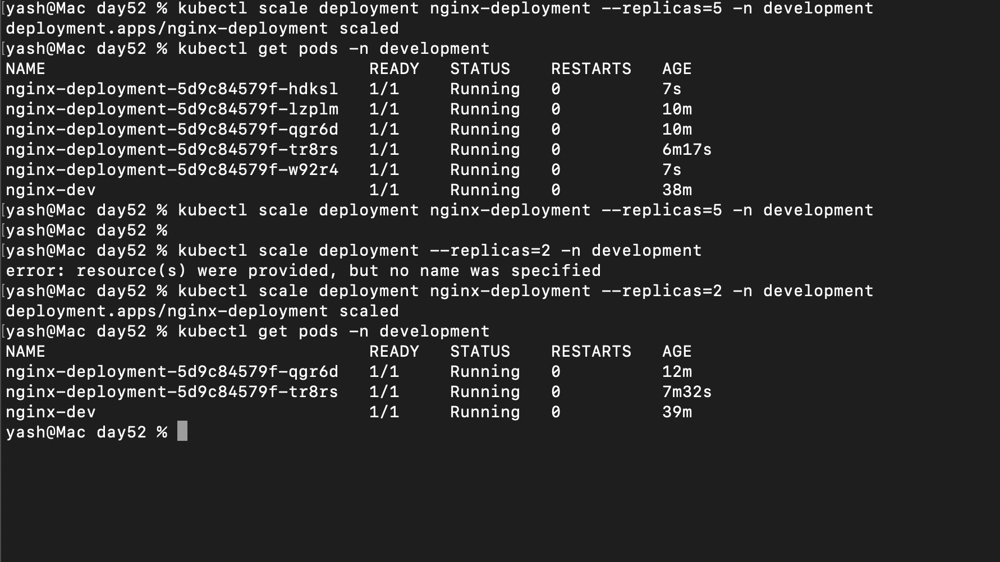

`kubectl get pods -n development`

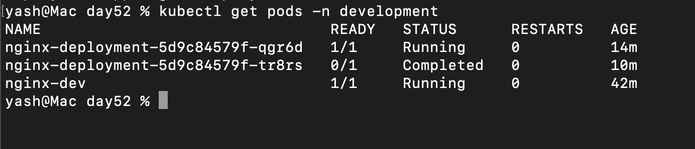

👉 When you scale a Deployment **down from 5 → 2**, Kubernetes needs to remove 3 Pods.

### 🔹 What actually happens

* The **Deployment updates desired replicas = 2**
* The **ReplicaSet compares current (5) vs desired (2)**
* It **terminates 3 Pods**

---

### 🔹 How Pods are removed

Kubernetes doesn’t just kill them randomly — it does a **graceful termination**:

1. Pod is marked **Terminating**
2. It is **removed from Service endpoints** (no new traffic)
3. Kubernetes sends **SIGTERM** to the container
4. Waits for `terminationGracePeriodSeconds` (default: 30s)
5. Then force kills if needed

---

### 🔹 Which Pods get deleted?

👉 No strict guarantee, but generally:

* Pods are selected **randomly**
* Kubernetes may prefer:

  * Not-ready Pods first
  * Pods on overloaded nodes

---

### 🔹 End result

```bash
Before: 5 Pods
After:  2 Pods
```

* 3 Pods → **gracefully terminated**
* 2 Pods → **keep running**

---

### 🔥 Interview-ready answer

👉
“When scaling down, the ReplicaSet terminates extra Pods gracefully. They are removed from traffic first, sent a SIGTERM, and then stopped until the desired replica count is met.”

---

### Task 6: Rolling Update
- kubectl set image deployment/<deployment-name> <container-name>=<new-image>

- 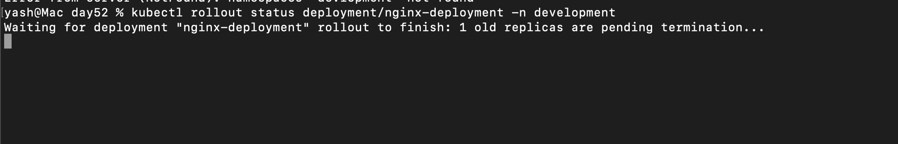

- 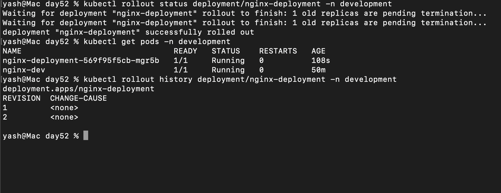

- 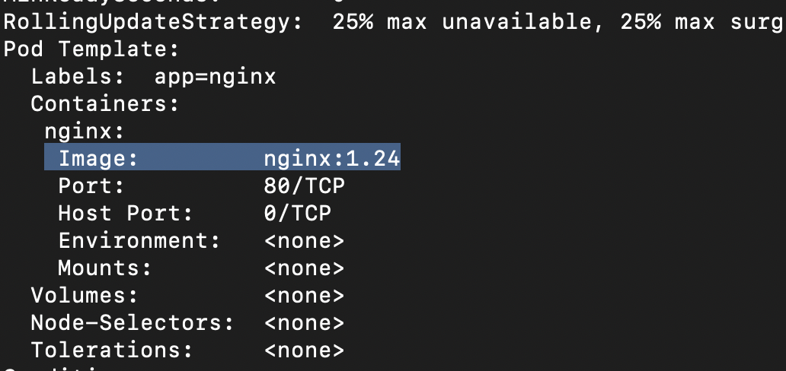

**Verify:** What image version is running after the rollback? - `Nginx: 1.24`

---

### Task 7: Clean Up

**Verify:** Are all your resources gone?- ✅

delete deployment <name> → removes deployment + pods

delete pod <name> → removes single pod

delete namespace <name> → removes everything inside

delete all --all -n <ns> → wipes namespace

delete -l <label> → deletes via label

---