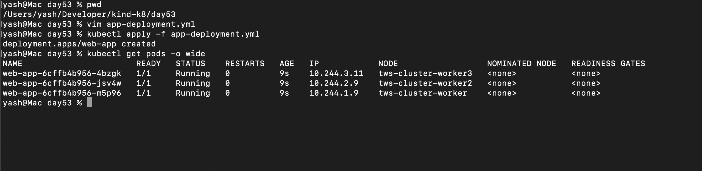
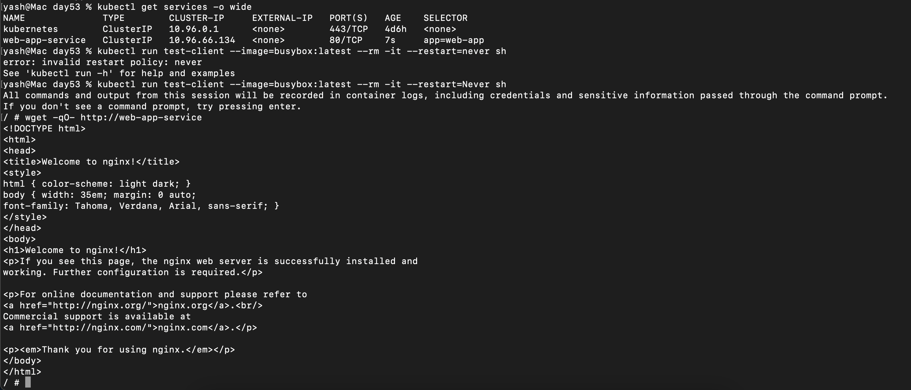
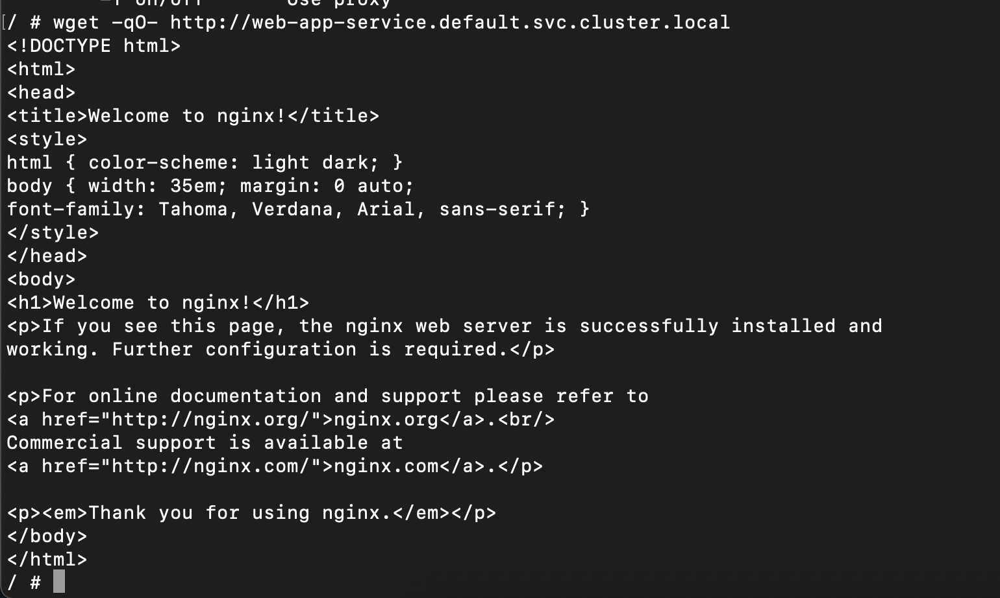
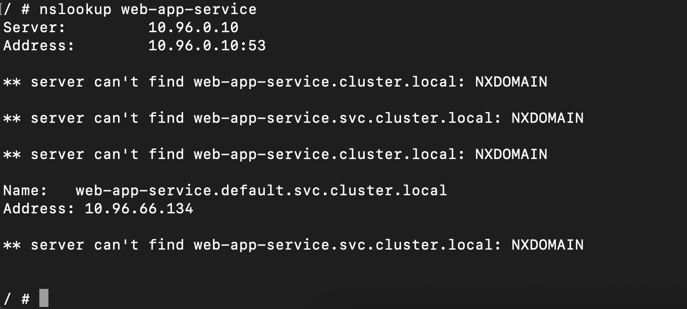
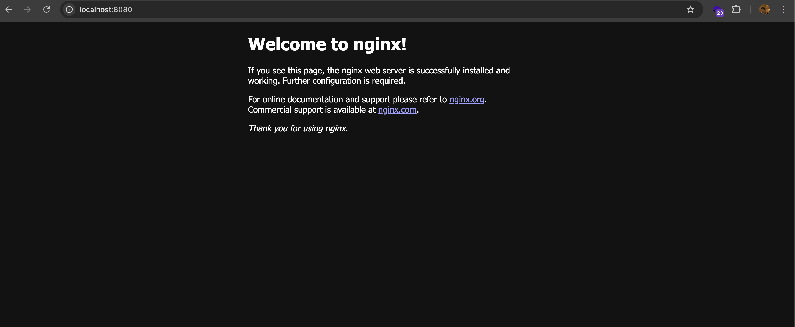
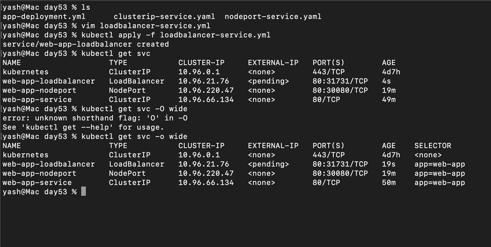
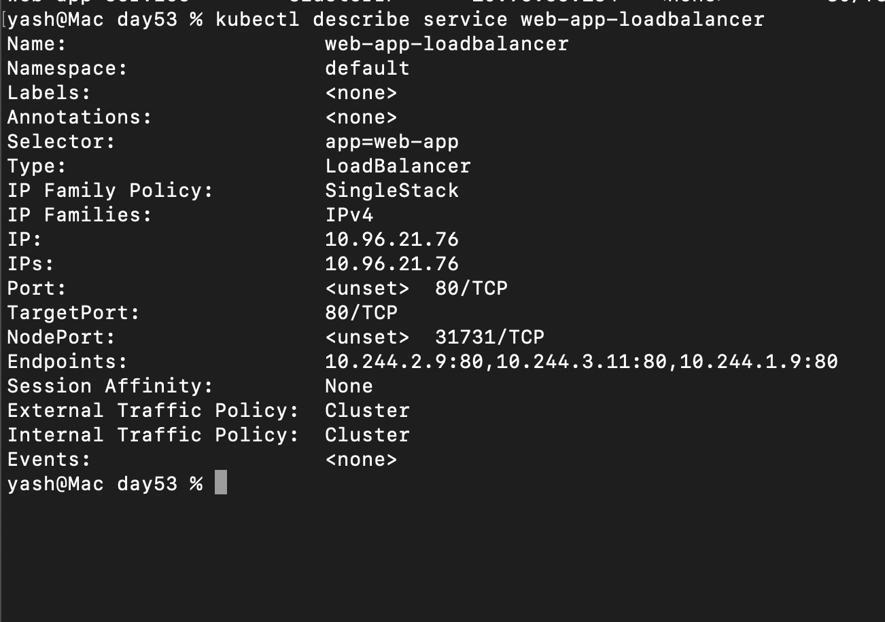
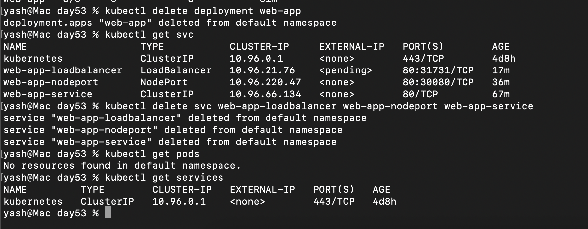

## Challenge Tasks

### Task 1: Deploy the Application

1. 


**Verify:** Are all 3 pods running? Note down their IP addresses.- ✅

---

### Task 2: ClusterIP Service (Internal Access)

Think of a **Kubernetes Service** as a *traffic router* that sends requests to your Pods.

Now for your question 👇

```yaml
ports:
- port: 80
  targetPort: 80
```

### 🔹 `port` (Service Port)

* This is the **port exposed by the Service**
* Other Pods (or users inside the cluster) will call the Service using this port

👉 Example:

```
http://web-app-service:80
```

---

### 🔹 `targetPort` (Pod Port)

* This is the **port inside the container (Pod) where your app is actually running**
* The Service forwards traffic **to this port**

---

### 🔁 Simple Flow

```
Client → Service (port 80) → Pod (targetPort 80)
```

---

### 🧠 Beginner Analogy

Think of it like a **customer care system**:

* 📞 `port` = customer care number (what people dial)
* 👨‍💻 `targetPort` = actual employee’s desk number (where call goes)

---

### 💡 Important Notes

* `port` and `targetPort` **can be different**

Example:

```yaml
port: 80
targetPort: 3000
```

➡️ Means:

* Users call Service on **port 80**
* But your app is running inside container on **port 3000**

---

### ⚡ Your Case

```yaml
port: 80
targetPort: 80
```

✔ Service listens on 80
✔ Pod also runs on 80
➡️ Direct mapping (simple setup)

- 


**Verify:** Does the Service respond? Try running the wget command multiple times — the Service distributes traffic across all healthy Pods. - YES ✅

---
### Task 3: Discover Services with DNS



- 


- **Verify:** What IP does `nslookup` return? Does it match the CLUSTER-IP from `kubectl get services`? - YES ✅
-----


### Task 4: NodePort Service (External Access via Node)

- 

Here’s a **clean notes version** you can copy 👇

---

# 🧠 Accessing NodePort in KIND (Notes)

## 🔹 Problem I Faced

* Created a **NodePort Service**
* Tried accessing using:

  ```bash
  curl http://<node-ip>:30080
  ```
* ❌ Didn’t work

---

## 🔹 Why It Didn’t Work

* KIND runs Kubernetes **inside Docker containers**
* Node IPs (like `172.18.x.x`) are **internal Docker network IPs**
* My local machine **cannot access them directly**

👉 So:

```
My Laptop ❌→ KIND Node (Docker network)
```

---

## 🔹 What I Did (Solution)

Used **port forwarding**:

```bash
kubectl port-forward service/web-app-nodeport 8080:80
```

Now accessed via:

```bash
http://localhost:8080
```

---

## 🔹 Why Port Forward Works

* It creates a **tunnel from my laptop → Kubernetes service**
* Bypasses Docker network limitation

👉 Flow:

```
Laptop → localhost:8080 → Service → Pod
```

---

## 🔹 Better Way (Without Port Forward)

Use **extraPortMappings in KIND cluster config**

---

### ✅ KIND Config Example

```yaml
kind: Cluster
nodes:
- role: control-plane
  extraPortMappings:
  - containerPort: 30080
    hostPort: 30080
```

---

### 🔹 What This Means

| Field           | Meaning                          |
| --------------- | -------------------------------- |
| `containerPort` | Port inside KIND node (NodePort) |
| `hostPort`      | Port exposed on your laptop      |

---

### 🔁 Flow Now

```
Laptop → localhost:30080 → KIND Node → Service → Pod
```

---

### 🔹 Steps

```bash
kind delete cluster
kind create cluster --config kind-config.yaml
```

Then:

```bash
curl http://localhost:30080
```

✔ Works without port-forward

---

## 🔹 Key Concepts

### 🧩 containerPort

* Port inside the **Kubernetes node (Docker container)**
* Must match your **NodePort (e.g., 30080)**

---

### 🧩 hostPort

* Port on your **local machine (Mac)**
* What you use in browser/curl

---

## 🔥 Final Understanding

| Method            | Use Case             |
| ----------------- | -------------------- |
| port-forward      | Quick testing        |
| extraPortMappings | Proper setup in KIND |

---

## 🚀 One-line Summary

👉 *KIND runs inside Docker, so NodePort isn’t directly accessible — we use port-forward or map container ports to host ports.*

----

### Task 5: LoadBalancer Service (Cloud External Access)

 


 Local clusters like:

KIND

Minikube

Docker Desktop

👉 Do NOT have a cloud load balancer

🔁 What Kubernetes is trying to do
Kubernetes → "Hey cloud provider, give me a LoadBalancer"
Cloud → ❌ (not available locally)

So:

EXTERNAL-IP = <pending>


🧠 Analogy

Nodes = multiple doors 🚪

Service = receptionist 🧑‍💼

Pods = employees 👨‍💻

👉 You can enter from any door
👉 Receptionist sends you to the right person

🚀 One-line answer

👉 “Even if the Pod is on one node, NodePort allows access from any node, and Kubernetes routes the traffic internally to the correct Pod.”

---

### Task 6: Understand the Service Types Side by Side

| Type | Accessible From | Use Case |
|------|----------------|----------|
| ClusterIP | Inside the cluster only | Internal communication between services |
| NodePort | Outside via `<NodeIP>:<NodePort>` | Development, testing, direct node access |
| LoadBalancer | Outside via cloud load balancer | Production traffic in cloud environments |

- 

Great question — this is a **core Kubernetes design concept** 🔥

---

# 🧠 Why does LoadBalancer also have ClusterIP + NodePort?

👉 Because **LoadBalancer is built on top of NodePort, and NodePort is built on top of ClusterIP**

---

## 🔁 Think of it as layers

```text
LoadBalancer
   ↓
NodePort
   ↓
ClusterIP
```

👉 Each layer adds more exposure

---

## 🔹 1. ClusterIP (base layer)

* Every Service **must have this**
* Used for **internal communication**

```text
Pod → ClusterIP → Pod
```

---

## 🔹 2. NodePort (next layer)

* Automatically created when you use LoadBalancer
* Exposes service on:

```text
<NodeIP>:NodePort
```

---

## 🔹 3. LoadBalancer (top layer)

* Talks to cloud provider (AWS/GCP)
* Creates external entry point:

```text
Public IP → NodePort → ClusterIP → Pod
```

---

## 🔁 Full Flow (real)

```text
User → LoadBalancer IP → NodePort → ClusterIP → Pod
```

---

# 🔥 Why Kubernetes designed it this way

### ✅ Reason 1: Reuse

* Instead of reinventing routing, it reuses:

  * ClusterIP (internal routing)
  * NodePort (node-level access)

---

### ✅ Reason 2: Flexibility

Even if LoadBalancer fails, you can still:

```text
<NodeIP>:NodePort
```

---

### ✅ Reason 3: Simplicity

* One consistent networking model
* Everything builds on top of Service abstraction

---

# 🔹 What you’ll see in `kubectl describe`

```text
Type:              LoadBalancer
IP:                10.96.x.x        ← ClusterIP
NodePort:          30080            ← NodePort
LoadBalancer Ingress: <pending> or external IP
```

---

# 🧠 Simple Analogy

| Layer        | Real-world                |
| ------------ | ------------------------- |
| ClusterIP    | Internal office network   |
| NodePort     | Office building entrance  |
| LoadBalancer | Reception desk for public |

---

# 🚀 Direct Answer

👉 **Yes**, a LoadBalancer service always has:

* ✅ ClusterIP (internal routing)
* ✅ NodePort (node-level access)
* ✅ LoadBalancer config (external access)

---

# ⚡ One-line Interview Answer

👉 *“LoadBalancer is implemented on top of NodePort and ClusterIP, so it automatically includes both to handle internal routing and node-level exposure.”*

---

### Task 7: Clean Up

- 

**Verify:** Is everything cleaned up?- ✅

----