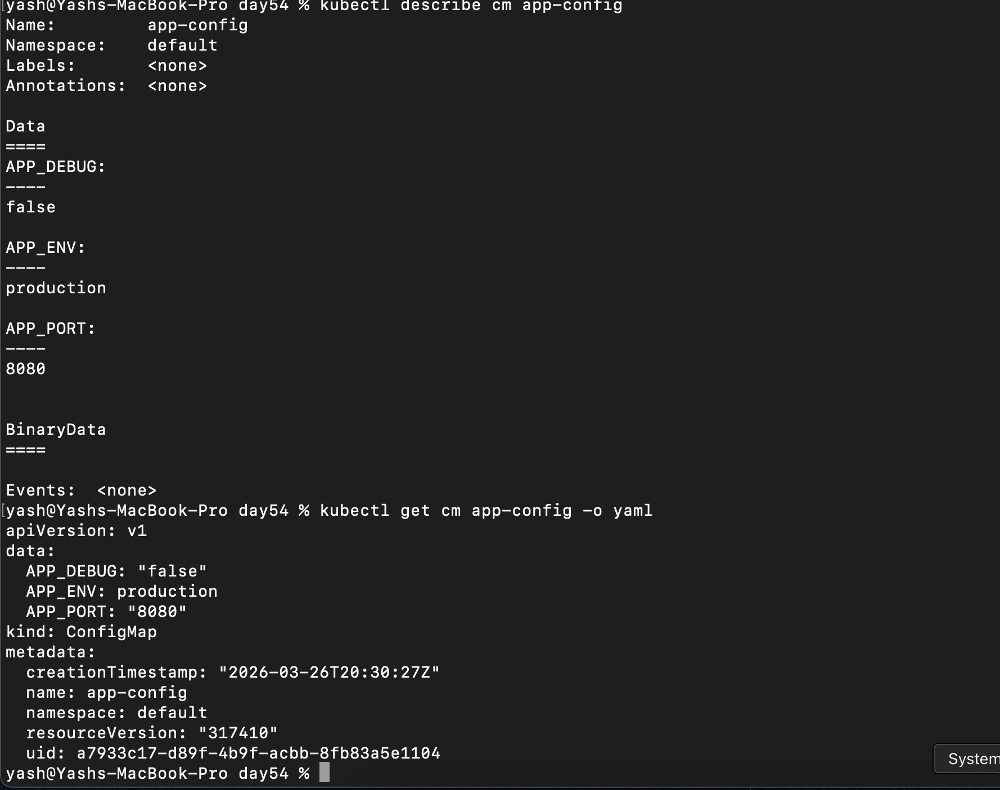
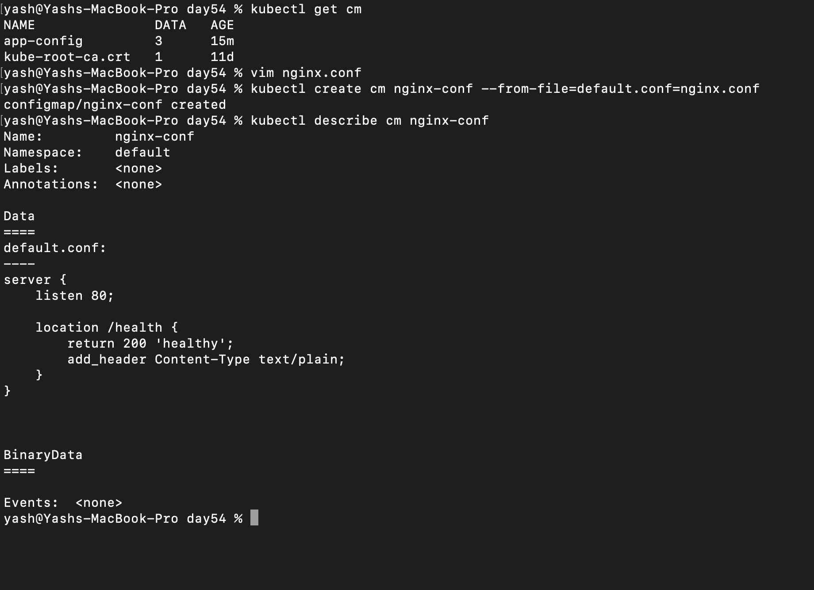
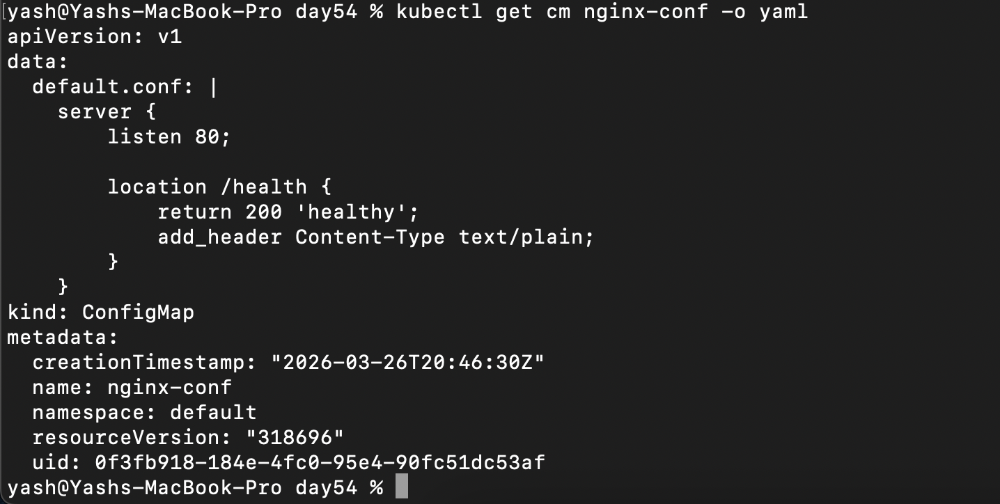
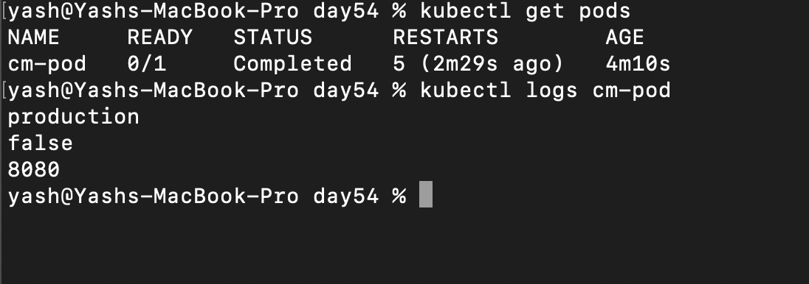
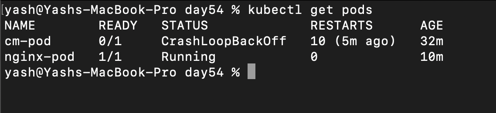
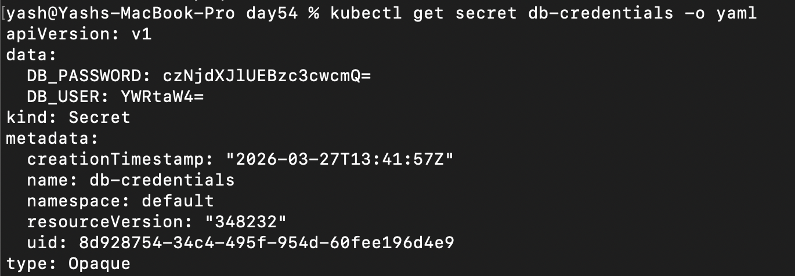
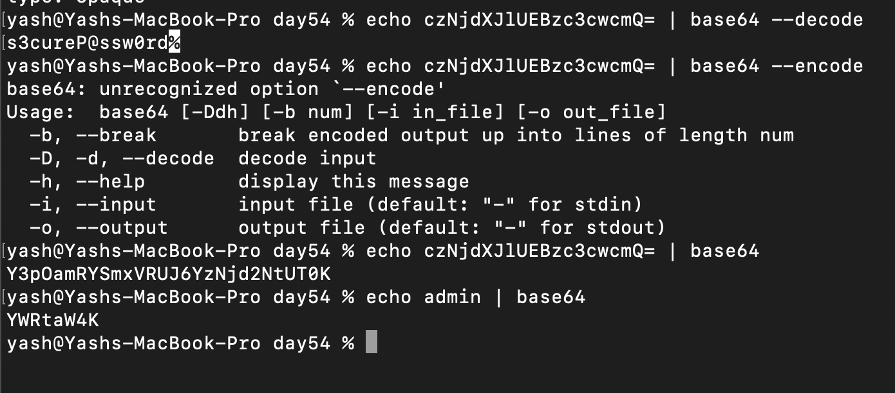
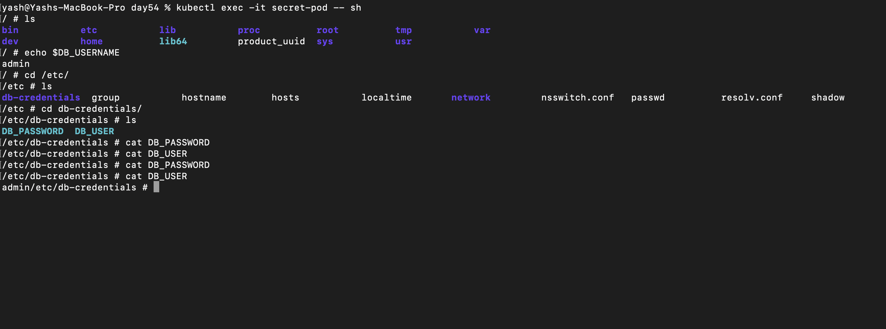
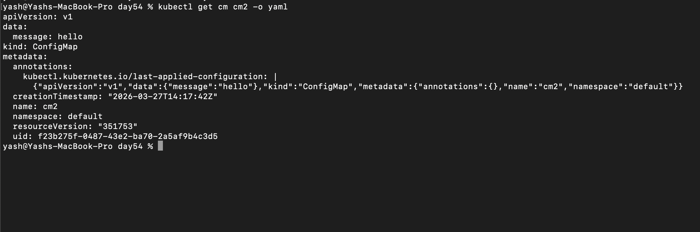

## Challenge Tasks

### Task 1: Create a ConfigMap from Literals

1. kubectl create cm app-config --from-literal=APP_ENV=production --from-literal=APP_DEBUG=false --from-literal=APP_PORT=8080

2. kubectl describe cm app-config


3. Yes it is stored as plaintext

**Verify:** Can you see all three key-value pairs?- YES ✅

---

### Task 2: Create a ConfigMap from a File
1. vim nginx.conf:
```
server {
    listen 80;

    location /health {
        return 200 'healthy';
        add_header Content-Type text/plain;
    }
}

```

2. kubectl create cm nginx-conf --from-file=defaul.conf=nginx.conf


3. 

- *ConfigMap key = filename inside container when mounted as volume*

**Verify:** Does `kubectl get configmap nginx-config -o yaml` show the file contents?- YES ✅


---

### Task 3: Use ConfigMaps in a Pod

1. 
2. 
3. 


**Verify:** Does the `/health` endpoint respond?- Yes ✅

Alright — let’s break **Volume Mounts** in a way that actually sticks 👇

---

# 🔥 What is a Volume Mount?

👉 A **volume** is storage
👉 A **volumeMount** is *where that storage appears inside the container*

---

## 🧠 Simple mental model

```text
Volume (data source)  →  Mounted into →  Container path
```

---

# 🔹 In your case (ConfigMap)

You did:

```yaml
volumes:
  - name: nginx-pod-cm-vol
    configMap:
      name: nginx-conf
```

👉 This creates a **volume from ConfigMap**

Then:

```yaml
volumeMounts:
  - name: nginx-pod-cm-vol
    mountPath: /etc/nginx/conf.d
```

👉 This says:

> “Take that ConfigMap and make it available as files at this path”

---

# 🔥 What actually happens

## Before mount (inside container)

```bash
/etc/nginx/conf.d/
  default.conf (nginx default)
```

---

## After mount

```bash
/etc/nginx/conf.d/
  default.conf (from ConfigMap)
```

👉 Your file **replaces or overrides** existing files

---

# 🔥 Types of volumes (quick overview)

| Type             | Use                               |
| ---------------- | --------------------------------- |
| ConfigMap        | Config files                      |
| Secret           | Sensitive data                    |
| emptyDir         | Temp storage                      |
| hostPath         | Node filesystem (not recommended) |
| PersistentVolume | Long-term storage                 |

---

# 🔹 Why not just use env variables?

Good question 👇

| Env               | Volume                       |
| ----------------- | ---------------------------- |
| Simple key-values | Full files                   |
| Small configs     | Complex configs (like nginx) |
| Static            | Can update dynamically       |

👉 Nginx needs **files**, not env → so volume is used

---

# 🔥 Important behavior (VERY important)

👉 ConfigMap volume is **read-only**

👉 If ConfigMap updates:

* Files update automatically (after some time)

---

# 🧠 One-line takeaway

👉 **Volume = data source, VolumeMount = where it appears in container**

---

# 🚀 In your Nginx case

* ConfigMap → holds config
* Volume → connects ConfigMap
* VolumeMount → injects into `/etc/nginx/conf.d`
* Nginx → automatically reads it


---

### Task 4: Create a Secret

1.  kubectl create secret generic db-credentials --from-literal=DB_USER=admin --from-literal=DB_PASSWORD=s3cureP@ssw0rd

2. - 

3. 

- To encode:

echo `value here` | base64

---

### Task 5: Use Secrets in a Pod
1. secret.pod.yml
2. done
3. - 


**Verify:** Are the mounted file values plaintext or base64? - *Plain Text ✅* 

---
### Task 6: Update a ConfigMap and Observe Propagation

1. cm2.yml
- 

kubectl apply -f cm2.yml

2. 

vim cm2-pod.yml
kubectl apply -f cm2-pod.yml

`kubectl patch configmap live-config --type merge -p '{"data":{"message":"world"}}'`

kubectl logs -f cm2-pod

values changes to World


Method	Updates automatically?
Env vars (env, envFrom)	❌ NO
Volume mount (files)	✅ YES

- **Verify:** Did the volume-mounted value change without a pod restart? - *YES*

---

### Task 7: Clean Up

- kubectl delete pods <pod_name>
- kubectl delete cm <cm_name>
- kubectl delete secret <secret_name>

---


