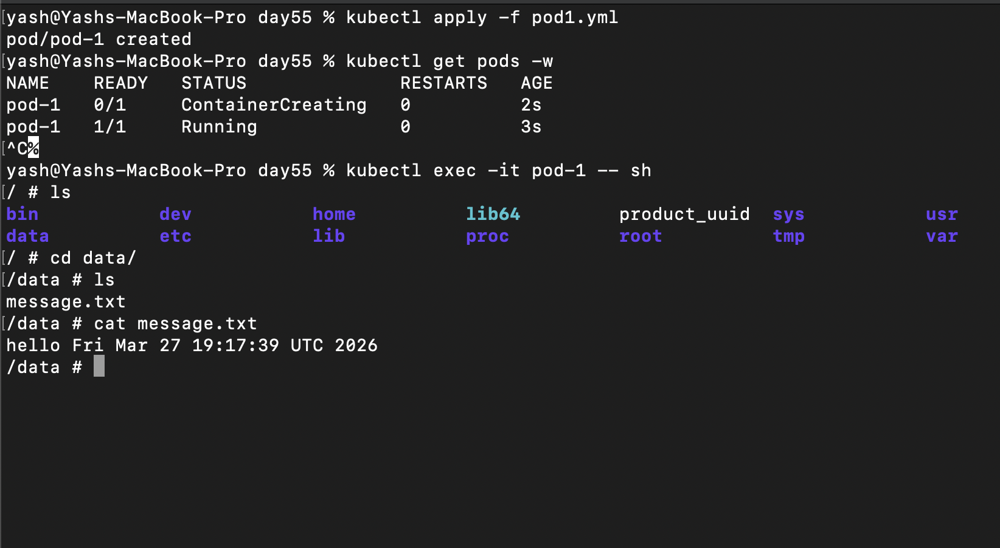
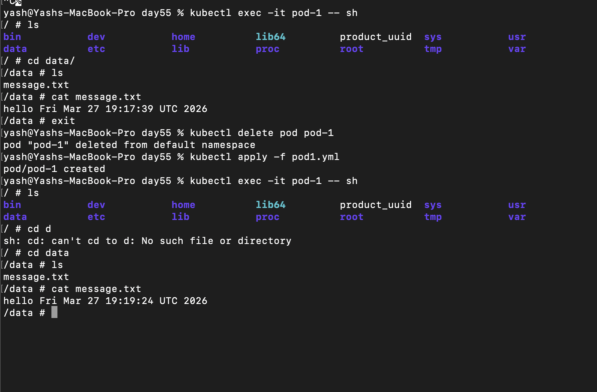
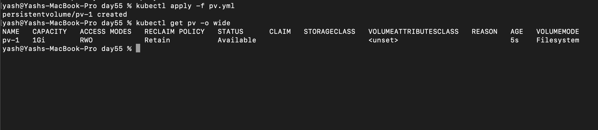
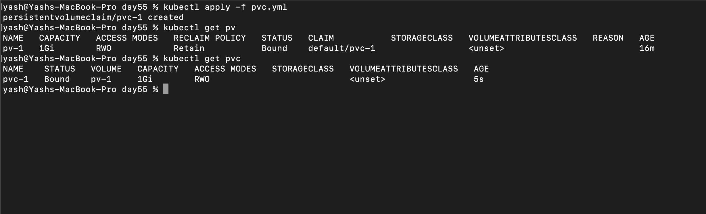
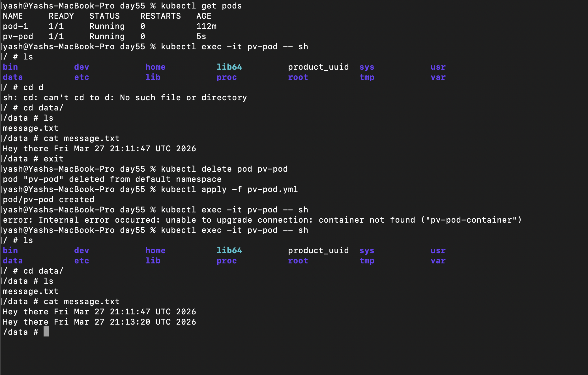
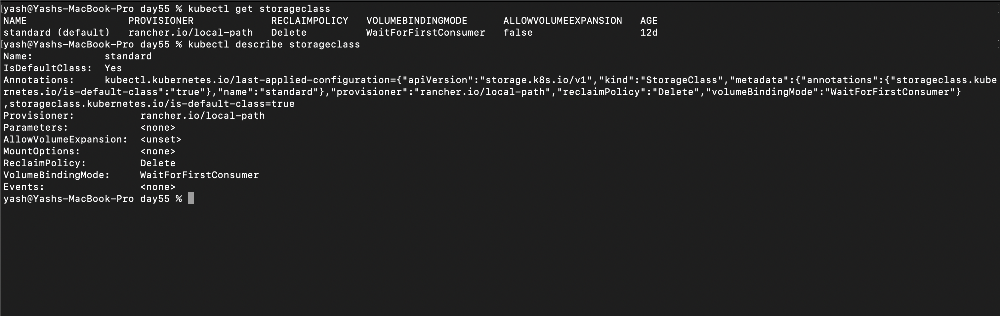
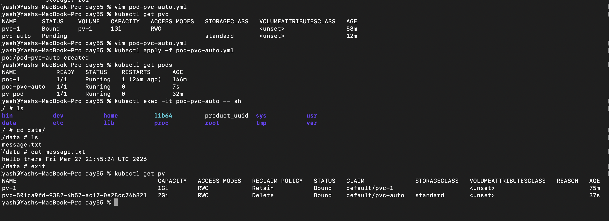
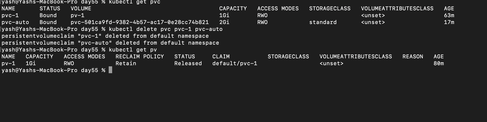

## Challenge Tasks

### Task 1: See the Problem — Data Lost on Pod Deletion

1. 
2. kubectl delete pod pod-1
- 

*Time Changed*

- Data isnt stored, once pod is deleted data is gone

----

### Task 2: Create a PersistentVolume (Static Provisioning)
1. Done, 2026/day-55/pv.yml
2.  

**Verify:** What is the STATUS of the PV?- *Available*

---

### Task 3: Create a PersistentVolumeClaim

`If a PVC is stuck in Pending, the first thing to check is StorageClass mismatch—especially when the cluster has a default StorageClass.`

- 
- we had to add storageClassName: "" to pvc.yml without which it wont bind.
- 2026/day-55/pvc.yml

**Verify:** What does the VOLUME column in `kubectl get pvc` show?- *It shows name of pv it got binded to*

---
### Task 4: Use the PVC in a Pod — Data That Survives

- 


**Verify:** Does the file contain data from both the first and second Pod? - *Yes it contains both the data*

---

### Task 5: StorageClasses and Dynamic Provisioning

1. 
2. 
- provisioner: rancher.io/local-path
- reclaim Policy: Delete
- Volume Binding Mode: WaitForFirstConsumer 

3. got it
```
🎯 Real meaning in one line

“StorageClass defines how storage is created, so developers don’t need to manually create PVs.”

🔥 Why this is powerful

Without dynamic provisioning:

You must pre-create many PVs ❌
Hard to scale ❌

With it:

Storage is created on demand ✅
Fully automated ✅
```

**Verify:** What is the default StorageClass in your cluster? - *Standard*

---

### Task 6: Dynamic Provisioning

1. pvc-auto.yml, 2026/day-55/pvc-auto.yml
2. it doesnt come automatically it will come once we use this pvc with a pod

3. yes it works

- 

```
now on doing kubectl get pv
we can see 2 pv (2nd one created automatically when we used pvc with the pod)
```

**Verify:** How many PVs exist now? Which was manual, which was dynamic?- *2, First manual, 2nd Dyna,ic*

---

### Task 7: Clean Up

- 
`Dynamic pv deleted`

**Verify:** Which PV was auto-deleted and which was retained? Why?- *Dynamic pv got deleted becaused of its Reclaim policy: Delete*

---