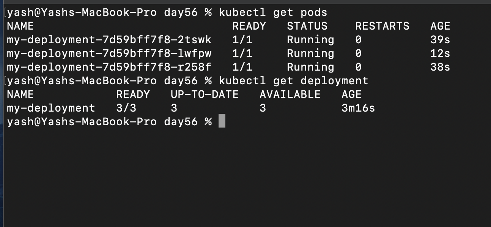
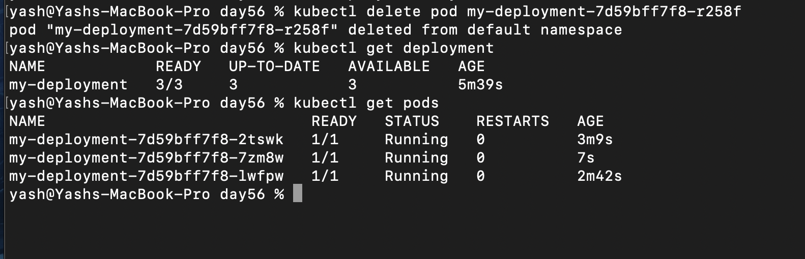
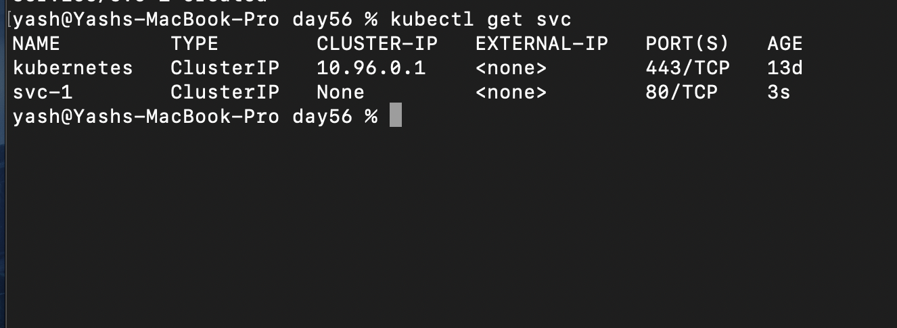
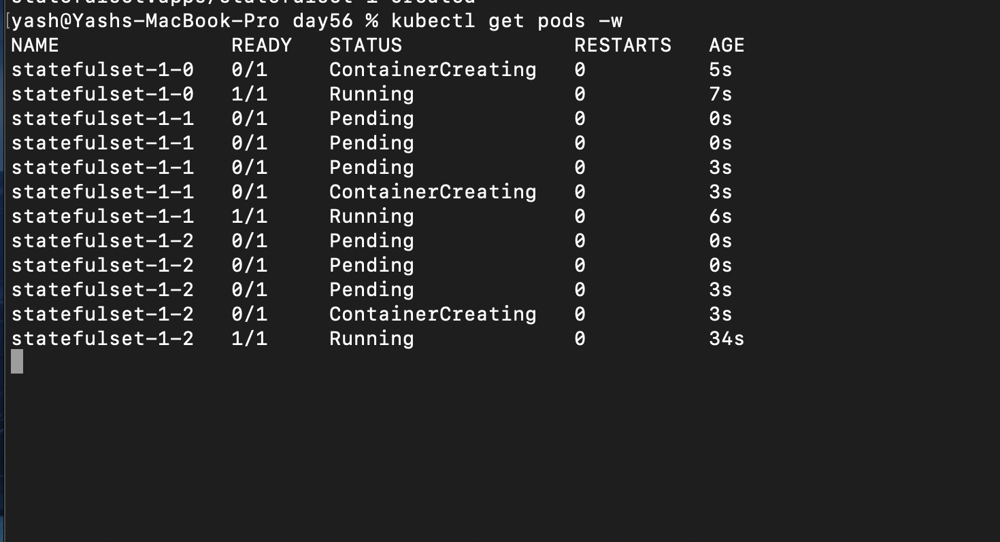
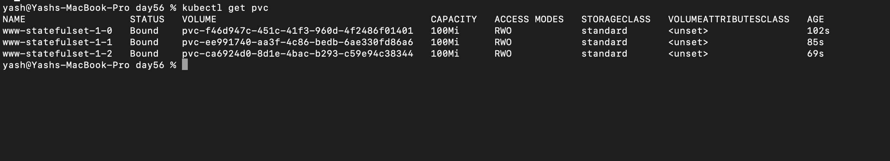
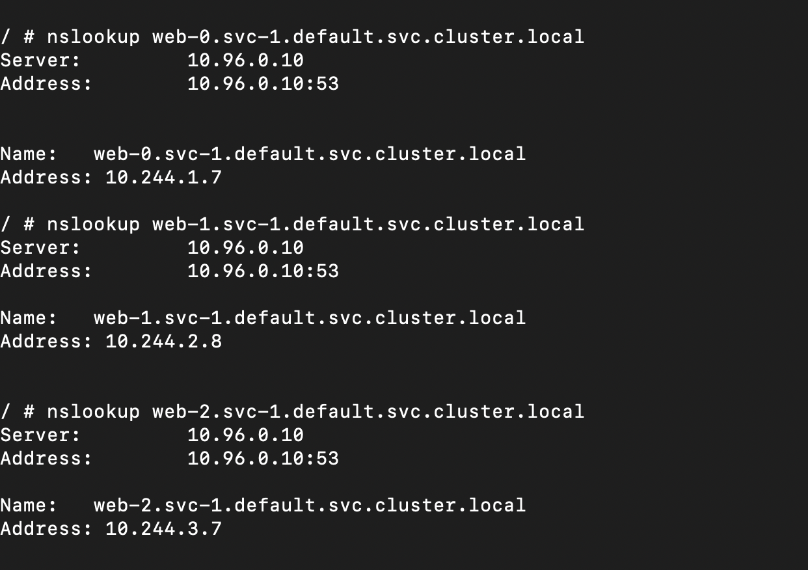
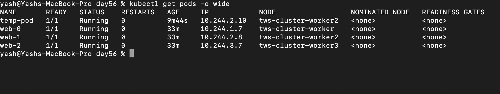
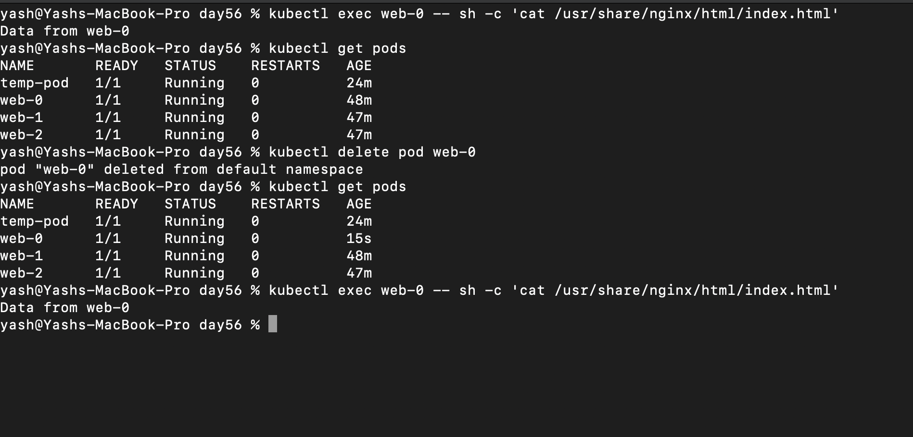
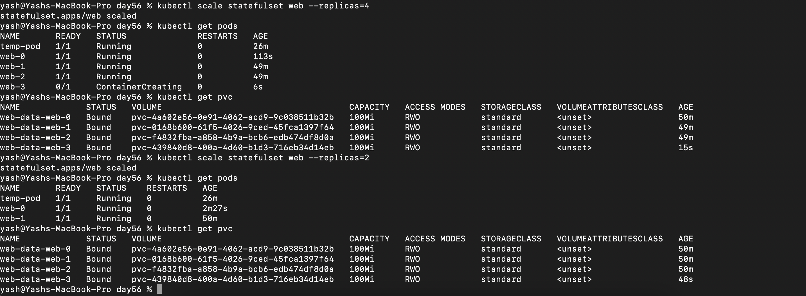

```
One-line

👉 Stateless = no important local data
👉 Stateful = data must survive pod restart

🧠 Easy analogy
Stateless → Calculator 🧮
(you input → get result → nothing stored)
Stateful → WhatsApp 📱
(messages must persist)
💡 Final answer to your doubt

"app without db?"

✔️ Close, but better definition:

👉 Stateless app =
App that does NOT rely on local storage (inside pod)
Even if it uses a DB — that DB is external

```
You’re already on the right track 👇 — StatefulSets solve exactly the problem you’re thinking about.

---

## ⚠️ Problem with Deployments (Stateless)

In a normal **Deployment**:

* Pods are **interchangeable**
* If a pod dies → a **new pod is created with**

  * ❌ New name
  * ❌ New IP
  * ❌ No memory of old data

👉 Example:

```
my-app-7f9c → dies
my-app-2k8x → new pod (completely different identity)
```

This is fine for:

* Frontend apps
* APIs
* Microservices

BUT ❌ not for databases

---

## 💣 Why this breaks databases

Databases need:

* Stable identity (same name)
* Stable storage (data shouldn’t vanish)
* Ordered startup (leader → replicas)

Imagine:

* MySQL pod dies → new pod comes with new name + empty data
  👉 Your DB is basically gone 💀

---

## ✅ What StatefulSets fix

StatefulSets give **3 superpowers**

---

### 1. 🧠 Stable Pod Names (Identity)

Pods get **fixed names**:

```
mysql-0
mysql-1
mysql-2
```

Even if `mysql-0` dies → it comes back as:

```
mysql-0 (same name)
```

👉 This is HUGE for databases

---

### 2. 💾 Persistent Storage per Pod

Each pod gets its **own volume**

```
mysql-0 → PVC → data-0
mysql-1 → PVC → data-1
```

Even if pod dies:

* New pod attaches to **same storage**
* Data is still there ✅

---

### 3. 🔢 Ordered Start/Stop

Pods start **in order**:

```
mysql-0 → then mysql-1 → then mysql-2
```

And stop in reverse:

```
mysql-2 → mysql-1 → mysql-0
```

👉 Needed for:

* DB replication
* Leader election

---

## 🔥 Simple Analogy

### Deployment:

> Like Uber drivers — anyone can replace anyone 🚗

### StatefulSet:

> Like employees with IDs + desks
> If someone leaves → same ID + same desk is reassigned 🧑‍💼

---

## ⚡ Quick Comparison

| Feature  | Deployment       | StatefulSet       |
| -------- | ---------------- | ----------------- |
| Pod name | Random           | Fixed (`app-0`)   |
| Storage  | Shared/ephemeral | Dedicated per pod |
| Identity | No               | Yes               |
| Order    | Random           | Sequential        |

---

## 🚀 When to use StatefulSets

Use when:

* MySQL / PostgreSQL
* MongoDB
* Kafka
* Redis cluster

---

## Challenge Tasks

### Task 1: Understand the Problem
- 

- 

3. Yes once the pod was deleted the new pod got a new name


**Verify:** Why would random pod names be a problem for a database cluster? -

```
👉 Random pod names break:

Identity
Replication
Service discovery

Which are critical for database clusters

---

Simple analogy
Deployment pods = random people entering/leaving a room
DB cluster = a team with fixed roles (CEO, manager, etc.)

👉 If CEO disappears and a random new person shows up:

Nobody trusts them
System breaks
```

---

## Headless Service

## 🧠 What is a **Headless Service** in Kubernetes?

👉 A **Headless Service** is a Service **without a ClusterIP**

```yaml
clusterIP: None
```

---

## 🔥 Normal Service vs Headless Service

### 🟢 Normal Service (ClusterIP)


* Has a virtual IP (like `10.x.x.x`)
* Load balances traffic across pods

```id="c1"
Client → Service IP → Random Pod
```

---

### 🔴 Headless Service


* ❌ No ClusterIP
* ❌ No load balancing
* ✅ Returns **all pod IPs via DNS**

```id="c2"
Client → DNS → Pod IPs (direct access)
```

---

## 📦 YAML Example

```yaml id="c3"
apiVersion: v1
kind: Service
metadata:
  name: postgres-headless
spec:
  clusterIP: None
  selector:
    app: postgres
  ports:
    - port: 5432
```

---

## 🌐 What makes it powerful → DNS

With a headless service + StatefulSet:

👉 You get **stable DNS per pod**

```id="c4"
postgres-0.postgres-headless
postgres-1.postgres-headless
postgres-2.postgres-headless
```

Each resolves to a specific pod ✅

---

## 💣 Why normal Service doesn’t work for DB clusters

Normal service:

```id="c5"
postgres-service → random pod
```

👉 Problem:

* You don’t know which pod you hit
* DB replication needs specific nodes

---

## ✅ Why Headless Service is used

Perfect for:

* Databases (MySQL, PostgreSQL)
* Kafka
* Zookeeper

Because:

* You can target **specific pods**
* No random load balancing
* Stable identity + DNS

---

## ⚡ Simple analogy

* Normal Service → Call center 📞 (any agent picks)
* Headless Service → Direct phone numbers ☎️ (call exact person)

---

## 🧠 One-line answer (interview)

👉 Headless Service is a Kubernetes Service with `clusterIP: None` that provides **direct DNS-based access to individual pods instead of load balancing**


### Task 2: Create a Headless Service

- 
it shows none

---

### Task 3: Create a StatefulSet

- 
- 

---

### Task 4: Stable Network Identity

- 
- 

---

### Task 5: Stable Storage — Data Survives Pod Deletion

- 


**Verify:** Is the data identical after pod recreation? - Yes data is identical ✅

### Task 6: Ordered Scaling

**Verify:** After scaling down, how many PVCs exist?

- 

- on scaling up pods increase, pvc increase as per pod but on scaling down the pods decrease as per number like 3 gone first then 2 but pvc remains same

---

### Task 7: Clean Up

**Verify:** Were PVCs auto-deleted with the StatefulSet?- NO ❌

--
