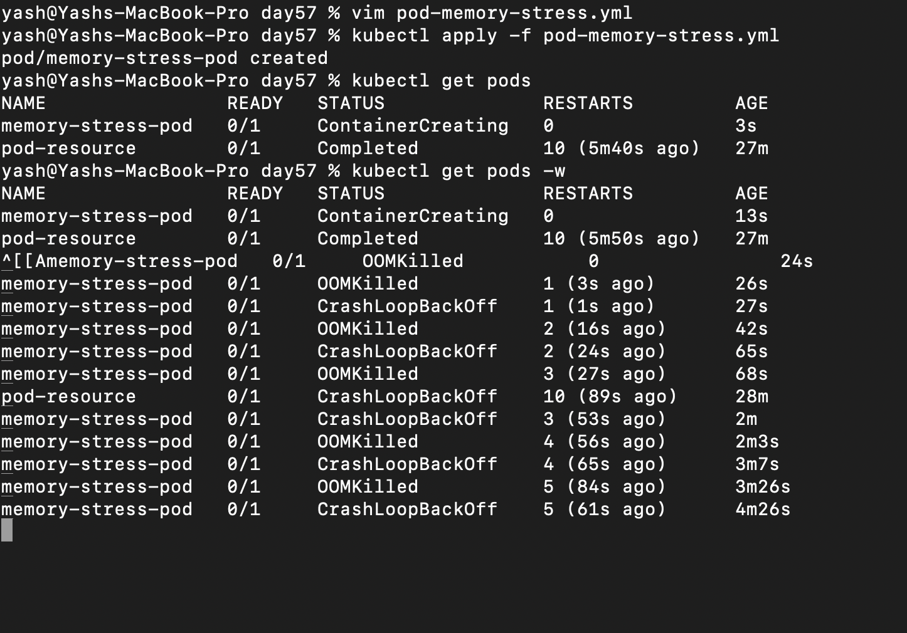
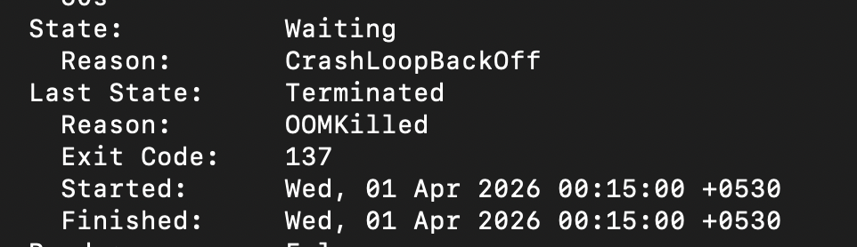
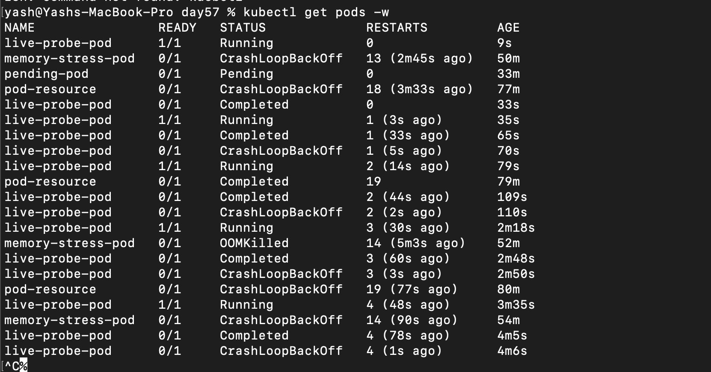
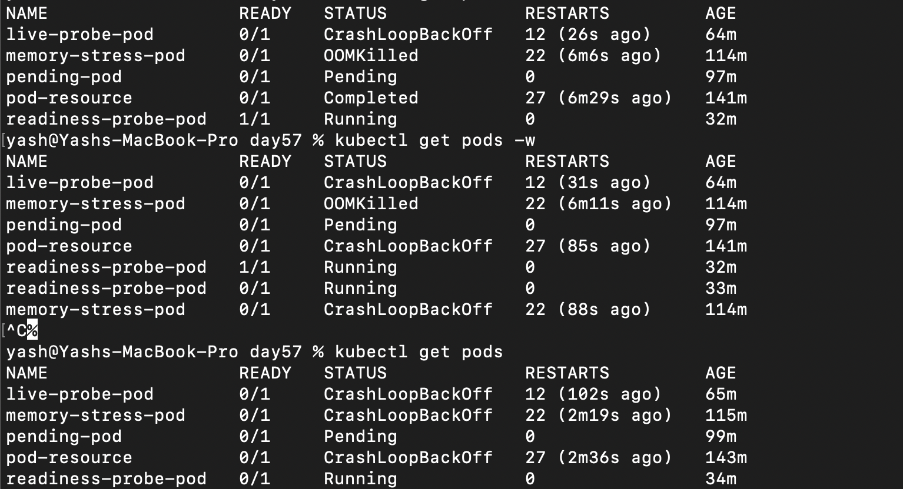
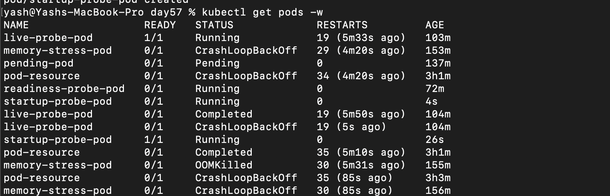

## Challenge Tasks

### Task 1: Resource Requests and Limits

1. vim pod-1.yml
2.
```
containers:
        - name: pod-resource-container
          image: busybox:latest
          ports:
          - containerPort: 80
          resources:
              requests: 
                  memory: 128Mi
                  cpu: 100m
              limits:
                  memory: 256Mi
                  cpu: 250m

```

3. It's QoS class is Burstable

---

### Task 2: OOMKilled — Exceeding Memory Limits

1. created
2. 
```
  containers:
        - name: memeory-stress-pod-container
          image: polinux/stress
          command: ["stress"]
          args: ["--vm", "1", "--vm-bytes", "150M", "--timeout", "60s"]
          resources:
              requests:
                  memory: 50Mi
              limits:
                  memory: 100Mi
```

3. 
   

---

### Task 3: Pending Pod — Requesting Too Much

1. 
```
containers:
        - name: pending-pod-container
          image: nginx:latest
          resources:
              requests:
                  cpu: 100
                  memory: 128Gi
```

2. 

3. 
```
Warning  FailedScheduling  2m6s  default-scheduler  0/4 nodes are available: 1 node(s) had untolerated taint(s), 3 Insufficient cpu, 3 Insufficient memory. no new claims to deallocate, preemption: 0/4 nodes are available: 4 Preemption is not helpful for scheduling.

```

---

### Task 4: Liveness Probe
1. 
```
 containers:
        - name: live-probe-pod-container
          image: busybox:latest
          command: ["/bin/sh", "-c"]
          args:
              - touch /tmp/healthy && sleep 30 && rm -rf /tmp/healthy
          livenessProbe:
              exec:  
                  command: ["cat", "/tmp/healthy"]
              periodSeconds: 5
              failureThreshold: 3
```
2. done
3. 

**Verify:** How many times has the container restarted? - 
`After 3 times the container restarts for endless time`


---

### Task 5: Readiness Probe

1. 

```
containers:
        - name: readiness-probe-pod-container
          image: nginx:latest
          ports:
              - containerPort: 80
          readinessProbe:
              httpGet:
                  path: /
```

2. `kubectl expose pod readiness-probe-pod --port=80 --name=readiness-svc`

3. 

`Yes its not restarting`


```
Time →
[Running + Ready] ✅
[Readiness fails] → 🚫 no traffic
[Liveness fails] → 🔁 restart
[Restarting] → 🚫 no traffic
[Ready again] → ✅ traffic resumes
```
---

### Task 6: Startup Probe

1. 
```
containers:
        - name: startup-probe-pod-container
          image: busybox:latest
          command: ["/bin/sh", "-c"]
          args:
              - sleep 20 && touch /tmp/started && sleep 300
          startupProbe:
              exec:
                  command: ["cat", "/tmp/started"]
              periodSeconds: 5
              failureThreshold: 12
          livenessProbe:
              exec:
                  command: ["cat", "/tmp/started"]
              periodSeconds: 5
```
2. 
3. done

```
startupProbe never succeeds
so:
liveness never starts
readiness never starts
```

```
If startupProbe fails, Kubernetes:

RESTARTS container

👉 It does NOT mark ready
```
---

### Task 7: Clean Up
- Done ✅