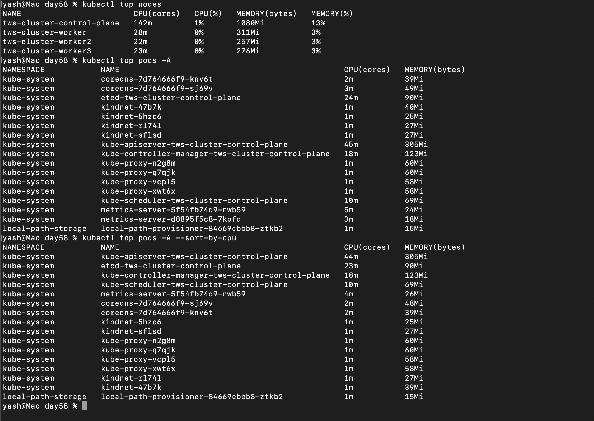
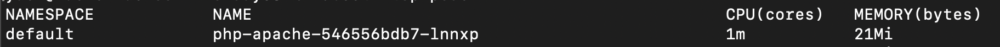
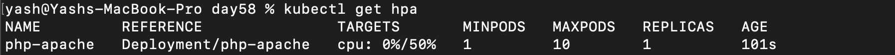
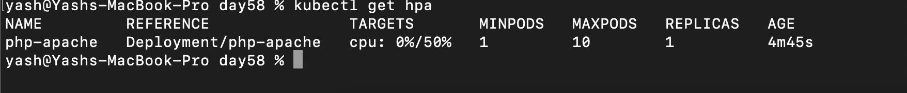
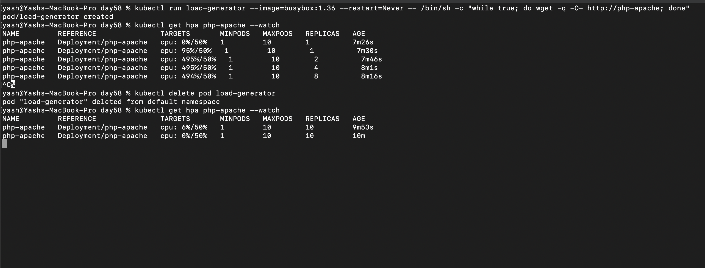
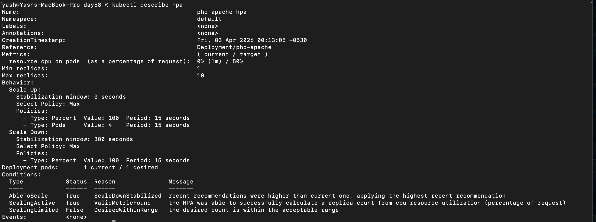

## Challenge Tasks

### Task 1: Install the Metrics Server

```
1. kubectl apply -f https://github.com/kubernetes-sigs/metrics-server/releases/latest/download/components.yaml

2. kubectl patch -n kube-system deployment metrics-server --type=json \
  -p '[{"op":"add","path":"/spec/template/spec/containers/0/args/-","value":"--kubelet-insecure-tls"}]'

3. kubectl get pods -n kube-system | grep metrics-server

4. kubectl edit deployment metrics-server -n kube-system

-> update port to 4443

kubectl rollout restart deployment metrics-server -n kube-system

now
-> kubectl top nodes
-> kubectl top pods -A

```

**The control plane node is using ~142m CPU (1%) and 1080Mi memory (13%), while worker nodes are using ~20–30m CPU (0%) and ~250–310Mi memory (~3%).**

---

### Task 2: Explore kubectl top

1. 
2. 3. Understood


**Verify:** Which pod is using the most CPU right now?
- apiserver (44m  CPU | 305Mi  Memory )

---

### Task 3: Create a Deployment with CPU Requests

1. 
```
kind: Deployment
apiVersion: apps/v1

metadata:
    name: php-apache
    labels:
        app: hpa-app

spec:
    replicas: 1
    selector:
        matchLabels:
            app: hpa-app
    template:
        metadata:
            labels:
                app: hpa-app
        spec:
            containers:
                - name: hpa-deployment-container
                  image: registry.k8s.io/hpa-example
                  ports:
                      - containerPort: 80
                  resources:
                      requests:
                          cpu: 200m
```

2. 
```
resources:
                      requests:
                          cpu: 200m
```

3. kubectl expose deployment php-apache --port=80

**Verify:** What is the current CPU usage of the Pod?- **1M**


---

### Task 4: Create an HPA (Imperative)

1. `kubectl autoscale deployment php-apache --cpu=50% --min=1 --max=10`
2. 
3. 

**Verify:** What does the TARGETS column show? - *It shows 0%/50%*

---

### Task 5: Generate Load and Watch Autoscaling

1. `kubectl run load-generator --image=busybox:1.36 --restart=never -- /bin/sh -c "while true; do wget -q -O- https://php-apache ; done`

2. kubectl get hpa php-apache --watch



`Scaling Up happens tremendously like it scaled to max of 10 pods (replicas) over a minute but scaling down takes time`


**Verify:** How many replicas did HPA scale to under load? - *10*

---

### Task 6: Create an HPA from YAML (Declarative)
1. Done
2.  hpa-horizontal.yml
3. 

```
    behavior:
        scaleUp:
            stabilizationWindowSeconds: 0  # No stabilization; scale up immediately
            policies:
                - type: Percent
                  value: 100                   # Double capacity every 15 seconds if needed
                  periodSeconds: 15
                - type: Pods
                  value: 4                     # Or add 4 pods every 15 seconds
                  periodSeconds: 15
            selectPolicy: Max

        scaleDown:
            stabilizationWindowSeconds: 300 # 300 second (5 min) window to prevent thrashing
            policies:
                - type: Percent
                  value: 100                   # Allow full scale down if metrics stay low
                  periodSeconds: 15
            selectPolicy: Max

```

4. 

**Verify:** What does the `behavior` section control?

`The behavior section in HPA (autoscaling/v2) controls scaling velocity and stability. It defines how quickly pods scale up or down using policies, rate limits, and stabilization windows to prevent rapid fluctuations and ensure smooth autoscaling.`

---

Great — now you’re stepping into **real production-grade HPA tuning** 👇
The `behavior` section in **`autoscaling/v2`** is what separates *basic HPA* from *production-ready HPA*.

---

# 🔥 What is `behavior` in HPA?

👉 It controls **HOW fast and HOW aggressively scaling happens**

Without it:

* Kubernetes uses default rules (often not ideal)

With it:

* You **fine-tune scaling speed, stability, and safety**

---

# 🔹 Where it exists

```yaml
apiVersion: autoscaling/v2
kind: HorizontalPodAutoscaler

spec:
  behavior:
    scaleUp:
      ...
    scaleDown:
      ...
```

---

# 🔹 Why this is needed

Default HPA problems:

* 🚨 Too fast scale up → cost spike
* 🚨 Too fast scale down → instability
* 🚨 Constant up/down → **flapping**

👉 `behavior` solves all of this

---

# 🔥 Core Components

---

# 🔹 1. `scaleUp` (when load increases)

Controls:
👉 How fast pods increase

---

## Example

```yaml
scaleUp:
  stabilizationWindowSeconds: 0
  policies:
    - type: Percent
      value: 100
      periodSeconds: 15
```

---

## 🧠 Meaning

* Can scale up **100% (double pods)** every 15 seconds
* No delay (`0 sec window`)

---

## 📊 Example

| Current Pods | After Scale |
| ------------ | ----------- |
| 2            | 4           |
| 4            | 8           |

---

# 🔹 2. `scaleDown` (when load decreases)

Controls:
👉 How fast pods decrease

---

## Example

```yaml
scaleDown:
  stabilizationWindowSeconds: 300
  policies:
    - type: Percent
      value: 50
      periodSeconds: 60
```

---

## 🧠 Meaning

* Wait **5 minutes before scaling down**
* Reduce only **50% at a time**
* Every **60 seconds**

---

## 📊 Example

| Current Pods | After Scale |
| ------------ | ----------- |
| 10           | 5           |
| 5            | 3           |
| 3            | 2           |

---

# 🔥 3. `stabilizationWindowSeconds` (VERY IMPORTANT)

👉 Prevents **flapping**

---

## How it works

* HPA remembers past recommendations
* Picks the **safest value**

---

## Example

Traffic pattern:

```text
80% → 20% → 70% → 30%
```

Without stabilization:

* Pods go up/down constantly ❌

With stabilization:

* Scaling is smooth ✅

---

# 🔹 4. `policies` (rate limiting)

Controls:
👉 **How much scaling is allowed**

---

## Types

### ✅ Percent-based

```yaml
type: Percent
value: 50
```

👉 Scale by % of current pods

---

### ✅ Pod-based

```yaml
type: Pods
value: 4
```

👉 Add/remove fixed number of pods

---

# 🔹 5. `selectPolicy`

👉 When multiple policies exist, choose:

```yaml
selectPolicy: Max | Min | Disabled
```

---

## Example

```yaml
policies:
  - type: Percent
    value: 50
  - type: Pods
    value: 4
selectPolicy: Max
```

👉 Picks the **larger scaling change**

---

# 🔥 Full Example (Production Style)

```yaml
behavior:
  scaleUp:
    stabilizationWindowSeconds: 0
    policies:
      - type: Percent
        value: 100
        periodSeconds: 15

  scaleDown:
    stabilizationWindowSeconds: 300
    policies:
      - type: Percent
        value: 50
        periodSeconds: 60
```

---

# 🔹 Real-world Behavior

| Situation        | Action             |
| ---------------- | ------------------ |
| Sudden spike     | Fast scale up 🚀   |
| Traffic drop     | Slow scale down 🐢 |
| Fluctuating load | Stabilized         |

---

# 🔥 Why scaleDown is slow

👉 To avoid:

* killing pods too early
* user experience issues
* repeated cold starts

---

# 🔹 Default behavior (if not defined)

* Scale up → aggressive
* Scale down → ~5 min delay

---

# 🔥 Key Insight (INTERVIEW GOLD)

👉 HPA is:

* **Reactive system**
* Needs **rate limiting + stabilization**

👉 `behavior` = **control system tuning**

---

# 🔹 Common Production Strategy

* Scale up → **fast**
* Scale down → **slow**
* Add stabilization → **avoid flapping**

---

# 🔹 Final Interview Answer

> The `behavior` section in HPA (autoscaling/v2) controls scaling velocity and stability. It defines how quickly pods scale up or down using policies, rate limits, and stabilization windows to prevent rapid fluctuations and ensure smooth autoscaling.

---

# 🚀 One-line summary

👉 `behavior` = **speed + stability control of autoscaling**

---
