## Challenge Tasks

### Task 1: Install Helm

1. 2.  `helm version
version.BuildInfo{Version:"v4.1.3"`

**Verify:** What version of Helm is installed?- *4.13*

---

### Task 2: Add a Repository and Search

1. 2. 3. Done

**Verify:** How many charts does Bitnami have?- *helm search repo bitnami | tail -n +2 | wc -l*

**144 Charts**

---

### Task 3: Install a Chart
1.  Done
2. 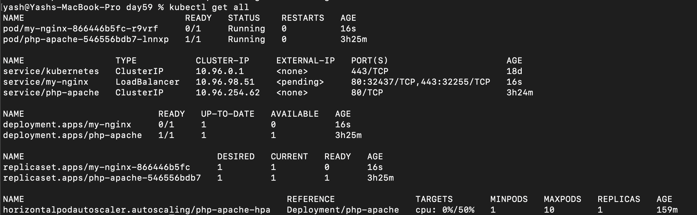, Pod, svc,deployment, replicaset were created
3. Done

**Verify:** How many Pods are running? What Service type was created? -
- 1 pod: my-nginx-866446b5fc-r9vrf 
-  svc type: loadBalancer, name: my-nginx

---

### Task 4: Customize with Values
1. Done
2. `helm install custom-nginx bitnami/nginx --set replicaCount=3 --set service.type=NodePort`

3. Created
4.  `helm install custom-nginx-2 bitnami/nginx -f custom-values.yaml`
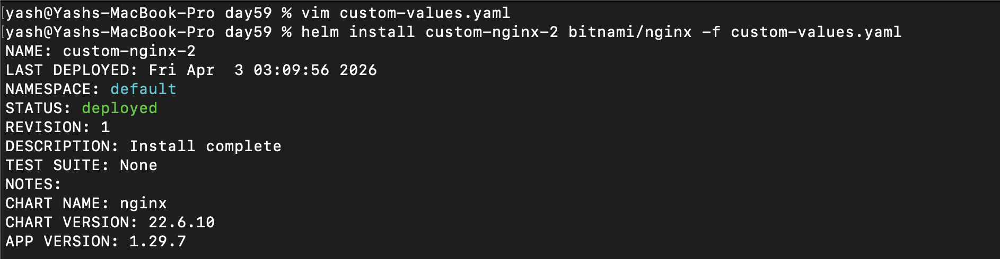

5. 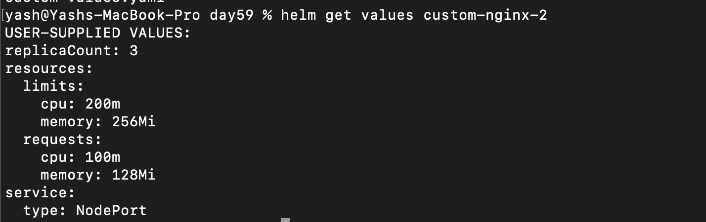

---

### Task 5: Upgrade and Rollback
1. `helm upgrade my-nginx bitnami/nginx --set replicaCount=5`

verified usiing: `helm get values my-nginx`
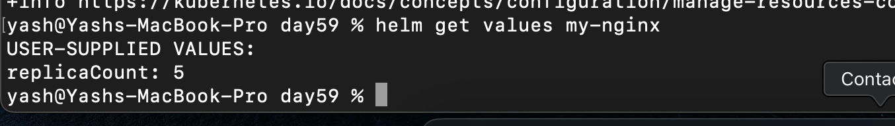

2. 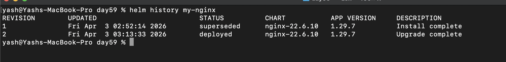
3. 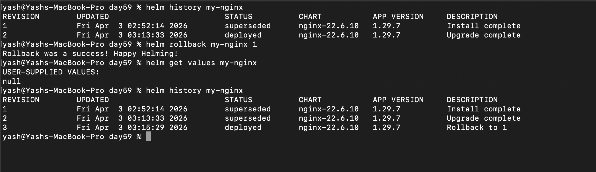
4. Verified

**Verify:** How many revisions after the rollback? - **3**

---

### Task 6: Create Your Own Chart

1. Done
2. 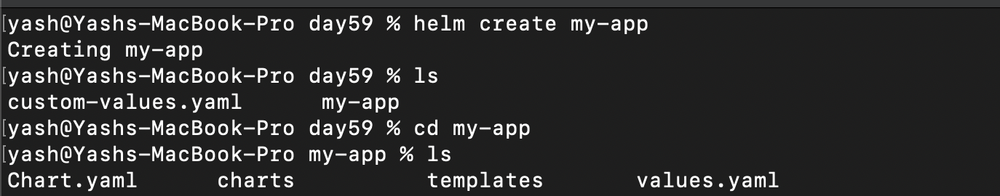
3. Done
4. vim values.yml and change replicaSet: 3 and tag: '1.25'
5. 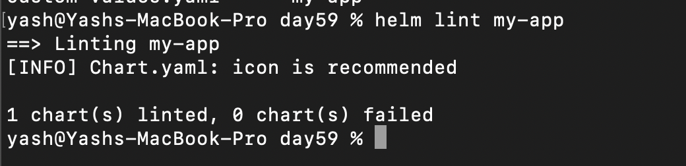
6. Done
7. 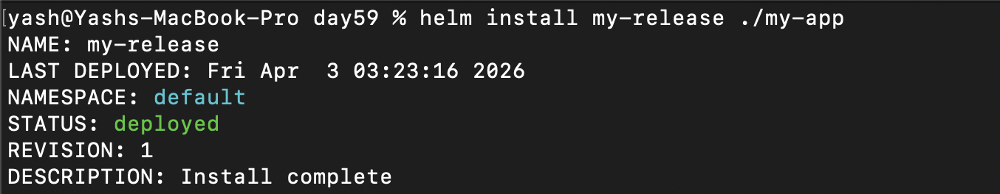
8. 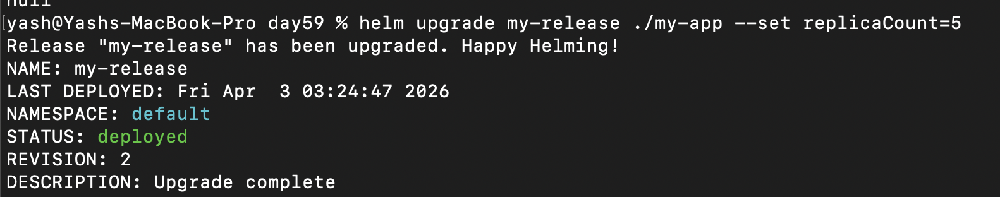
9. 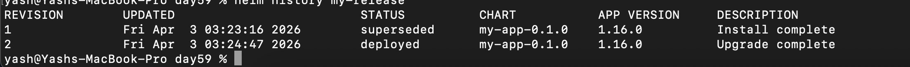
10. helm get values my-release
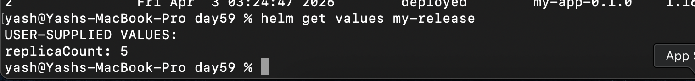

**Verify:** After installing, 3 replicas? After upgrading, 5? - Yes ✅

---
### Task 7: Clean Up
1. 2. 3. Done
**Verify:** Does `helm list` show zero releases? - Yes ✅
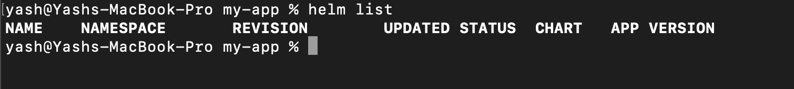

---