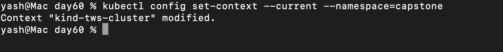
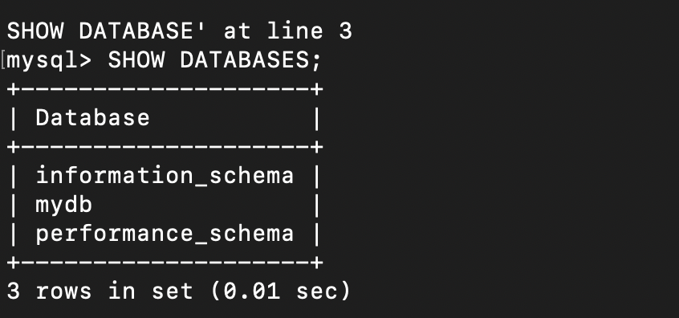
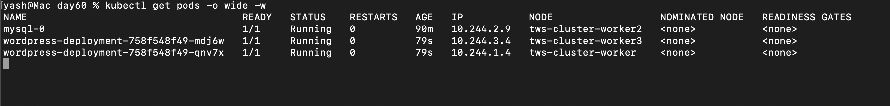
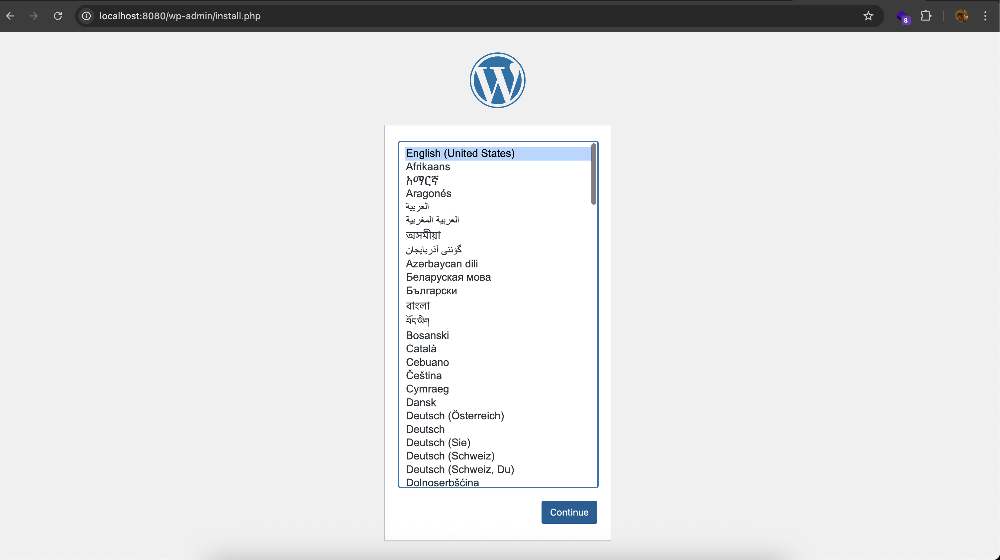
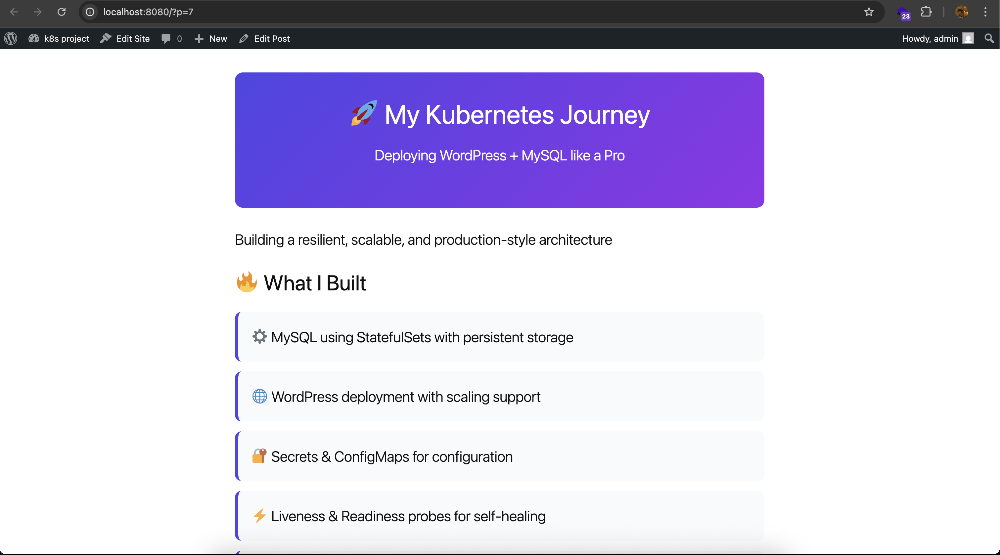
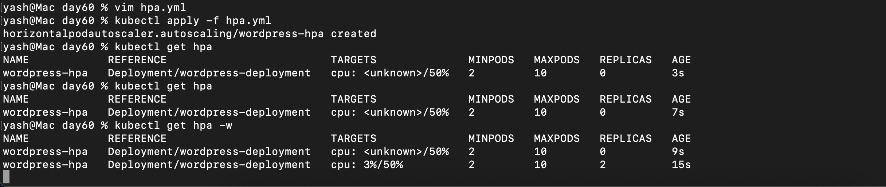
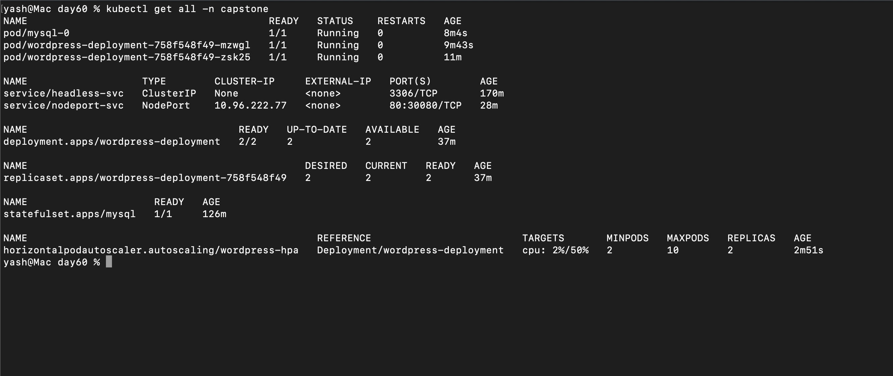
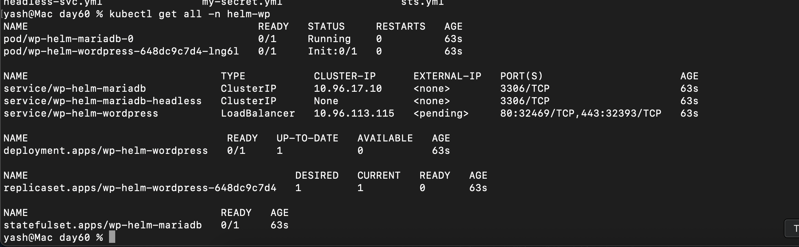

## Challenge Tasks

### Task 1: Create the Namespace (Day 52)

1. kubectl create namespace capstone
2. kubectl config set-context --current --namespace=capstone

---

### Task 2: Deploy MySQL (Days 54-56)

1. No need to encode
2. vim headless-svc.yml
3. vim mysts.yml
4. 
`We can see mydb there`

---

### Task 3: Deploy WordPress (Days 52, 54, 57)

1. created
2. created
3. 
`both pods running`

**Verify:** Are both WordPress pods running and ready?- YES ✅

---

### Task 4: Expose WordPress (Day 53)
1. done
2. kubectl port-forward svc/wordpress 8080:80 -n capstone
- 
- 

**Verify:** Can you see the WordPress setup page? - YES ✅

---

### Task 5: Test Self-Healing and Persistence

1. Yes
2. Yes it recreates
3. Yes its there

**Verify:** After deleting both pods, is your blog post still there?- Yes ✅

---

### Task 6: Set Up HPA (Day 58)
1. done
2. 
3. 

**Verify:** Does the HPA show correct min/max and target? - Yes ✅

---

### Task 7: (Bonus) Compare with Helm (Day 59)

1. Done
2. kubectl get all -n hem-wp

`kubectl get all,cm,secret,pvc -n helm-wp` -> to get detailed

3. ` helm uninstall wp-helm -n helm-wp`

---

### Task 8: Clean Up and Reflec
1. Done
2. Done
3. Done
4. Done

**Verify:** Did deleting the namespace remove everything? - Yes ✅

---
