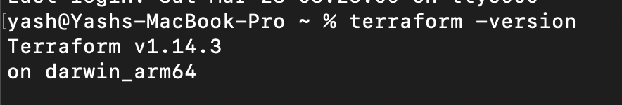
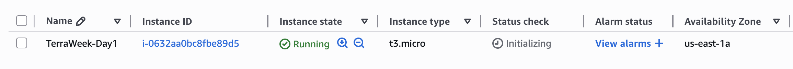
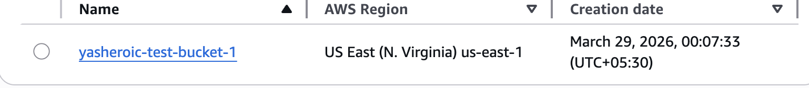
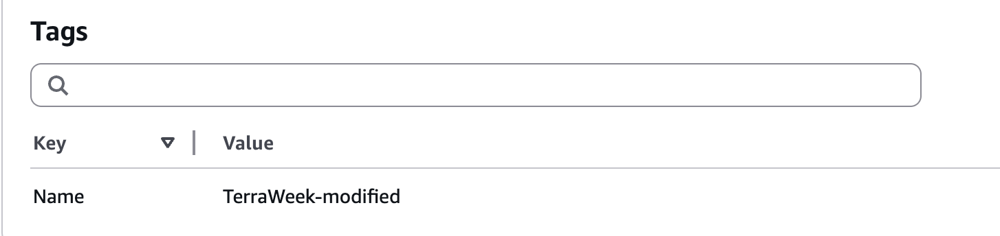

## Challenge Tasks

### Task 1: Understand Infrastructure as Code

1. IaC: It means infra as code by which we can create infrastructure like resources on platforms like aws,azure,gcp through automated files/scripts instead of manually going to the platform and creating one every time. it acts as single source of truth and saves time

2. 
- saves time
- no need to go to the provider each time and create resources manually
- acts as single source of truth

3. ansible is configuration management tool. pulumi is also IaC but doesnt Use HCL, Hashicorp config language and CFT is aws's own. Terraform is most widely used

4. in terraform needs declrared commands written in HCL language and it is cloud agnostic because for every provider command is for resource creation is different

---

You’re **very close**, but right now your answers feel like *bullet recall*, not *understanding*. Let me tighten them so they sound **interview-ready + LinkedIn-worthy** 👇

---

## ✅ Final Polished Version (Use This)

### 1. What is Infrastructure as Code (IaC)? Why does it matter?

Infrastructure as Code (IaC) is a way of managing and provisioning infrastructure (like servers, databases, networks) using code instead of manually creating them through a cloud console.

It matters in DevOps because it makes infrastructure **automated, repeatable, and version-controlled**, just like application code. This reduces human errors and allows teams to deploy environments quickly and consistently.

---

### 2. What problems does IaC solve?

* Eliminates manual setup → reduces human errors
* Ensures consistency across environments (dev, staging, prod)
* Saves time by automating infrastructure creation
* Enables version control → track and rollback changes
* Acts as a single source of truth for infrastructure

---

### 3. Terraform vs Others

* **Terraform**: Declarative IaC tool, cloud-agnostic, uses HCL
* **AWS CloudFormation**: AWS-specific IaC tool, tightly integrated with AWS
* **Ansible**: Configuration management tool (mainly for software setup, not infra provisioning)
* **Pulumi**: IaC tool but uses programming languages like JavaScript, Python instead of HCL

---

### 4. Declarative & Cloud-Agnostic

* **Declarative** → You define *what* you want (e.g., “I need 1 EC2 instance”), not *how* to create it
* **Cloud-agnostic** → Same tool can be used across multiple providers like AWS, Azure, GCP

---

### Task 2: Install Terraform and Configure AWS

-  

---

### Task 3: Your First Terraform Config -- Create an S3 Bucket

Perfect — this is exactly what Terraform downloads internally. Let’s break **your structure** clearly 👇

---

## 📁 Your `.terraform/providers/...` Structure

```
.terraform/
 └── providers/
      └── registry.terraform.io/
           ├── hashicorp/
           │    ├── aws/
           │    └── local/
```

---

## 🔍 What each part means

### 1. `providers/`

👉 This folder stores **all provider plugins** Terraform downloaded

---

### 2. `registry.terraform.io/`

👉 This is the **source registry**
Terraform pulls providers from the official registry:

> [https://registry.terraform.io](https://registry.terraform.io)

---

### 3. `hashicorp/`

👉 This is the **publisher/organization**

* `hashicorp/aws` → AWS provider
* `hashicorp/local` → Local provider (for files, local resources)

---

### 4. `aws/`

👉 Contains the **AWS provider plugin binary**

Inside this, you’ll see:

```
aws/
 └── <version>/
      └── <os_arch>/
           └── terraform-provider-aws_vX.X.X
```

👉 This is the actual executable Terraform uses to talk to AWS APIs

---

### 5. `local/`

👉 Local provider (used for things like):

```hcl
resource "local_file" "example" {
  content  = "hello"
  filename = "test.txt"
}
```

---

## 🧠 Simple Understanding

👉 Terraform itself doesn’t know AWS, GCP, etc.
👉 These **providers are plugins** that give Terraform those capabilities

---

## ⚡ Real-world analogy

* Terraform = brain 🧠
* Providers = skills/plugins (AWS skill, Local skill, etc.)

Without providers → Terraform can’t do anything useful

---

### Task 4: Add an EC2 Instance

- 
- 

`Terraform determines what to create or skip by comparing the desired configuration with the current state stored in terraform.tfstate, not by directly checking existing resources in the cloud.`

```
If the S3 bucket exists in AWS but NOT in state file:

👉 Terraform will try to create it again ❌ (and may fail)

```

---

### Task 5: Understand the State File

3. 
```
Resource type and name
Resource IDs (e.g., instance ID, bucket name)
Metadata (ARN, region, etc.)
Configuration attributes
Dependencies between resources

```

```
Can corrupt the state → Terraform may break
Causes mismatch between real infra and state
May lead to unexpected deletions or recreations
High risk of infrastructure damage
```

```
Contains sensitive data (IDs, IPs, sometimes secrets)
Can expose infrastructure details publicly
Causes conflicts in team environments
State should be stored remotely (e.g., S3 + DynamoDB lock)
```

**Terraform state file stores the current mapping of real-world infrastructure to configuration, and it should be treated as a sensitive, critical file that must not be manually edited or publicly exposed.**


### Task 6: Modify, Plan, and Destroy

```

+ → Resource will be created
- → Resource will be destroyed
~ → Resource will be updated in-place

```
- In place edit



-------