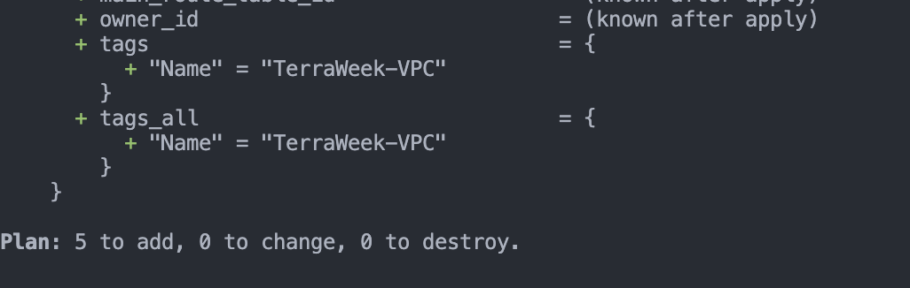
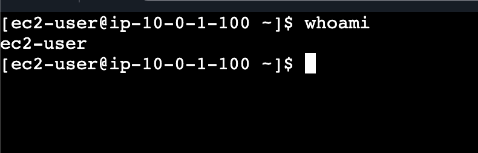
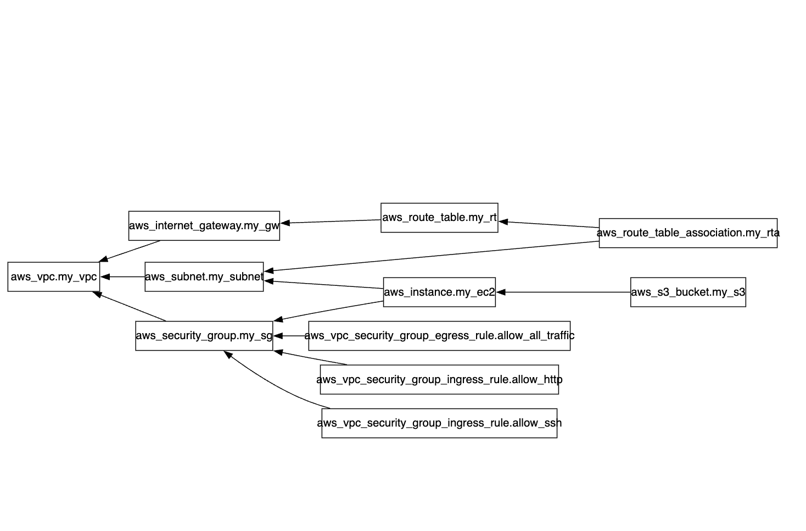
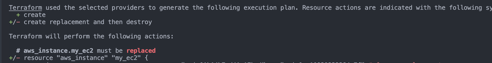

## Challenge Tasks

### Task 1: Explore the AWS Provider

1. Done
2. Done
3. v5.100.0...

`👉 ~> 5.0 = “Give me the latest 5.x version, but never jump to 6.”`

**.terraform.lock.hcl**
```
What it does (simple)
Locks exact provider versions (like AWS, Azure, etc.)
Stores checksums (hashes) of provider binaries
Ensures everyone (you, CI/CD, teammates) uses the same provider versions
Why it matters

Without it:

- terraform init might download different provider versions

- Your infra could behave differently across machines

With it:

- You get deterministic builds (same result every time)

```

| Constraint | Range                 | Safe? | Flexible? | Use Case       |
| ---------- | --------------------- | ----- | --------- | -------------- |
| `~> 5.0`   | `>= 5.0.0, < 6.0.0`   | ✅     | ✅         | ✅ Best default |
| `>= 5.0`   | `>= 5.0.0` (no limit) | ❌     | ✅         | Experimental   |
| `= 5.0.0`  | Only `5.0.0`          | ✅     | ❌         | Strict pinning |

---
### Task 2: Build a VPC from Scratc

- 
- 

---

### Task 3: Understand Implicit Dependencies

- Because of implicit dependency
`vpc_id = aws_vpc.my_vpc.id`
- It would fail and give error
`InvalidVpcID.NotFound`

- 
1. vpc -> subnet
2. vpc -> igw
3. vpc -> rt, igw-> rt
4. subnet -> rta, rt-> rta


```
Alright — let’s break this down **from absolute basics** (no fluff, just clarity).

---

# 🧠 What is a Dependency in Terraform?

A **dependency** means:

👉 “This resource must be created before another resource”

Example:

* Subnet needs VPC → so **VPC must be created first**

---

# ⚙️ How Terraform Handles This

Terraform builds something called a **dependency graph (DAG)**

👉 It scans your code and figures out:

* What depends on what
* What order to create resources in

---

# ❓ Q1: How does Terraform know to create VPC before subnet?

Because of this line:

```hcl
vpc_id = aws_vpc.my_vpc.id
```

👉 You are saying:

* “Hey Terraform, this subnet needs the ID of that VPC”

So Terraform understands:

```
aws_vpc.my_vpc  →  aws_subnet.my_subnet
```

👉 That creates an **implicit dependency**

---

# ❓ Q2: What if subnet is created before VPC?

👉 It would FAIL ❌

Because:

* Subnet needs a valid `vpc_id`
* If VPC doesn’t exist → no ID → AWS throws error

Example error:

```
InvalidVpcID.NotFound
```

---

# 🔍 Q3: All implicit dependencies in YOUR code

Let’s list them clearly:

---

## 1. Subnet depends on VPC

```hcl
vpc_id = aws_vpc.my_vpc.id
```

👉 Dependency:

```
VPC → Subnet
```

---

## 2. Internet Gateway depends on VPC

```hcl
vpc_id = aws_vpc.my_vpc.id
```

👉 Dependency:

```
VPC → Internet Gateway
```

---

## 3. Route Table depends on:

### (a) VPC

```hcl
vpc_id = aws_vpc.my_vpc.id
```

### (b) Internet Gateway

```hcl
gateway_id = aws_internet_gateway.my_gw.id
```

👉 Dependency:

```
VPC → Route Table
Internet Gateway → Route Table
```

---

## 4. Route Table Association depends on:

```hcl
subnet_id      = aws_subnet.my_subnet.id
route_table_id = aws_route_table.my_rt.id
```

👉 Dependency:

```
Subnet → Association
Route Table → Association
```

---

# 🧾 Final Dependency Graph (Super Important)

```
        VPC
       /   \
      ↓     ↓
Subnet   Internet Gateway
      \     /
       ↓   ↓
     Route Table
          ↓
 Route Table Association
```

---

# ⚡ Key Concept: Implicit vs Explicit

### Implicit (what you're using)

* Happens automatically when you reference another resource
* Example:

  ```hcl
  aws_vpc.my_vpc.id
  ```

### Explicit (manual)

* You force dependency using:

  ```hcl
  depends_on = [aws_vpc.my_vpc]
  ```
* Used only when Terraform can’t detect it

---

# 🚀 One-line summary

👉 Terraform reads references like `aws_vpc.my_vpc.id` and **automatically builds the correct creation order** so things don’t break.

---

If you want, I can show you:
```
* 🔥 A real `terraform graph` visualization
* ⚠️ Trick interview questions on dependencies (very common)

```

---

### Task 4: Add a Security Group and EC2 Instance

- 

---

### Task 5: Explicit Dependencies with depends_on
-

```

When would you use depends_on in real projects?

👉 Use depends_on when Terraform cannot automatically detect a dependency

✅ Example 1: Provisioning after EC2 is ready
You create EC2
Then run a script (via provisioner or external resource)
depends_on = [aws_instance.my_ec2]

👉 Ensures:

EC2 is fully created before running script
✅ Example 2: Logging / Monitoring setup
You create infrastructure (EC2, ALB, etc.)
Then create S3 bucket / CloudWatch setup
depends_on = [aws_instance.my_ec2]

👉 Ensures:

Logs/monitoring is configured after infra exists
⚠️ Bonus (important interview line)

👉 “depends_on should be used only when implicit dependencies are not possible, otherwise Terraform handles ordering automatically.”

```

---

### Task 6: Lifecycle Rules and Destroy

- 

`S3 → EC2 → RTA → RT → IGW → Subnet → SG → VPC`

`VPC got deleted during the end`

```
## ✅ Destroy Order (your observation)

👉 You said: **“VPC got destroyed at last”**

✔ That is **100% correct**

### Why?

Terraform always destroys in **reverse dependency order**

From your setup:

```text
VPC
 ├── Subnet
 ├── Security Group
 └── Internet Gateway
        ↓
   Route Table
        ↓
   Route Table Association
        ↓
        EC2
        ↓
        S3
```

### 🧨 Destroy order (reverse)

```text
S3 → EC2 → RTA → RT → IGW → Subnet → SG → VPC
```

👉 VPC is last because:

* Everything depends on it
* You can’t delete a VPC until all attached resources are gone

---

# 📘 Lifecycle Arguments (Very Important)

Terraform has a `lifecycle` block to control resource behavior.

---

## 1. `create_before_destroy`

### 🔹 What it does

Creates new resource **before deleting old one**

### 🔹 Example

```hcl
lifecycle {
  create_before_destroy = true
}
```

### 🔹 When to use

👉 When downtime is NOT acceptable

### 💡 Real example

* Updating EC2 instance
* Load balancer changes
* Database replacement

👉 Instead of:

```text
Destroy → Create (downtime ❌)
```

👉 It does:

```text
Create → Destroy (zero downtime ✅)
```

---

## 2. `prevent_destroy`

### 🔹 What it does

Stops Terraform from deleting a resource

### 🔹 Example

```hcl
lifecycle {
  prevent_destroy = true
}
```

### 🔹 When to use

👉 For critical resources

### 💡 Real example

* Production database
* S3 bucket with important data
* VPC in production

👉 If someone runs:

```bash
terraform destroy
```

❌ Terraform will throw error instead of deleting

---

## 3. `ignore_changes`

### 🔹 What it does

Tells Terraform to ignore specific changes

### 🔹 Example

```hcl
lifecycle {
  ignore_changes = [tags]
}
```

### 🔹 When to use

👉 When something changes **outside Terraform**

### 💡 Real example

* Tags modified manually in AWS console
* Auto-scaling changing instance count
* External tools updating configs

👉 Prevents:

```text
Terraform trying to “fix” everything again
```

---

# ⚡ Quick Summary

| Argument                | Purpose                 | Use Case          |
| ----------------------- | ----------------------- | ----------------- |
| `create_before_destroy` | Avoid downtime          | EC2, LB updates   |
| `prevent_destroy`       | Protect critical infra  | DB, S3, VPC       |
| `ignore_changes`        | Ignore external changes | Tags, autoscaling |

---

# 🧠 One-line memory trick

👉 **CBD → PD → IC**

* Create Before Destroy
* Prevent Destroy
* Ignore Changes

---

If you want, I can give you:

* 🔥 Interview-ready answers (1–2 lines each)
* ⚠️ Real-world mistakes people make with lifecycle (very common)

```

---