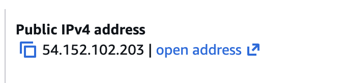
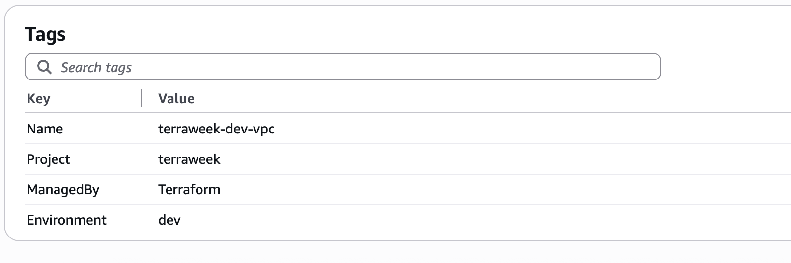
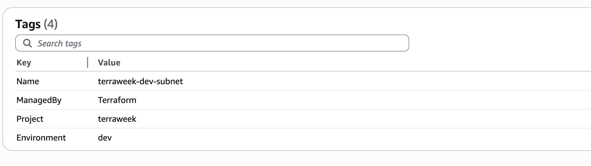
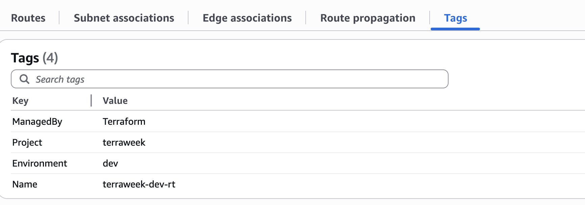
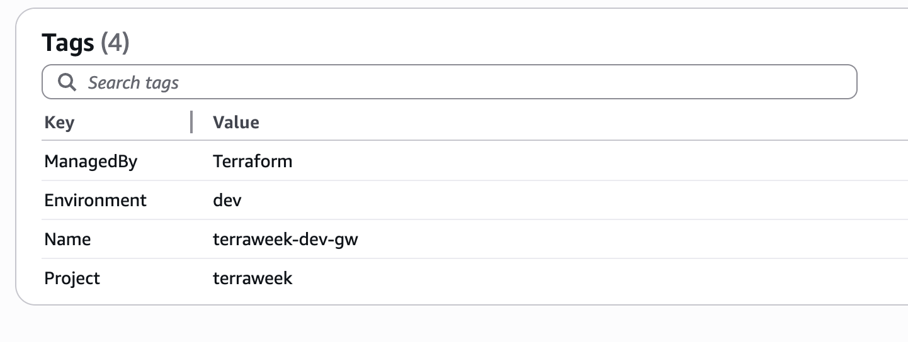
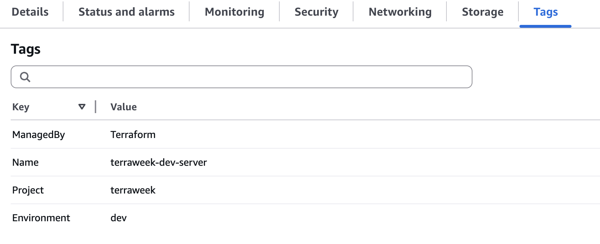

## Challenge Tasks

### Task 1: Extract Variables

- `for_each = toset([for port in var.allowed_ports : tostring(port)])`
- `tonumber(each.value)`
- (`string`, `number`, `bool`, `list`, `map`)

---
### Task 2: Variable Files and Precedence

1. Default (Lowest)
2. .tfvar file
3. CLI (Highest)

---

### Task 3: Add Outputs

```

Changes to Outputs:
  + instance_id         = (known after apply)
  + instance_public_dns = (known after apply)
  + instance_public_ip  = (known after apply)
  + security_group_id   = (known after apply)
  + subnet_id           = (known after apply)
  + vpc_id              = (known after apply)

```

```
Outputs:

instance_id = "i-038cce19acbe19b42"
instance_public_dns = ""
instance_public_ip = "54.152.102.203"
security_group_id = "sg-0e05ecaa1cbedab07"
subnet_id = "subnet-0059054aeb8a885fd"
vpc_id = "vpc-0f16cd0731f3cbee3"
```

- terraform output instance_public_ip
**"54.152.102.203"**

```

terraform output -json 
{
  "instance_id": {
    "sensitive": false,
    "type": "string",
    "value": "i-038cce19acbe19b42"
  },
  "instance_public_dns": {
    "sensitive": false,
    "type": "string",
    "value": ""
  },
  "instance_public_ip": {
    "sensitive": false,
    "type": "string",
    "value": "54.152.102.203"
  },
  "security_group_id": {
    "sensitive": false,
    "type": "string",
    "value": "sg-0e05ecaa1cbedab07"
  },
  "subnet_id": {
    "sensitive": false,
    "type": "string",
    "value": "subnet-0059054aeb8a885fd"
  },
  "vpc_id": {
    "sensitive": false,
    "type": "string",
    "value": "vpc-0f16cd0731f3cbee3"
  }
}

```


---

### Task 4: Use Data Sources

| Feature        | resource             | data                   |
| -------------- | -------------------- | ---------------------- |
| Purpose        | Create/manage infra  | Read existing info     |
| Lifecycle      | Managed by Terraform | Not managed            |
| Creates infra? | ✅ Yes                | ❌ No                   |
| Example        | EC2, VPC, S3         | AMI, AZs, existing VPC |


---

### Task 5: Use Locals for Dynamic Values

- 
- 
- 
- 
- 

---

### Task 6: Built-in Functions and Conditional Expressions

Here are **5 most useful Terraform functions** (clean + interview-ready 👇)

---

# ✅ 1. `merge()`

👉 Combines multiple maps into one

```hcl
merge({a = 1}, {b = 2})
```

👉 Result:

```hcl
{a = 1, b = 2}
```

### 💡 Why useful:

* Used for **tagging (VERY common)**
* Combine default + custom values

---

# ✅ 2. `lookup()`

👉 Fetch value from a map using a key

```hcl
lookup({dev = "t2.micro", prod = "t3.small"}, "dev")
```

👉 Result:

```hcl
"t2.micro"
```

### 💡 Why useful:

* Dynamic configs based on env (dev/prod)
* Avoid hardcoding

---

# ✅ 3. `length()`

👉 Returns number of elements

```hcl
length(["a", "b", "c"])
```

👉 Result:

```hcl
3
```

### 💡 Why useful:

* Count resources
* Validate inputs

---

# ✅ 4. `cidrsubnet()`

👉 Creates subnet from a CIDR block

```hcl
cidrsubnet("10.0.0.0/16", 8, 1)
```

👉 Result:

```hcl
"10.0.1.0/24"
```

### 💡 Why useful:

* Auto-generate subnets
* Used in real VPC design

---

# ✅ 5. `join()`

👉 Joins list into a string

```hcl
join("-", ["terra", "week", "2026"])
```

👉 Result:

```hcl
"terra-week-2026"
```

### 💡 Why useful:

* Naming resources dynamically
* Clean string formatting

---

# 🧠 Bonus (very important)

👉 Conditional expression:

```hcl
var.environment == "prod" ? "t3.small" : "t2.micro"
```

* If prod → bigger instance
* Else → smaller

---

# 🔥 Final Interview Answer (short version)

👉

* `merge()` → combines maps (used for tags)
* `lookup()` → gets value from map
* `length()` → counts elements
* `cidrsubnet()` → generates subnet CIDRs
* `join()` → joins list into string

---

