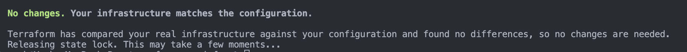
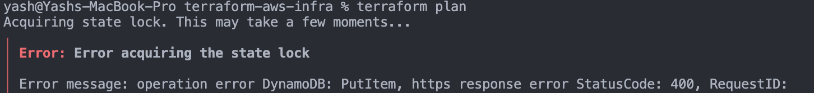
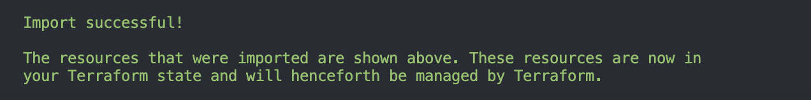
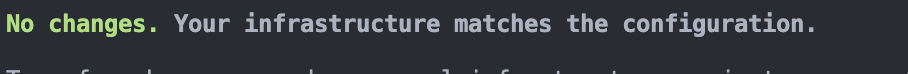
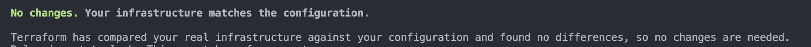
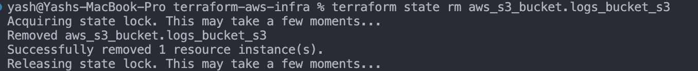
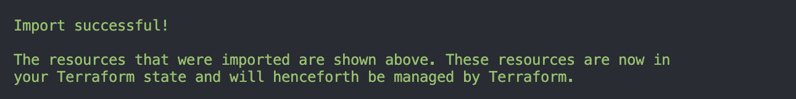

## Challenge Tasks

### Task 1: Inspect Your Current State

**Terraform State list**

```

data.aws_ami.amazon_linux
data.aws_availability_zones.available
aws_instance.my_ec2
aws_internet_gateway.my_gw
aws_route_table.my_rt
aws_route_table_association.my_rta
aws_s3_bucket.my_s3
aws_security_group.my_sg
aws_subnet.my_subnet
aws_vpc.my_vpc
aws_vpc_security_group_egress_rule.allow_all_traffic
aws_vpc_security_group_ingress_rule.allow_ports["22"]
aws_vpc_security_group_ingress_rule.allow_ports["443"]
aws_vpc_security_group_ingress_rule.allow_ports["80"]

```

Answer:
1. How many resources does Terraform track?
- **All Which are defined in main.tf file**
2. What attributes does the state store for an EC2 instance? (hint: way more than what you defined)
- **It stores metadata,cpu_core,threads and much more**
3. Open `terraform.tfstate` in an editor -- find the `serial` number. What does it represent?
`"version": 4,`
  `"terraform_version": "1.14.3",`
  `"serial": 168,`

```
⚠️ Real-world importance

In team setups:

Dev A → serial = 10
Dev B → tries to apply with serial = 9

👉 Terraform blocks it ❌
👉 Prevents state corruption

🧠 One-line answer (for interview)

👉 serial is the version counter of the Terraform state file that increments on every state change.
```
---

### Task 2: Set Up S3 Remote Backend

- created
- 

---

### Task 3: Test State Locking

- 


**Error Message**

`State locking ensures only one Terraform operation modifies the state at a time, preventing race conditions and state corruption in team environments.`

---

### Task 4: Import an Existing Resource

- 
- 

**Document:** What is the difference between `terraform import` and creating a resource from scratch? ->

Import means to import already created resources which were created manually not through IaC (terraform). we import them here so now further changes we can do it from here and control them too. we need to match the config of the created resource so that we can easily import it

resource created from scratch is managed by terraform from beginning and the .tfstate acts as the single source of truth

```
terraform import is used to bring existing infrastructure (created outside Terraform) into Terraform state so that it can be managed going forward. It does not create the resource — it only maps the existing resource to Terraform.

When importing, the Terraform configuration must match the actual resource; otherwise, terraform plan will show differences.

Creating a resource from scratch means Terraform provisions and manages the resource from the beginning, and the state file becomes the source of truth for that infrastructure.
```

---

### Task 5: State Surgery -- mv and rm

1. 
2. 
3. 

Here’s a **clean, interview-ready answer** 👇

---

# ✅ When to use `terraform state mv`

👉 Use `state mv` when you **rename or refactor resources in your Terraform code** but don’t want to recreate them in AWS.

### 💡 Examples:

* Renaming a resource:

  ```hcl
  aws_s3_bucket.old_name → aws_s3_bucket.logs_bucket
  ```
* Moving resource into a module
* Changing resource structure during refactoring

👉 It updates only the **state mapping**, not the actual resource.

---

# ✅ When to use `terraform state rm`

👉 Use `state rm` when you want Terraform to **stop managing a resource** but keep it running in AWS.

### 💡 Examples:

* Resource will be managed manually (outside Terraform)
* Migrating resource to another Terraform project
* Removing wrongly imported resource from state

👉 It removes the resource from **state only**, not from AWS.

---

# 🧠 One-line difference (important)

👉

* `state mv` → **rename/re-map resource in state**
* `state rm` → **remove resource from Terraform management**

---

# 🔥 Final polished answer (copy this)

`terraform state mv` is used when refactoring or renaming resources in Terraform without recreating them, by updating their mapping in the state file.
`terraform state rm` is used to remove a resource from Terraform state so that it is no longer managed by Terraform, while keeping the resource intact in the cloud.

---
### Task 6: Simulate and Fix State Drift

`Teams prevent state drift by restricting direct access to cloud consoles and enforcing all infrastructure changes through Terraform. They use CI/CD pipelines to apply changes in a controlled manner, implement role-based access control (RBAC), and regularly run terraform plan to detect unintended changes.`

Here’s a **clean, point-wise answer** you can directly use in your document 👇

---

# ✅ How do teams prevent state drift in production?

### 🔹 1. Restrict manual changes (no direct console access)

* Limit access to AWS Console using IAM policies
* Developers should not modify infrastructure manually

---

### 🔹 2. Enforce Infrastructure as Code (IaC)

* All changes must go through Terraform
* No changes outside `.tf` files

---

### 🔹 3. Use CI/CD pipelines

* Apply Terraform only via pipelines (GitHub Actions, Jenkins, etc.)
* Prevents unauthorized or accidental changes

---

### 🔹 4. Code reviews and approvals

* Every infrastructure change goes through PR review
* Ensures correctness before deployment

---

### 🔹 5. State locking

* Use remote backend (S3 + DynamoDB)
* Prevents concurrent changes and state corruption

---

### 🔹 6. Regular drift detection

* Run `terraform plan` periodically
* Detect differences between state and actual infrastructure

---

### 🔹 7. Monitoring and alerts

* Use AWS Config / CloudTrail
* Detect and alert on manual changes

---

# 🧠 One-line summary

👉
**Teams prevent state drift by enforcing Terraform-only changes, restricting manual access, and using CI/CD pipelines with regular drift detection.**

---