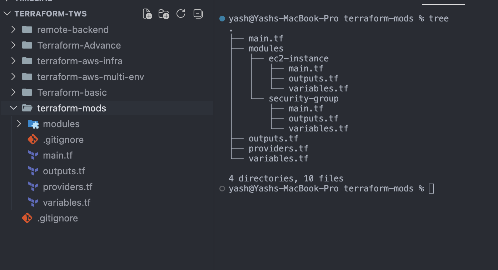
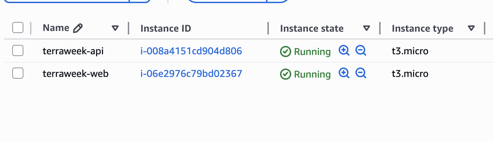

## Challenge Tasks

### Task 1: Understand Module Structure

- 

**Document:** What is the difference between a "root module" and a "child module"?

`Root module is the main working directory where Terraform runs, while child modules are reusable components invoked by the root (or other modules).`

Here’s a clean, interview-ready answer 👇

---

### 🔹 Root Module vs Child Module in Terraform

#### 🟢 Root Module

* The **main module** where Terraform execution starts.
* It is the directory where you run:

  ```bash
  terraform init
  terraform apply
  ```
* Contains primary `.tf` files (e.g., `main.tf`, `variables.tf`, `outputs.tf`)
* Can **call other modules (child modules)**

👉 Example:

```hcl
module "vpc" {
  source = "./modules/vpc"
}
```

---

#### 🔵 Child Module

* Any module that is **called by another module**
* Used for **reusability and modularization**
* Can accept **inputs (variables)** and return **outputs**

👉 Example structure:

```
root/
 ├── main.tf
 └── modules/
      └── vpc/
           ├── main.tf
           ├── variables.tf
           └── outputs.tf
```

---

### ⚡ Key Differences

| Feature     | Root Module                 | Child Module                     |
| ----------- | --------------------------- | -------------------------------- |
| Entry Point | Yes (execution starts here) | No                               |
| Called By   | CLI (terraform commands)    | Root or another module           |
| Purpose     | Orchestrates infrastructure | Reusable components              |
| Location    | Current working directory   | Separate folder / registry / git |
| Reusability | Not typically reused        | Designed to be reusable          |

---

### 🧠 One-liner (for interviews)

> **Root module is the main working directory where Terraform runs, while child modules are reusable components invoked by the root (or other modules).**

---

### Task 2: Build a Custom EC2 Module

- Done

---

### Task 3: Build a Custom Security Group Module

```
🧠 What is dynamic block (IMPORTANT)
🔹 Problem it solves

Normally you'd write:

ingress { port 22 }
ingress { port 80 }
ingress { port 443 }

But ports can be dynamic → so you loop instead

🔹 How dynamic works
dynamic "ingress" {
  for_each = var.ingress_ports

👉 This means:

Loop over [22, 80]
content {
  from_port = ingress.value
}

👉 For each item:

ingress.value = current element (22, then 80)
🔁 What Terraform generates internally

If:

ingress_ports = [22, 80]

Terraform creates:

ingress {
  from_port = 22
  to_port   = 22
}
ingress {
  from_port = 80
  to_port   = 80
}
⚡ Super Simple Analogy

Think of it like JS:

ports.map(port => createIngress(port))

Terraform equivalent:

dynamic "ingress" {
  for_each = ports
}
🧠 Interview One-liner

Dynamic blocks in Terraform are used to programmatically generate repeated nested blocks (like ingress rules) from a list or map.

```

---

### Task 4: Call Your Modules from Root
- 
- Verified both running in same SG

---

### Task 5: Use a Public Registry Module

Here’s a clean, **document-ready answer** 👇

---

# 📊 Comparison: VPC Module vs Hand-Written VPC

## 🔹 Hand-written VPC (Day 62)

Typically you created:

* 1 × VPC
* 1 × Subnet
* (maybe) 1 × Internet Gateway
* (maybe) 1 × Route Table + association

👉 **Total: ~3–6 resources**

---

## 🔹 Terraform Registry VPC Module

When using:

```hcl
source = "terraform-aws-modules/vpc/aws"
```

👉 It creates **a LOT more automatically**, such as:

* VPC
* Multiple public subnets (per AZ)
* Multiple private subnets
* Internet Gateway
* Route tables (public + private)
* Route table associations
* NAT Gateway (if enabled)
* Elastic IPs (if NAT enabled)
* DHCP options
* Network ACLs (optional)

👉 **Total: ~15–30+ resources** (depending on config)

---

## ⚡ Final Comparison

| Approach            | Resources Created | Effort | Scalability |
| ------------------- | ----------------- | ------ | ----------- |
| Hand-written VPC    | ~3–6              | High   | Low         |
| Registry VPC Module | ~15–30+           | Low    | High        |

---

## 🧠 Key Insight

> The registry module abstracts complex infrastructure and creates production-ready networking with minimal code.

---

# 📂 Where does Terraform download registry modules?

👉 Terraform downloads modules into:

```bash
.terraform/modules/
```

---

## 🔹 What you’ll see inside

```bash
.terraform/
  modules/
    vpc/
    web_sg/
    web_server/
```

👉 Each folder contains:

* Downloaded module code
* Versioned module source

---

## 🔹 Important Notes

* Modules are downloaded during:

  ```bash
  terraform init
  ```
* If version changes:

  ```bash
  terraform init -upgrade
  ```
* You **should NOT edit** files inside `.terraform/modules/`

---

## 🎯 Final Answer (Interview Style)

> The Terraform VPC registry module creates significantly more resources (~15–30+) compared to a hand-written VPC (~3–6), including subnets, route tables, and gateways, making it production-ready. Terraform downloads registry modules into the `.terraform/modules/` directory during initialization.

---

### Task 6: Module Versioning and Best Practices

- **terraform state list**
```
data.aws_ami.amazon_linux
module.api_server.aws_instance.my_ec2
module.vpc.aws_default_network_acl.this[0]
module.vpc.aws_default_route_table.default[0]
module.vpc.aws_default_security_group.this[0]
module.vpc.aws_internet_gateway.this[0]
module.vpc.aws_route.public_internet_gateway[0]
module.vpc.aws_route_table.private[0]
module.vpc.aws_route_table.private[1]
module.vpc.aws_route_table.public[0]
module.vpc.aws_route_table_association.private[0]
module.vpc.aws_route_table_association.private[1]
module.vpc.aws_route_table_association.public[0]
module.vpc.aws_route_table_association.public[1]
module.vpc.aws_subnet.private[0]
module.vpc.aws_subnet.private[1]
module.vpc.aws_subnet.public[0]
module.vpc.aws_subnet.public[1]
module.vpc.aws_vpc.this[0]
module.web_server.aws_instance.my_ec2
module.web_sg.aws_security_group.my_sg
```

---
**Document:** Write down five module best practices:

# 📦 Terraform Module Best Practices

## 1️⃣ Always Pin Versions for Registry Modules

When using public modules from the Terraform Registry, always specify a version.

```hcl
module "vpc" {
  source  = "terraform-aws-modules/vpc/aws"
  version = "~> 5.0"
}
```

### 🔍 Why?

* Prevents unexpected breaking changes
* Ensures consistent deployments across environments
* Makes your infrastructure reproducible

### ⚡ Best Practice:

* Use `~>` for safe upgrades within a major version
* Avoid using `latest` or no version

---

## 2️⃣ Keep Modules Focused (Single Responsibility)

Each module should do **one thing well**.

### ❌ Bad:

* One module creating VPC + EC2 + RDS + S3

### ✅ Good:

* `vpc` module → only networking
* `ec2-instance` module → only compute
* `security-group` module → only firewall rules

### 🔍 Why?

* Easier to debug
* Easier to reuse
* Cleaner architecture

---

## 3️⃣ Use Variables for Everything (Avoid Hardcoding)

Modules should be **fully configurable** using variables.

### ❌ Bad:

```hcl
instance_type = "t2.micro"
```

### ✅ Good:

```hcl
variable "instance_type" {
  default = "t2.micro"
}
```

### 🔍 Why?

* Makes modules reusable across environments (dev/staging/prod)
* Avoids duplication
* Allows flexibility without changing code

---

## 4️⃣ Always Define Outputs

Outputs allow other modules or the root module to **access values**.

```hcl
output "instance_id" {
  value = aws_instance.my_ec2.id
}
```

### 🔍 Why?

* Enables module chaining
* Allows passing values between modules
* Required for real-world infra (e.g., SG → EC2, VPC → subnet)

### ⚡ Example:

```hcl
module.web_sg.sg_id → used in EC2 module
```

---

## 5️⃣ Add a README.md to Every Module

Each module should include documentation explaining:

* Purpose of the module
* Input variables
* Outputs
* Example usage

### 🔍 Why?

* Helps other developers understand quickly
* Improves collaboration in teams
* Makes your module production-ready

---

# 🚀 Additional Advanced Best Practices

## 6️⃣ Keep Modules Environment-Agnostic

Modules should not contain environment-specific values like:

* Region
* Account IDs
* Hardcoded names

👉 These should come from the root module.

---

## 7️⃣ Use Meaningful Naming Conventions

* Resource names should be clear and consistent
* Follow a naming standard across modules

### Example:

```hcl
Name = "${var.project}-web-server"
```

---

## 8️⃣ Avoid Over-Engineering Modules

Don’t make modules too complex with:

* Too many variables
* Too many conditions

👉 Keep them simple and maintainable.

---

## 9️⃣ Validate Inputs

Use validation rules in variables:

```hcl
variable "instance_type" {
  type = string

  validation {
    condition     = can(regex("^t[2-3]\\.", var.instance_type))
    error_message = "Only t2 or t3 instances allowed."
  }
}
```

---

## 🔟 Use Outputs and Tags Consistently

* Always include common tags (like `Environment`, `ManagedBy`)
* Helps in cost tracking and management

---

## 1️⃣1️⃣ Don’t Modify `.terraform/modules/`

* These are downloaded modules
* Always change source code, not cached modules

---

# 🎯 Final Summary

> Terraform modules should be reusable, configurable, and focused. By following best practices like version pinning, using variables, defining outputs, and keeping modules simple, you can build scalable and production-ready infrastructure.

---


