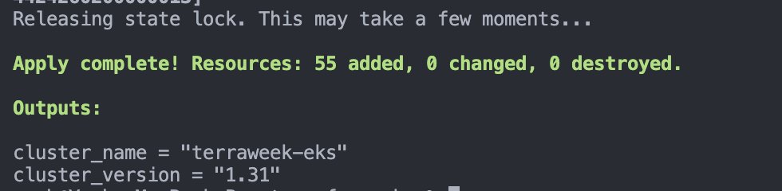
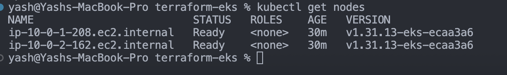
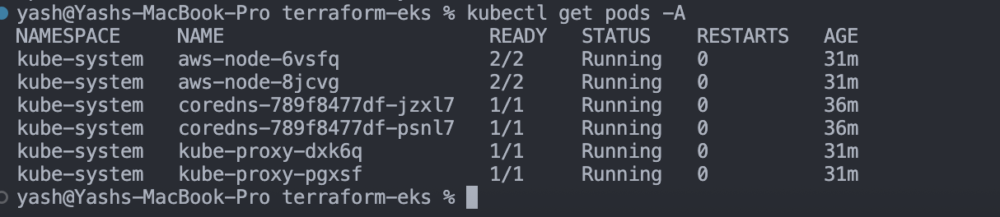
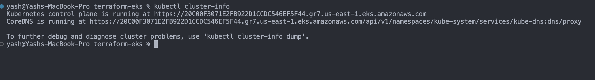
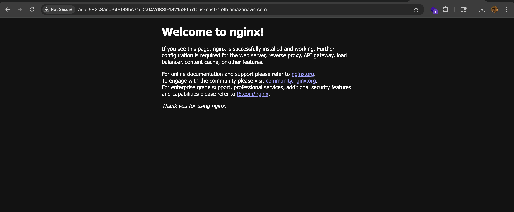

## Challenge Tasks

### Task 1: Project Setup

- Done ✅

---

### Task 2: Create the VPC with Registry Module

- Done ✅

Here’s a clean, **interview-ready + documentation-style answer** 👇

---

# 📘 Why does EKS need both Public and Private Subnets?

Amazon Amazon EKS uses a **hybrid networking model** to balance **security + accessibility**.

---

## 🔹 Public Subnets (Internet-facing layer)

Used for:

* Load Balancers (ALB/NLB)
* Exposing apps to the internet

### 👉 Why needed?

* To allow **external traffic** (users, APIs) to reach your application
* AWS creates **internet-facing load balancers** here

### 💡 Example:

* Your frontend app (React / Next.js) is exposed via an **ALB**
* That ALB lives in **public subnets**

---

## 🔹 Private Subnets (Secure layer)

Used for:

* Worker nodes (EC2 instances)
* Pods running your application

### 👉 Why needed?

* Keeps your core infrastructure **hidden from the internet**
* Reduces attack surface
* Follows **security best practices**

### 💡 Example:

* Your backend services, APIs, databases run inside private subnets

---

## 🔥 Architecture Flow (Simple)

```
Internet → Load Balancer (Public Subnet) → EKS Nodes (Private Subnet)
```

👉 Public handles **entry**
👉 Private handles **execution**

---

## ⚠️ Why not only public subnets?

* Nodes would be directly exposed → ❌ security risk
* Violates best practices (no isolation)
* Easier target for attacks

---

## ⚠️ Why not only private subnets?

* No internet access → ❌ users can't reach your app
* No public load balancer possible

---

## 🎯 Final Concept

> Public subnets = **Access layer**
> Private subnets = **Execution layer**

---

# 📘 What do the Subnet Tags do?

These tags are **critical for Kubernetes + AWS integration**.

---

## 🔹 Public Subnet Tag

```hcl
"kubernetes.io/role/elb" = 1
```

### 👉 Purpose:

* Tells EKS:

  > “Use this subnet for **public load balancers**”

### 💡 Used when:

* You create a **Service of type LoadBalancer (public)**

---

## 🔹 Private Subnet Tag

```hcl
"kubernetes.io/role/internal-elb" = 1
```

### 👉 Purpose:

* Tells EKS:

  > “Use this subnet for **internal load balancers**”

### 💡 Used when:

* Internal services (microservices communication)
* No public exposure needed

---

## 🔥 What happens without these tags?

* EKS **cannot auto-discover subnets**
* Load balancer creation may fail ❌
* You’ll get errors like:

  * *“no suitable subnets found”*

---

## 🎯 Final Summary

| Component        | Role                                    |
| ---------------- | --------------------------------------- |
| Public Subnets   | Handle incoming internet traffic        |
| Private Subnets  | Run secure workloads (nodes/pods)       |
| ELB Tag          | Enables public load balancers           |
| Internal ELB Tag | Enables private/internal load balancers |

---

## 💬 Interview One-liner

> “EKS uses public subnets for exposing applications via load balancers and private subnets to securely run workloads. Subnet tags allow AWS to automatically place the correct type of load balancer in the appropriate subnet.”

---
### Task 4: Apply and Connect kubectl

-

```
 aws eks update-kubeconfig --name terraweek-eks --region us-east-1    
Added new context arn:aws:eks:us-east-1:798256686416:cluster/terraweek-eks to /Users/yash/.kube/config

```
4. kubectl get pods

kubectl get nodes


kubectl get pods -A





**Verify:** Do you see 2 nodes in `Ready` state? Can you see the kube-system pods running?- YES ✅

---

### Task 5: Deploy a Workload on the Cluster



**Verify:** Can you access the Nginx welcome page through the LoadBalancer URL? - YES ✅

---

### Task 6: Destroy Everything


**Verify:** Is your AWS account completely clean? No leftover resources?- Yes ✅