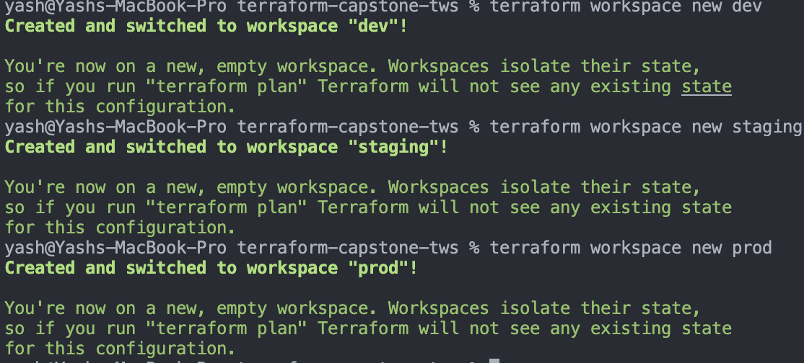
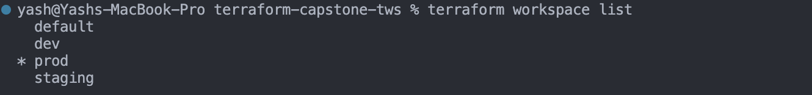
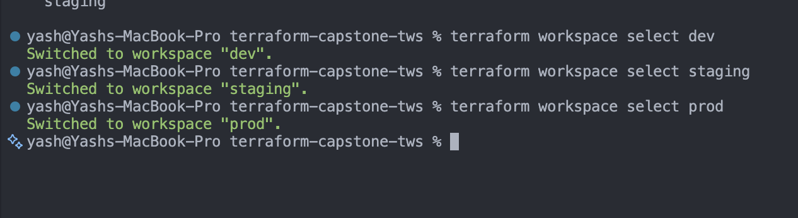
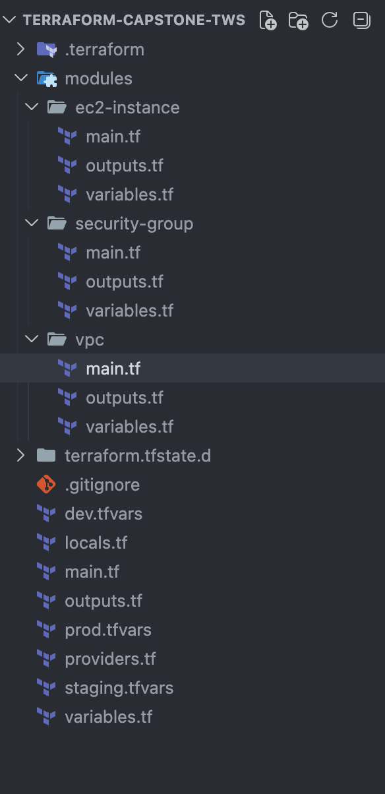
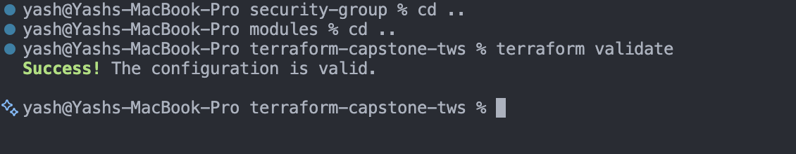
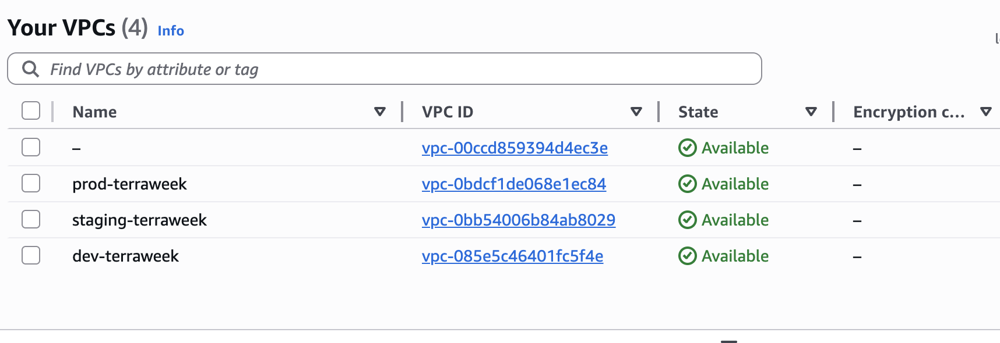

## Challenge Tasks

### Task 1: Learn Terraform Workspaces

- 
- 
- 


1. it return sthe slected env
->
`terraform.workspace returns the name of the currently selected workspace (e.g., dev, staging, prod) which can be used inside configuration to dynamically change resources, naming, or variables.`

2. terraform.tfstate.d
->
```
Each workspace stores its state in:

terraform.tfstate.d/<workspace_name>/terraform.tfstate

The default workspace stores state in the root terraform.tfstate, while others are inside the terraform.tfstate.d directory.

```
3. we dont need to specify env each time we select one and we can use it without specifying env each time

```
Workspaces:
Same codebase, multiple states
Easy environment switching (terraform workspace select)
Good for lightweight environment separation
Separate directories:
Completely isolated configurations per environment
Better for real production setups
Allows different variables, backends, and even architecture per env

👉 In practice:

Workspaces = simple setups
Separate dirs = industry standard for production
```

Got it — let’s make this **super practical**, no fluff 👇

---

## 🧱 How Separate Directories Look (Real Industry Style)

This is the **most common production structure**:

```
terraweek-capstone/
│
├── modules/                     # reusable code
│   ├── vpc/
│   ├── ec2/
│   └── eks/
│
├── envs/                        # environments
│   ├── dev/
│   │   ├── main.tf
│   │   ├── variables.tf
│   │   ├── terraform.tfvars
│   │   └── backend.tf
│   │
│   ├── staging/
│   │   ├── main.tf
│   │   ├── variables.tf
│   │   ├── terraform.tfvars
│   │   └── backend.tf
│   │
│   └── prod/
│       ├── main.tf
│       ├── variables.tf
│       ├── terraform.tfvars
│       └── backend.tf
│
└── README.md
```

---

## 🔧 What Each Folder Does

### 📦 `modules/`

Reusable building blocks:

* VPC
* EC2
* EKS

👉 Write once, reuse everywhere

---

### 🌍 `envs/dev`, `staging`, `prod`

Each environment has its **own config + state + variables**

---

## 🧩 Example Files

### 🔹 `envs/dev/main.tf`

```hcl
module "vpc" {
  source = "../../modules/vpc"

  cidr_block = var.cidr_block
  env        = "dev"
}

module "ec2" {
  source = "../../modules/ec2"

  instance_type = var.instance_type
  env           = "dev"
}
```

---

### 🔹 `envs/dev/terraform.tfvars`

```hcl
cidr_block    = "10.0.0.0/16"
instance_type = "t2.micro"
```

---

### 🔹 `envs/prod/terraform.tfvars`

```hcl
cidr_block    = "10.1.0.0/16"
instance_type = "t3.medium"
```

👉 Same code, different configs

---

### 🔹 `backend.tf` (VERY IMPORTANT 🔥)

Each env has separate state:

```hcl
terraform {
  backend "s3" {
    bucket = "my-terraform-state"
    key    = "dev/terraform.tfstate"
    region = "ap-south-1"
  }
}
```

For prod:

```hcl
key = "prod/terraform.tfstate"
```

---

## 🚀 How You Use It

Instead of switching workspace:

```bash
cd envs/dev
terraform init
terraform apply
```

Switch env:

```bash
cd ../prod
terraform init
terraform apply
```

---

## ⚔️ Workspaces vs Directories (REAL Difference)

| Feature          | Workspaces | Separate Directories |
| ---------------- | ---------- | -------------------- |
| Code separation  | ❌ Same     | ✅ Separate           |
| State isolation  | ⚠️ Medium  | ✅ Strong             |
| Flexibility      | ❌ Limited  | ✅ High               |
| Production usage | ❌ Rare     | ✅ Standard           |

---

## 💥 Why Companies Prefer This

* Safer (no accidental prod changes)
* Different configs per env
* Easy CI/CD pipelines
* Better team collaboration

---

## 🧠 Simple Way to Remember

👉 Workspaces = *same house, different rooms*
👉 Directories = *different houses*

---

### Task 2: Set Up the Project Structure
- 
**Document:** Why is this file structure considered best practice?

-> `Because everything is seprate and in a root-child architecure`

```
## Why This File Structure is Considered Best Practice

This Terraform project structure follows industry best practices because it ensures modularity, scalability, maintainability, and environment isolation.

### 1. Clear Root–Child Architecture

The root module (main.tf) acts as an orchestrator, calling reusable child modules like VPC, EC2, and Security Groups. This keeps the infrastructure code clean, avoids duplication, and makes it easier to manage.

### 2. Reusable Modules

The modules/ directory contains independent and reusable components such as VPC, security groups, and EC2 instances. This allows writing code once and reusing it across environments, making updates and maintenance easier while following the DRY (Don’t Repeat Yourself) principle.

### 3. Environment Separation via tfvars

Separate tfvars files like dev.tfvars, staging.tfvars, and prod.tfvars allow different configurations for each environment without modifying the core code. This ensures safer deployments and reduces the risk of misconfiguration.

### 4. Separation of Concerns

Each Terraform file has a specific purpose:

* main.tf defines infrastructure resources
* variables.tf defines inputs
* outputs.tf exposes outputs
* providers.tf configures providers and backend
* locals.tf defines computed values

This improves readability, debugging, and collaboration.

### 5. Secure and Clean State Management

The .gitignore file prevents sensitive and unnecessary files from being committed, such as tfstate files, tfvars files containing secrets, and the .terraform directory. This helps protect infrastructure data and keeps the repository clean.

### 6. Scalability for Real-World Projects

This structure is suitable for large projects and teams. It integrates well with CI/CD pipelines and allows easy addition of new modules or environments without major restructuring.

### Final Summary

This structure is considered best practice because it provides modular, reusable, secure, and scalable infrastructure management with clear separation of concerns and environment-specific configurations.

```

### Task 3: Build the Custom Modules

- 

---

### Task 4: Wire It All Together with Workspace-Aware Config

- Done

---

### Task 5: Deploy All Three Environments

- 

**Verify:** Are all three environments completely isolated from each other?- Yes ✅

---