## Challenge Tasks

### Task 1: Understand Ansible

1. **Configuration Management:** We need config management because when we have to manage multiple server we cannot manually go to so many server and manage config so with help of config management we have a master node through which we manage the other nodes so it saves time and also we can manage multiple state of servers all at once

2. Ansible is agentless which means it doesnt needs to be downloaded to other servers just the control or master server and also it works on push mechanism unlike chef which works on push and pull model. only requirement is all nodes must have python installed

3. agentless means ansible doesnt needs to be installed on all server just the control server

4. - **Control Node** -- the machine where Ansible runs (your laptop or a jump server)
   - **Managed Nodes** -- the servers Ansible configures (your EC2 instances)
   - **Inventory** -- the list of managed nodes
   - **Modules** -- units of work Ansible executes (install a package, copy a file, start a service)
   - **Playbooks** -- YAML files that define what to do on which hosts


**GPT ANSWERS**


```
✅ 1. Configuration Management

Your idea is correct, just polish it:

Better version:

Configuration management is the process of managing and maintaining the desired state of servers (software, configs, services).
We need it because:
Managing servers manually doesn’t scale
Ensures consistency across environments (dev, staging, prod)
Reduces human errors
Enables automation and faster deployments
⚠️ 2. Ansible vs Chef, Puppet, Salt

You made a mistake here:

❌ "Chef works on push and pull model" → Incorrect

Correct version:

Ansible
Agentless
Uses push model (control node pushes configs)
Chef & Puppet
Agent-based (agent runs on nodes)
Use pull model (nodes pull config from server)
Salt
Supports both push & pull
Can be agent-based or agentless (Salt SSH)

👉 Key takeaway (say this in interviews):

“Ansible is simpler because it is agentless and uses SSH, unlike Chef/Puppet which require agents.”

✅ 3. Agentless Meaning

You're correct but incomplete.

Better version:

Agentless means no software/agent is required on managed nodes
Ansible connects using:
SSH (Linux)
WinRM (Windows)
Only requirement:
Python installed on Linux nodes
✅ 4. Ansible Architecture

Your definitions are good 👍 just refine wording:

Control Node
Machine where Ansible is installed and commands are run
Managed Nodes
Target servers controlled by Ansible
Inventory
File listing all managed nodes (IP/domain)
Modules
Small tasks (install package, copy file, restart service)
Playbooks
YAML files defining automation workflows
```
---

### Task 2: Set Up Your Lab Environment

- Done. created via Terraform

### Task 3: Install Ansible

- 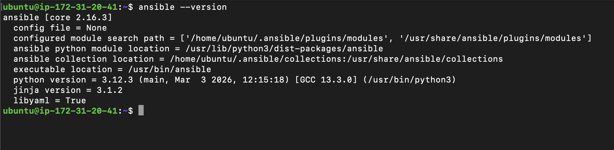
**Document:** On which machine did you install Ansible? Why is it only needed on the control node?
- installed ansible on the control node-web1 server. It is only needed on control node since it works on push model. it ssh into the worker nodes and pushes the config to the worker nodes
`I installed Ansible on the control node. Since Ansible is agentless and uses SSH, it only needs to run from a central machine and pushes configurations to managed nodes without requiring any agents.”`

---

### Task 4: Create Your Inventory File
The inventory tells Ansible which servers to manage. Create a project directory and your first inventory:

- 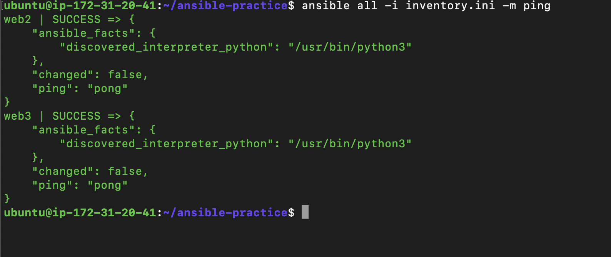

---

### Task 5: Run Ad-Hoc Commands

1. 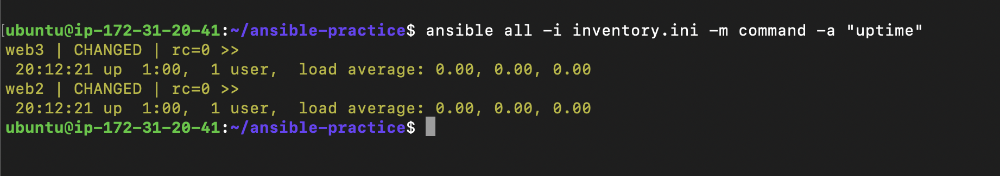

2. 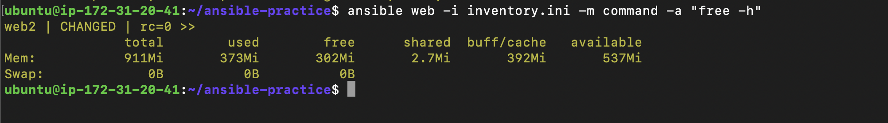

3. 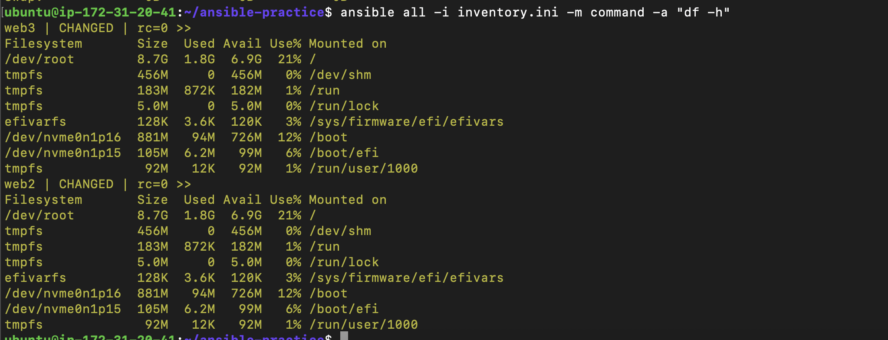

4. 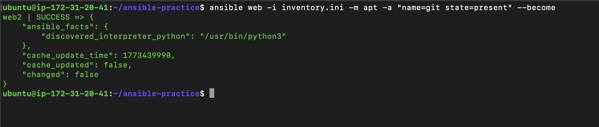

5. 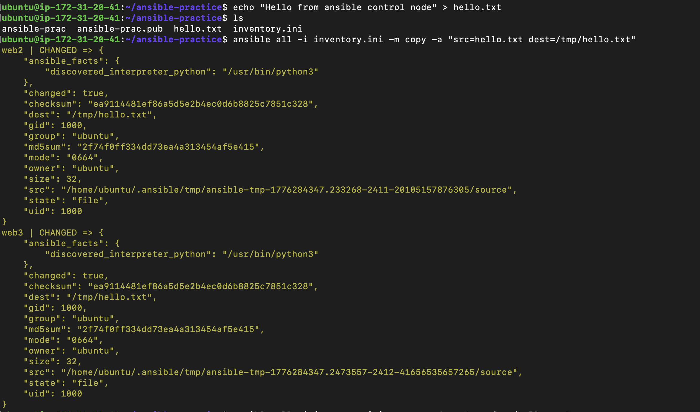

6. 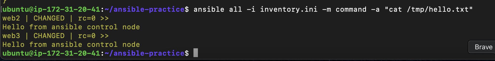

**Document:** What does `--become` do? When do you need it? -> It is used to run sudo commands when we need to run command as root user

---

### Task 6: Explore Inventory Groups and Patterns

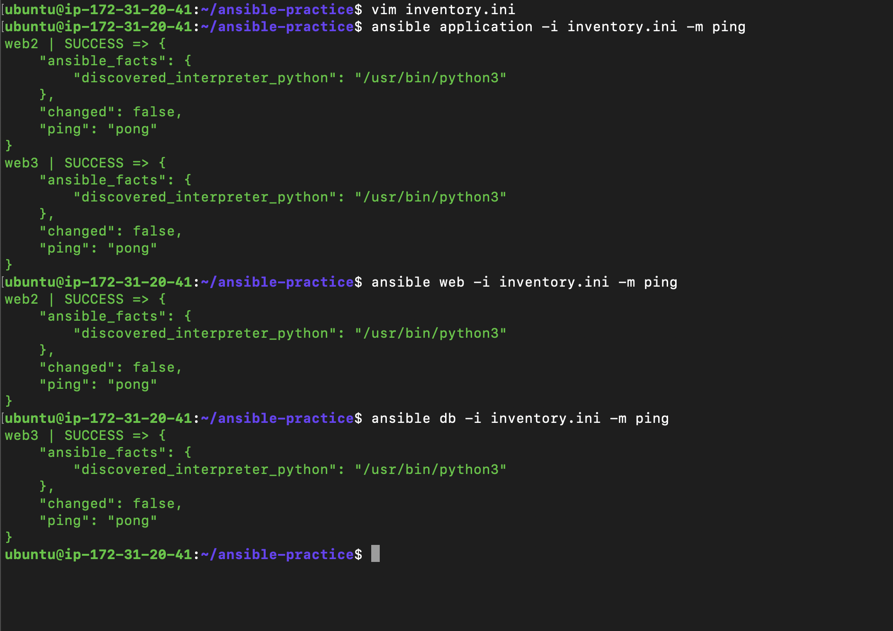

```
Here by using 
[application: children]
web
db

```
`we can group different groups` and run command using

**ansible application -i inventory.ini -m ping**
'

- 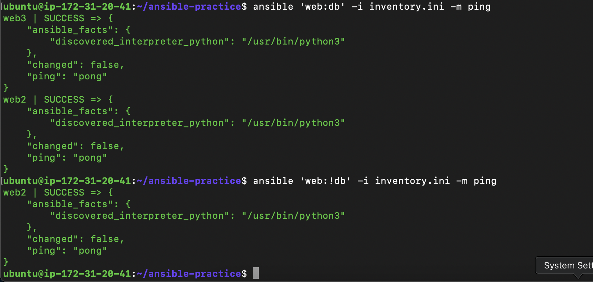


- 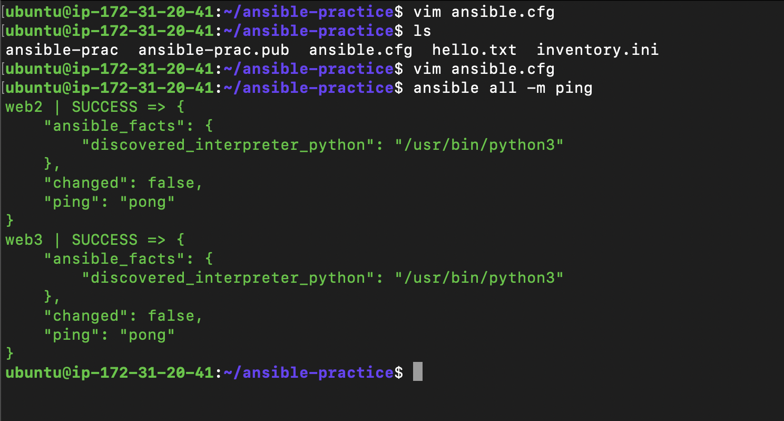