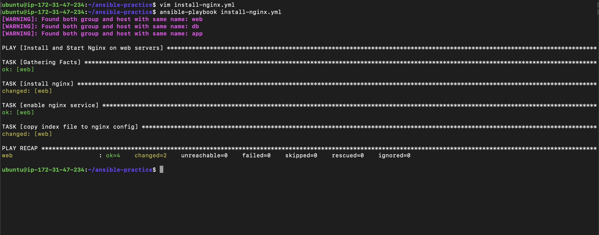
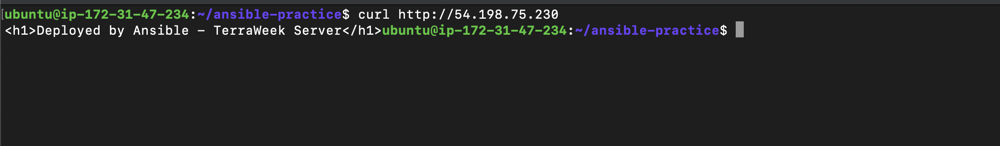
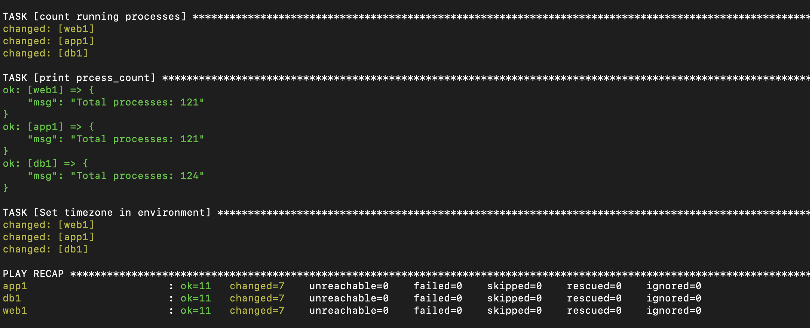
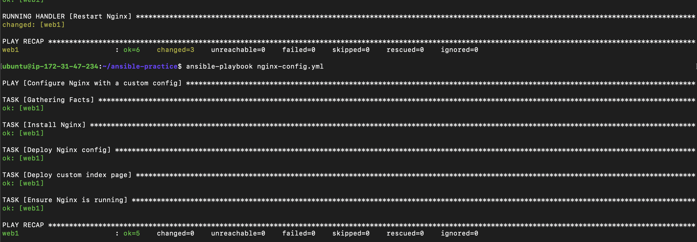
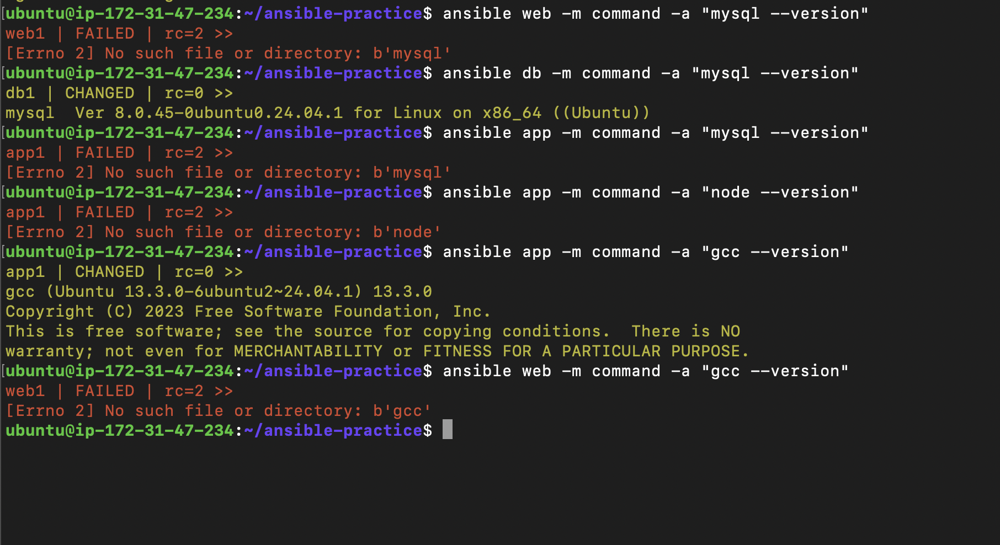

## Challenge Tasks

### Task 1: Your First Playbook

- Done
- 

- 

**Verify:** Curl the web server's public IP. Do you see your custom page?- **YES ✅**
---

### Task 2: Understand the Playbook Structure

1. What is the difference between a play and a task?

```
Play → defines which hosts to target and what overall work to do
Task → a single action executed on those hosts (using a module)

👉 In simple words:

A play = “where + what overall”
A task = “one step inside that”

```

2. Can you have multiple plays in one playbook?
```
Yes, a playbook can contain multiple plays, each targeting different host groups.
```

3. What does `become: true` do at the play level vs the task level?

```
At play level:
become: true

👉 Applies to ALL tasks in that play

At task level:
- name: install nginx
  become: true

👉 Applies ONLY to that specific task

Example
become: true   # applies to all

tasks:
  - name: install nginx   # runs as root
  - name: copy file       # runs as root

vs

tasks:
  - name: install nginx
    become: true   # only this runs as root

  - name: copy file   # runs as normal user
Best one-liner (use this)

“At play level it applies to all tasks, at task level it overrides or applies only to that specific task.”
```

4. What happens if a task fails -- do remaining tasks still run?

```
👉 By default:

❌ Play stops for that host

Remaining tasks → NOT executed for that host
But continues for other hosts
Example

If task fails on web1:

web1 → stops
web2 → continues
Important flags (extra knowledge 🔥)
ignore_errors: true → continue even if task fails
any_errors_fatal: true → stop everything
Best answer:

“If a task fails, Ansible stops executing further tasks for that host by default, but continues execution for other hosts.”
```

---

### Task 3: Learn the Essential Modules

- Done
---
# ✅ 1. Difference between `command` and `shell`

## 🧠 Core difference

| Module    | Supports shell features? | Example                     |
| --------- | ------------------------ | --------------------------- |
| `command` | ❌ No                     | `ls`, `df -h`               |
| `shell`   | ✅ Yes                    | pipes, redirects, variables |

---

## ✅ `command` module

```yaml
- name: Check disk space
  command: df -h
```

👉 Runs directly (no shell)

### ✔ Use when:

* Simple commands
* No pipes (`|`)
* No redirects (`>`, `>>`)
* Safer & faster

---

## ✅ `shell` module

```yaml
- name: Count processes
  shell: ps aux | wc -l
```

👉 Runs via shell (`/bin/sh`)

### ✔ Use when:

* Pipes (`|`)
* Redirection (`>`)
* Environment variables
* Complex commands

---

## ❗ Golden rule (say this in interview)

> “Use `command` by default for safety. Use `shell` only when shell features like pipes or redirection are required.”

---

# ✅ 2. Why `debug: var=` vs `debug: msg=`

You noticed this 👇

```yaml
debug:
  var: disk_output.stdout_lines
```

vs

```yaml
debug:
  msg: "Total processes: {{ process_count.stdout }}"
```

---

## 🧠 Difference

### 🔹 `var`

```yaml
debug:
  var: disk_output.stdout_lines
```

👉 Directly prints a **variable**

* No `{{ }}` needed
* Cleaner for debugging

Output looks like:

```yaml
disk_output.stdout_lines:
  - line1
  - line2
```

---

### 🔹 `msg`

```yaml
debug:
  msg: "Total processes: {{ process_count.stdout }}"
```

👉 Used when:

* You want **custom message**
* Combine text + variables

---

## 🧪 Simple comparison

### Using `var`

```yaml
debug:
  var: process_count.stdout
```

👉 Output:

```
process_count.stdout: "123"
```

---

### Using `msg`

```yaml
debug:
  msg: "Total processes: {{ process_count.stdout }}"
```

👉 Output:

```
msg: "Total processes: 123"
```

---

## 🧠 Why both are used in your task

### Disk output:

```yaml
stdout_lines
```

👉 Already structured → `var` is better

---

### Process count:

```yaml
stdout
```

👉 Single value → better to format → `msg`

---

## ❗ Interview-level explanation

> “`debug: var` is used to directly print variables for debugging, while `debug: msg` is used to format custom messages using Jinja2 expressions.”

---

## 🔥 Pro tip

If you’re debugging deeply:

```yaml
debug:
  var: disk_output
```

👉 Shows full structure (very useful)

---

## ✅ TL;DR

* `command` → simple, safe (default choice)
* `shell` → use only for pipes/redirection
* `debug var` → direct variable output
* `debug msg` → formatted/custom output

---

- 

---

### Task 4: Handlers -- Restart Services Only When Needed

- done
- 
- **Verify:** Run it twice and compare the output. Does the handler run both times? - **No**
- 

---

### Task 5: Dry Run, Diff, and Verbosity

---

## ✅ Why `--check --diff` is most important for production

`--check` and `--diff` together allow you to **preview changes safely before applying them**, which is critical in production environments.

---

### 🔹 `--check` (Dry Run)

* Shows **what Ansible *would* change**
* Does **NOT actually modify anything**
* Prevents accidental breaking of systems

---

### 🔹 `--diff`

* Shows the **exact changes in files**
* Example:

  ```diff
  - old config
  + new config
  ```

---

## 🧠 Why both together matter

👉 `--check` alone:

* Tells you *something will change*
* But not *what exactly*

👉 `--diff` alone:

* Shows changes
* But actually applies them ❌

---

### ✅ Together:

```bash
ansible-playbook nginx-config.yml --check --diff
```

👉 You get:

* ✔ What will change
* ✔ Exact file differences
* ✔ No actual changes made

---

## 🔥 Real-world importance

In production:

* Prevents **downtime**
* Avoids **bad deployments**
* Helps in **code review / approvals**
* Ensures **safe automation**

---

## 🎯 Interview-level answer

> “`--check --diff` is critical in production because it allows us to preview both the impact and exact changes of a playbook without applying them, ensuring safe and predictable deployments.”

---

## ✅ TL;DR

* `--check` → simulate
* `--diff` → show exact changes
* Together → **safe + transparent execution**

---

These two flags are for **previewing scope**, not changes. Think of them as:
👉 *“What will run?”* instead of *“What will change?”*

---

# ✅ `--list-hosts`

```bash
ansible-playbook install-nginx.yml --list-hosts
```

## 🧠 What it does

Shows **which servers (hosts)** the playbook will run on.

---

### Example output:

```id="x7q3lq"
play #1 (web): Install and start Nginx on web servers
  hosts (2):
    web1
    web2
```

---

## ✅ Why it’s useful

* Confirms you’re targeting the **correct machines**
* Prevents mistakes like:

  * Running on **prod instead of staging**
  * Running on **all instead of web**

---

## 🔥 Real-world use

Before production deploy:

```bash id="v3c9gn"
ansible-playbook deploy.yml --list-hosts
```

👉 Double-check: *“Am I hitting the right servers?”*

---

# ✅ `--list-tasks`

```bash
ansible-playbook install-nginx.yml --list-tasks
```

## 🧠 What it does

Shows **all tasks that will be executed**

---

### Example output:

```id="k1y8hf"
play #1 (web): Install and start Nginx on web servers
  tasks:
    Install Nginx
    Start and enable Nginx
    Create a custom index page
```

---

## ✅ Why it’s useful

* Helps understand:

  * Execution flow
  * What exactly will run
* Useful for:

  * Debugging
  * Reviewing playbooks

---

# ⚡ Important difference

| Flag           | Shows         |
| -------------- | ------------- |
| `--list-hosts` | WHERE it runs |
| `--list-tasks` | WHAT it runs  |

---

# 🧠 Combine mindset

Before running in prod:

1. `--list-hosts` → correct servers?
2. `--list-tasks` → correct tasks?
3. `--check --diff` → safe changes?

👉 Then run actual playbook

---

# 🎯 Interview-level answer

> “`--list-hosts` shows which machines will be targeted, while `--list-tasks` shows what actions will be performed. Together, they help validate execution scope before running a playbook.”

---

# ✅ TL;DR

* `--list-hosts` → target servers
* `--list-tasks` → tasks to run
* Both = **safe preview of execution scope**

---

### Task 6: Multiple Plays in One Playbook

- 

`ansible db -m command -a "mysql --version" - Yes 🙌`

`ansible web -m command -a "mysql --version" - No ❌`