## Challenge Tasks

### Task 1: Variables in Playbooks

- Done
- 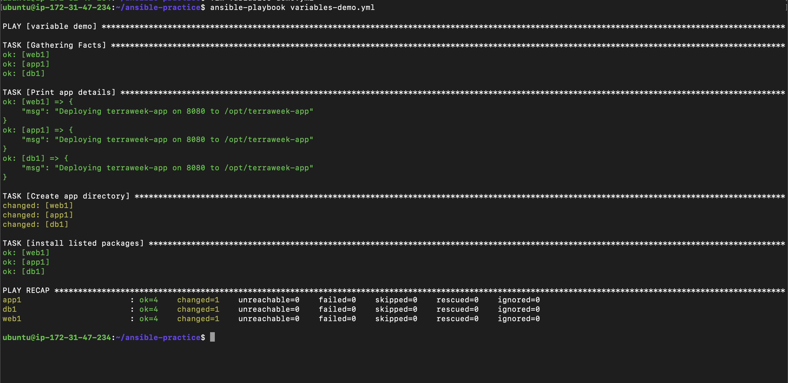

- 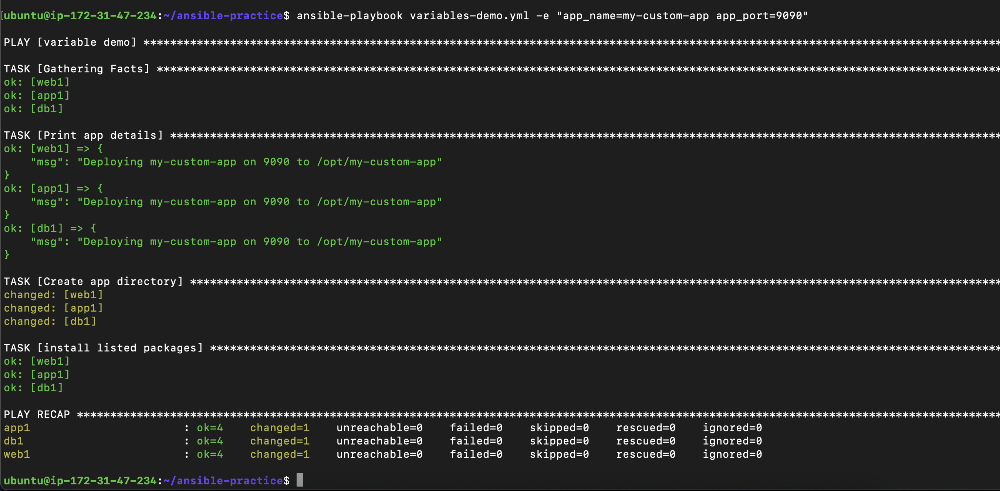

**Verify:** Does the CLI variable override the playbook variable? - Yes 🙌

---

### Task 2: group_vars and host_vars
- 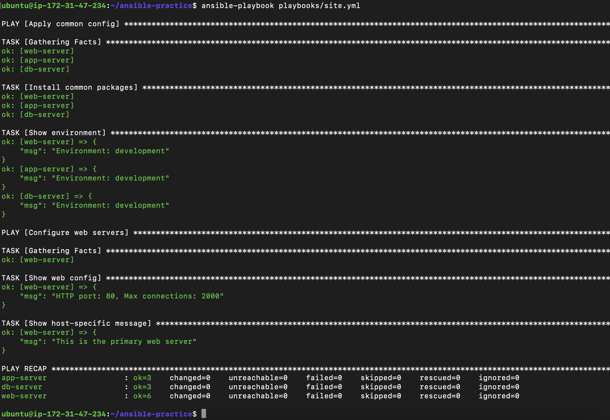
- 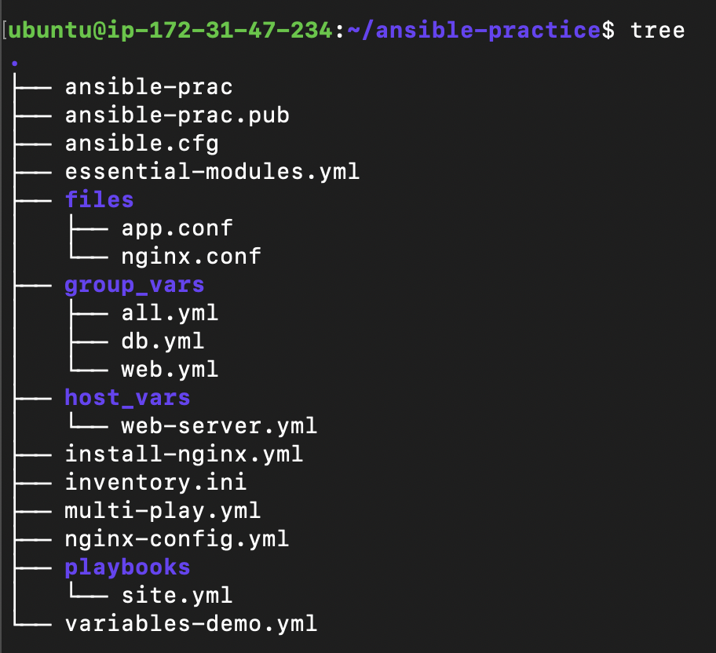

`host_vars > group_vars > playbook vars, and `-e` overrides everything`

---
### Task 3: Ansible Facts -- Gathering System Information

`ansible web-server -m setup -a "filter=ansible_os_family"`

```
web-server | SUCCESS => {
    "ansible_facts": {
        "ansible_os_family": "Debian",
        "discovered_interpreter_python": "/usr/bin/python3"
    },
    "changed": false
}
```

- `ansible web-server -m setup -a "filter=ansible_distribution*" `

```
web-server | SUCCESS => {
    "ansible_facts": {
        "ansible_distribution": "Ubuntu",
        "ansible_distribution_file_parsed": true,
        "ansible_distribution_file_path": "/etc/os-release",
        "ansible_distribution_file_variety": "Debian",
        "ansible_distribution_major_version": "24",
        "ansible_distribution_release": "noble",
        "ansible_distribution_version": "24.04",
        "discovered_interpreter_python": "/usr/bin/python3"
    },
    "changed": false
}

```

- `ansible web-server -m setup -a "filter=ansible_memtotal_mb"`

```
web-server | SUCCESS => {
    "ansible_facts": {
        "ansible_memtotal_mb": 911,
        "discovered_interpreter_python": "/usr/bin/python3"
    },
    "changed": false
}

```

- `ansible web-server -m setup -a "filter=ansible_default_ipv4"`

```
web-server | SUCCESS => {
    "ansible_facts": {
        "ansible_default_ipv4": {
            "address": "172.31.37.9",
            "alias": "ens5",
            "broadcast": "",
            "gateway": "172.31.32.1",
            "interface": "ens5",
            "macaddress": "0e:a3:f9:85:89:ed",
            "mtu": 9001,
            "netmask": "255.255.240.0",
            "network": "172.31.32.0",
            "prefix": "20",
            "type": "ether"
        },
        "discovered_interpreter_python": "/usr/bin/python3"
    },
    "changed": false
}
```

3. 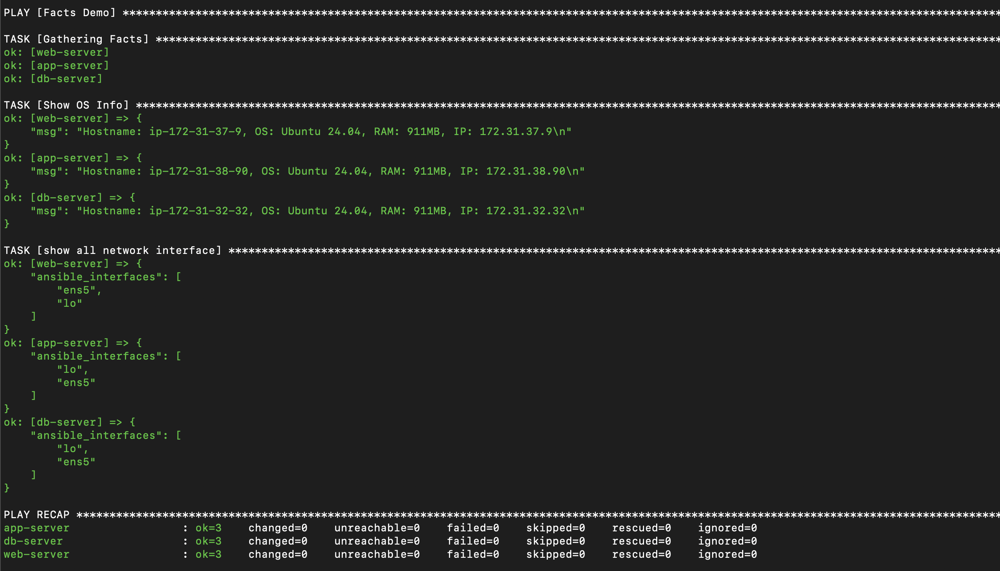

---

## ✅ Five useful Ansible facts and why they are used

### 1. `ansible_distribution`

👉 **What it tells:** OS type (Ubuntu, Amazon Linux, etc.)

**Why use it:**
To install correct packages based on OS

```yaml
when: ansible_distribution == "Ubuntu"
```

---

### 2. `ansible_os_family`

👉 **What it tells:** OS family (Debian, RedHat)

**Why use it:**
Handle package managers (`apt` vs `yum`)

```yaml
when: ansible_os_family == "Debian"
```

---

### 3. `ansible_memtotal_mb`

👉 **What it tells:** Total RAM in MB

**Why use it:**
Run tasks only on servers with enough memory

```yaml
when: ansible_memtotal_mb > 1024
```

---

### 4. `ansible_default_ipv4.address`

👉 **What it tells:** Primary IP address

**Why use it:**
Useful in configs, logs, or service binding

```yaml
msg: "Server IP: {{ ansible_default_ipv4.address }}"
```

---

### 5. `ansible_hostname`

👉 **What it tells:** Hostname of the machine

**Why use it:**
For identification, logging, and reporting

```yaml
msg: "Running on {{ ansible_hostname }}"
```

---

## 🎯 Interview-level summary

> “Ansible facts allow playbooks to adapt dynamically based on system properties like OS, memory, and network, enabling environment-aware automation.”

---

## ✅ TL;DR

* OS → `ansible_distribution`, `ansible_os_family`
* Resource → `ansible_memtotal_mb`
* Network → `ansible_default_ipv4.address`
* Identity → `ansible_hostname`

---

### Task 4: Conditionals with when

- 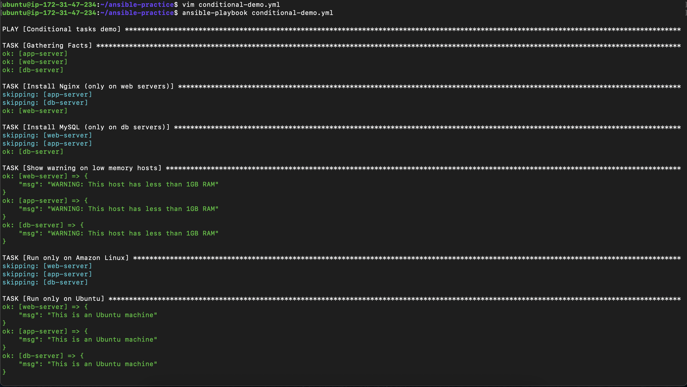

---

### Task 5: Loops

- 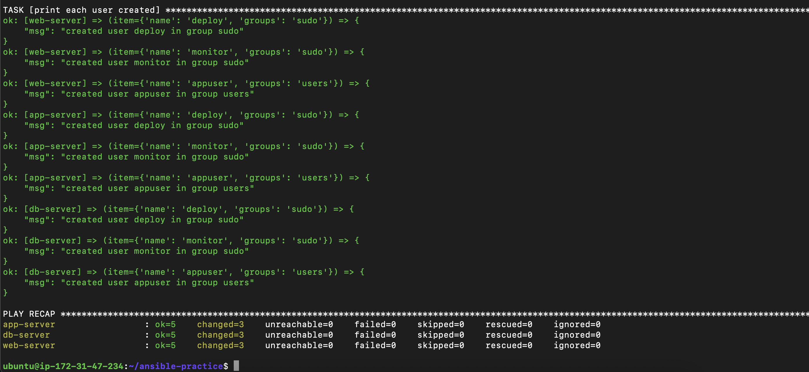


## ✅ Difference between `loop` and `with_items`

### 🔹 `with_items` (older syntax)

* Legacy looping method in Ansible
* Less flexible and less consistent
* Different loop types existed (`with_items`, `with_dict`, etc.)

```yaml id="k1p9y5"
- name: Install packages
  yum:
    name: "{{ item }}"
    state: present
  with_items:
    - git
    - curl
```

---

### 🔹 `loop` (modern syntax)

* Recommended approach
* Cleaner and more consistent
* Works with all data types (lists, dictionaries, etc.)
* Easier to combine with filters and variables

```yaml id="k3u8h2"
- name: Install packages
  yum:
    name: "{{ item }}"
    state: present
  loop:
    - git
    - curl
```

---

## ⚡ Key differences

| Feature     | `loop`          | `with_items`               |
| ----------- | --------------- | -------------------------- |
| Status      | ✅ Modern        | ❌ Deprecated/legacy        |
| Syntax      | Clean           | Older style                |
| Flexibility | High            | Limited                    |
| Consistency | Single approach | Multiple `with_*` variants |

---

## 🧠 Why `loop` is better

* One unified looping mechanism
* Works well with:

  * variables
  * filters
  * complex data structures
* Future-proof (Ansible standard)

---

## 🎯 Interview-level answer

> “`loop` is the modern, unified looping syntax in Ansible that replaces older constructs like `with_items`. It is more flexible, consistent, and recommended for all new playbooks.”

---

## ✅ TL;DR

* `with_items` → old way
* `loop` → new standard
* Always use `loop` in modern playbooks

---

### Task 6: Register, Debug, and Combine Everything

- 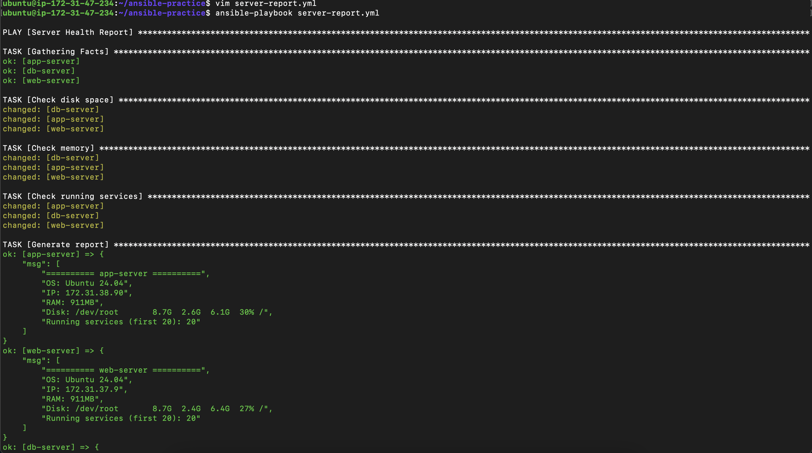
- 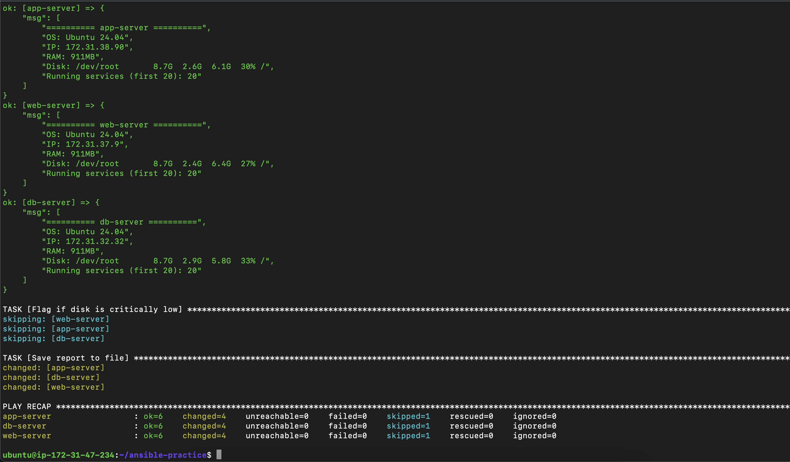

`app-server`
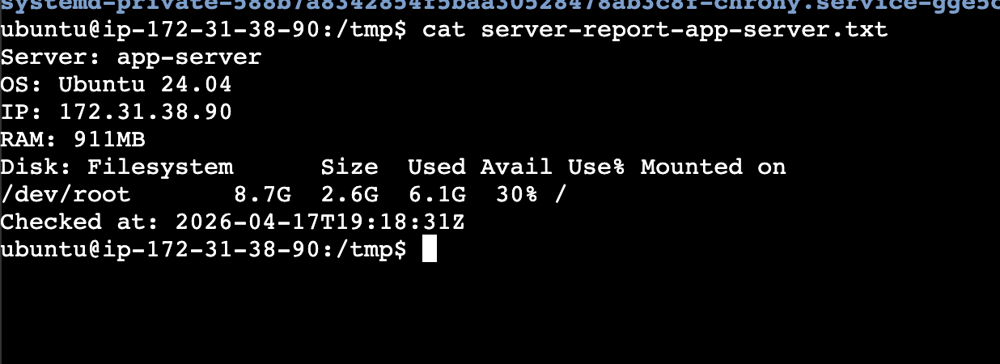

`web-server`
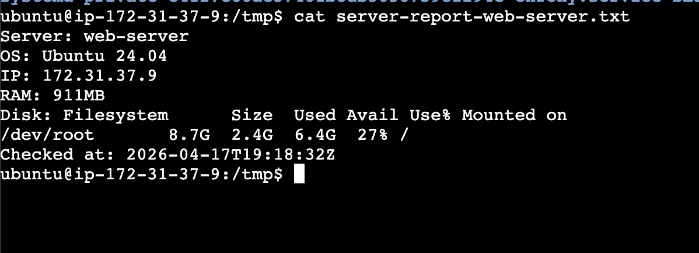

`db-server`
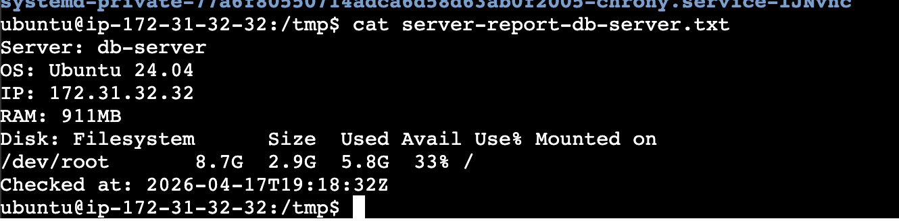

Yes it contains accurate info - ✅


---