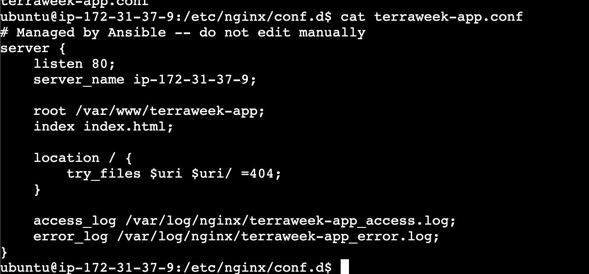
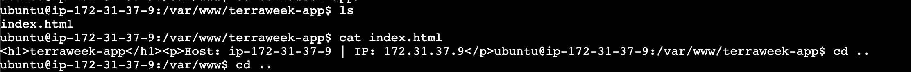
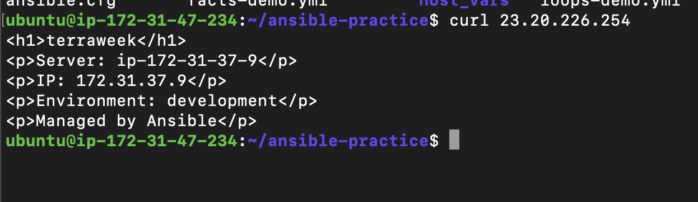
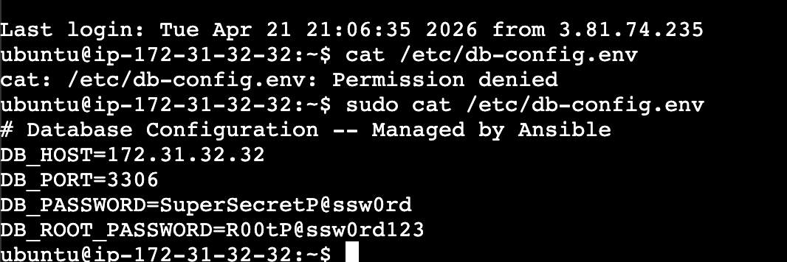

## Challenge Tasks

### Task 1: Jinja2 Templates

- 
- 

**Verify:** SSH into the web server and read the generated config. Are the variables replaced with actual values? - YES 🙌

---

### Task 2: Understand the Role Structure

## 🔥 Difference (VERY IMPORTANT)

| File     | Priority | Use               |
| -------- | -------- | ----------------- |
| defaults | LOW      | user can override |
| vars     | HIGH     | fixed values      |

---

### Task 3: Build a Custom Webserver Role

- 
- **Verify:** Curl the web server. Does the custom page load?- Yes 🙌

---

### Task 4: Ansible Galaxy -- Use Community Roles

```
Your answer is **partially correct**, but too basic ❌
You need to make it more **production-level** 👇

---

# ❌ Your answer

> “so that we can install multiple roles together”

👉 True, but **not enough** for interview/doc

---

# ✅ Correct & strong answer

> `requirements.yml` is used to manage and install multiple roles in a consistent, reproducible way. It allows version control, easy setup across environments, and simplifies dependency management compared to manual installation.

---

# 🧠 Why it's important (real reasons)

## 🔹 1. Reproducibility

👉 Same roles + same versions every time

```yaml
- name: geerlingguy.docker
  version: "7.4.1"
```

---

## 🔹 2. Team collaboration

👉 Anyone can run:

```bash
ansible-galaxy install -r requirements.yml
```

👉 and get exact setup

---

## 🔹 3. Version control (VERY IMPORTANT)

👉 Manual install → latest version ❌
👉 requirements.yml → fixed version ✅

---

## 🔹 4. CI/CD friendly

👉 Pipelines can auto-install roles

---

## 🔹 5. Single source of truth

👉 All dependencies in one file

---

# 🔥 Better version (use this in doc)

> `requirements.yml` is used to define and manage role dependencies in a single file. It ensures consistent environments by allowing version control, simplifies installation of multiple roles, and is essential for automation in CI/CD pipelines.

---

# 🎯 Interview-level one-liner

> “It ensures reproducible and version-controlled role management.”


```
```
---

### Task 5: Ansible Vault -- Encrypt Secrets

Here’s a clean, production-level answer you can use 👇

---

## ✅ Why `--vault-password-file` is better than `--ask-vault-pass`

`--vault-password-file` is better for automated pipelines because it allows **non-interactive execution**, which is required in CI/CD environments.

---

## 🧠 Key reasons

### 🔹 1. Automation (MOST IMPORTANT)

* `--ask-vault-pass` → requires manual input ❌
* `--vault-password-file` → runs without human intervention ✅

👉 CI/CD pipelines cannot type passwords

---

### 🔹 2. CI/CD compatibility

* Tools like GitHub Actions, Jenkins, GitLab CI need **fully automated runs**
* Password file can be injected securely via:

  * environment variables
  * secret managers

---

### 🔹 3. Consistency

* Same password used across runs
* Avoids human errors during manual input

---

### 🔹 4. Script-friendly

* Can be used in:

  * scripts
  * cron jobs
  * automated deployments

---

### 🔹 5. Better security practices (when handled properly)

* File can be:

  * restricted (`chmod 600`)
  * ignored in git (`.gitignore`)
* Can be replaced with secure vault integrations

---

## 🎯 Interview-level answer

> “`--vault-password-file` enables non-interactive, consistent, and automated execution, making it suitable for CI/CD pipelines, whereas `--ask-vault-pass` requires manual input and is not automation-friendly.”

---

### Task 6: Combine Roles, Templates, and Vault

-

---